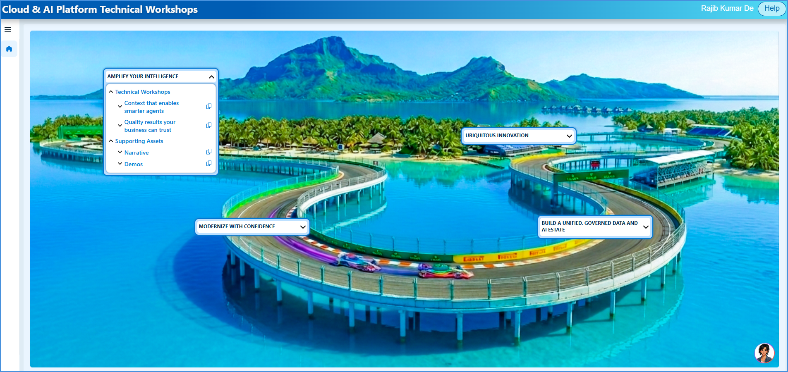
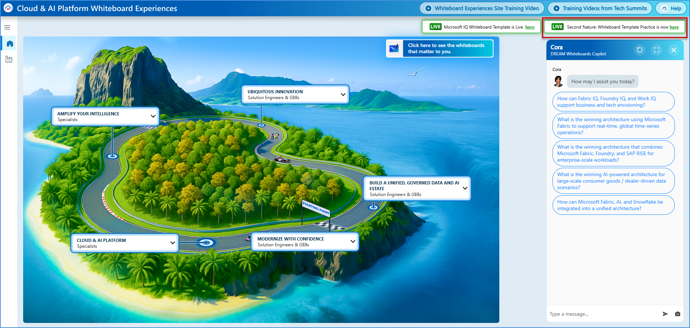
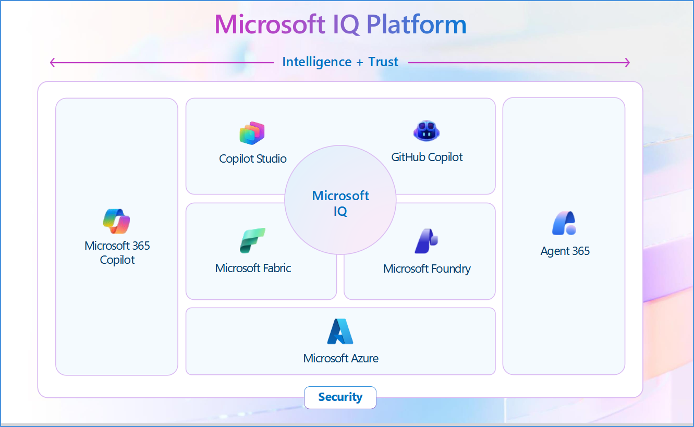
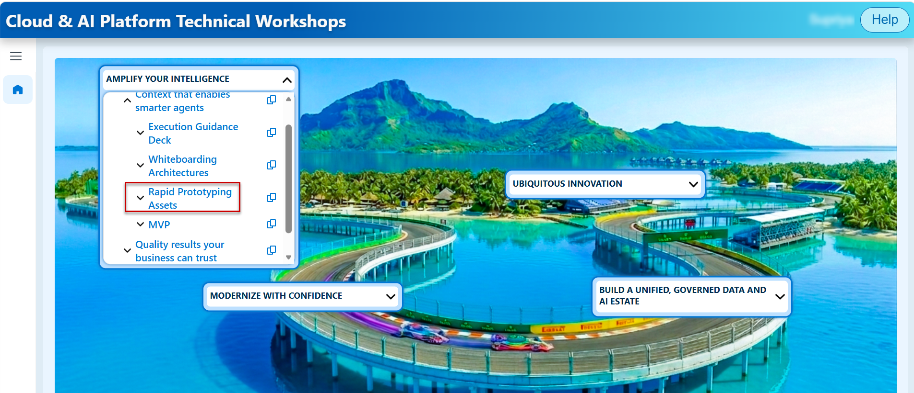
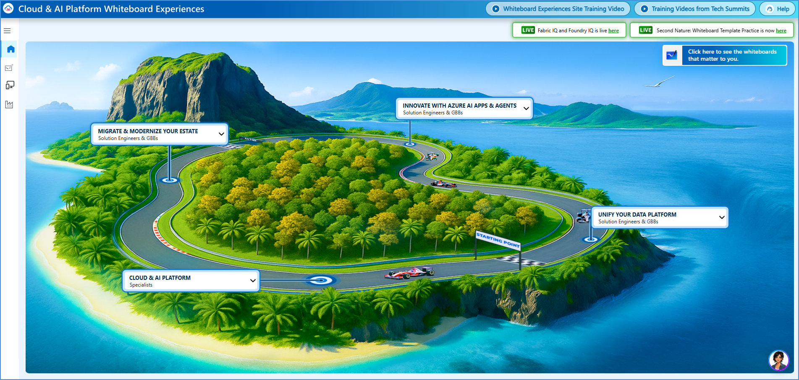
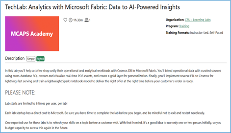

# Amplify Your Intelligence Technical Workshop — End-to-End Execution Guide (v3)

> **Audience:** Microsoft Solution Engineers, GBBs, other FTEs, and Partners who deliver this workshop.\
> **Workshop Level:** L300 (Translating deep technical capability into strategic business value)\
> **Primary Theme:** Building context-aware, trusted AI solutions with **Microsoft IQ** — Fabric IQ, Foundry IQ, Work IQ, and Web IQ\
> **Delivery Model:** Instructor-led, self-paced, or modular customer engagement

---

## 🌟 Executive Summary & Welcome

Welcome to the **Amplify Your Intelligence Technical Workshop Execution Guide**. Whether you are a business leader, a project manager, or a solution architect, this guide will help you understand how to move enterprise AI from a simple chatbot to a highly capable, autonomous corporate assistant.

> 💡 In short, most enterprise AI projects stall because the AI lacks context. It may be able to chat, but it may not understand your company's specific definitions, your standard operating procedures, who owns which responsibilities, or what is happening in the market right now.

**Microsoft IQ** addresses this by creating a single, shared "intelligence layer." A hands-on technical workshop to architect end-to-end solutions that unify **work context, business data, enterprise knowledge, and external web intelligence** into that single intelligence layer. This guide explains the full workshop — modules, discovery questions, whiteboarding, hands-on labs, solution accelerators, and rapid prototyping — so sellers and facilitators can execute it end to end.

---

## 🗂️ Table of Contents

1. [Workshop Agenda](#workshop-agenda)
2. [Technical Workshops Overview for the Sellers](#technical-workshops-overview-for-the-sellers)
3. [Amplify Your Intelligence — Technical Workshop Modules](#technical-workshop-modules)
4. [One-Page Summary: Build Context-Aware AI Solutions with Microsoft IQ (L300)](#one-page-summary-l300)
5. [CAIP Technical Workshops Site — Content Overview](#caip-site-overview)
6. [The Core Concept: What Is Microsoft IQ?](#microsoft-iq)
7. [Business Scenario & Personas](#business-scenario-personas)
8. [Workshop Execution Models & Agendas](#workshop-execution-models-agendas)
9. [Discovery & Architecture Whiteboarding Framework](#discovery-architecture-whiteboarding-framework)
10. [Scenario Deep Dives](#scenario-deep-dives)
    - [Scenario 01 — Establishing Context Across Work and Business](#scenario-01)
    - [Scenario 02 — Converting Knowledge into Reusable Intelligence](#scenario-02)
11. [Deep Dive: Work IQ](#deep-dive-work-iq)
12. [Deep Dive: Web IQ](#deep-dive-web-iq)
13. [Deep Dive: Fabric IQ](#deep-dive-fabric-iq)
14. [Deep Dive: Foundry IQ](#deep-dive-foundry-iq)
15. [Suggested Workshop Flow & Modular Deep-Dive Tracks](#suggested-workshop-flow)
16. [Expected Outputs / Results](#expected-outputs)
17. [Microsoft IQ Demos](#microsoft-iq-demos)
18. [Rapid Prototyping](#rapid-prototyping)
    - [Rapid Prototyping Assets](#rapid-prototyping-assets)
    - [Whiteboarding Experience](#whiteboarding-experience)
    - [Hands-On Labs Walkthrough](#hands-on-labs-walkthrough)
    - [Solution Accelerators](#solution-accelerators)
    - [GitHub Repos — Quick Access](#github-repos-quick-access)
19. [Rapid Prototyping & MVP Planning Blueprint](#mvp-scoping-blueprint)
20. [Troubleshooting, Risks, & Delivery Notes](#troubleshooting-risks-delivery-notes)
21. [Facilitator Delivery Playbook](#facilitator-delivery-playbook)
22. [Final Call to Action & Next Steps](#final-call-to-action-next-steps)
23. [Master Resource Directory (All Links)](#master-resource-directory)
24. [Appendix — Source References for Facilitators](#appendix-source-references)

---

## 1. 🗓️ Workshop Agenda

The workshop unfolds in three activity blocks, straight from the execution guidance deck:

**1 - Technical Workshops Overview for the Sellers**
- Technical Workshops Overview for the sellers
- Amplify your Intelligence Tech Workshop Overview
- Technical Workshops Site Content Overview
- Microsoft IQ Overview
- Module 1: Work IQ
- Module 2: Web IQ
- Module 3: Fabric IQ
- Module 4: Foundry IQ
- Microsoft IQ Demos

**2 - Activities: Build Prototypes and/or MVPs faster with:**
- Whiteboarding
- Hands-On Labs (HOLs)
- Solution Accelerators
- GitHub Repos
- Rapid Prototyping
- MVPs

**3 - Call to Action**
- Call to Action
- Next Steps

---

## 2. Technical Workshops Overview for the Sellers

### 2.1 🧭 Technical Workshop | xMSFT Definition

**Outcome:** The technical workshop accelerates the customer's technical decision through a working MVP or pilot.

| Technical Workshop | Data Source | Environment |
|---|---|---|
| Option A | Customer data | Customer sandbox |
| Option B | Microsoft sandbox | Microsoft sandbox |

The workshop is **modular and connected** across three linked stages:

| Stage | Activity | Outcome |
|---|---|---|
| **Architecture Whiteboarding** | Co-design using interactive Reference Architecture templates in MS Whiteboard. | Validated customer architecture design with deployable templates. |
| **Rapid Prototyping** | Deliver a tailored prototype by co-building in sandbox environments using acceleration tooling. | Prototype in sandbox environment. |
| **MVP / Pilot** | Co-build/co-deploy in customer environment with customer data. | MVP or limited-scale deployment in sandbox. |

- **Audience:** TDM (Technical Decision Maker), Practitioner
- **Modalities of delivery:** 1:1 (by SE, Partner, Hubs), 1:many (digital and in-person, including by partners)

Business and solution requirements are needed as **inputs** to the Tech Workshops.

**Note:** Demos are part of the "L200 Discussion" phase, which occurs *prior to* the Tech Workshop.

### 2.2 🔍 Workshop Deep Dive — Example Technical Workshop

The full journey spans an L200 discussion (pre-requisites) followed by three technical-workshop phases:

| Phase | What Happens |
|---|---|
| **L200 Discussion — Pre-requisites** | The Specialist gathers the inputs SEs need to scope and run a successful workshop: expected timelines and technical success metrics; platform architecture requirements (UI, agent, and knowledge layers, plus governance); compliance requirements; AI readiness across governance, cloud, workforce, and data. |
| **Architecture Whiteboarding** *(~1 hour)* | Co-design session to map an architecture tailored to the customer's needs. Build a customer-specific architecture diagram using interactive Reference Architecture templates. Delivered on Microsoft Whiteboard via Teams, or in person. |
| **Rapid Prototyping** | Create a rapid prototype using Solution Accelerators, GitHub Repos, Cora (AI Agent), etc. Uses Solution Accelerators or GitHub Repos to generate deployable infrastructure-as-code templates. Produces synthetic data and a data relationship schema. Code is exported to VS Code with instructions to review and deploy in sandbox. |
| **MVP / Pilot** | Limited-scale deployment in a sandbox for the customer to test. Test the prototype and create a functional MVP. Customer validates the MVP against defined success criteria. Hands off to CSU or partner for follow-through. |

### 2.3 🎯 Workshop Purpose

**Purpose:** This workshop helps technical teams design and deliver integrated Microsoft IQ solutions that unify work context, business data, enterprise knowledge, and external web intelligence into a single intelligence layer. Participants learn how to architect end-to-end solutions, create rapid prototypes to connect data, use context across systems, and guide customer conversations toward a meaningful MVP.

**Positioning statement:** Unify fragmented work context, business data, and enterprise knowledge into a shared intelligence layer — enabling AI that delivers accurate insights, consistent decisions, and meaningful business outcomes.

**Modular & flexible:** Deliver end-to-end as a structured engagement, or break into targeted modules focused on work, business, or knowledge context based on customer priorities.

### 2.4 👥 Before You Begin — Audience & Pre-Work

**Recommended audience who will deliver these workshops:** Microsoft Solution Engineers, GBBs, other FTEs, Partners.

**Pre-work & inputs needed:**
- Access to the hosted workshop environment (pre-configured).
- Supporting materials, setup guidance, and assets on the [CAIP Technical Workshops site](https://aka.ms/CAIPTechWorkshops).
- When available: customer scenario, data context, or architecture inputs for alignment.

### 2.5 🧭 The Arc — How the Workshop Unfolds

| Step | Name | What Happens |
|---|---|---|
| **1** | **Ground** | Start in a real customer scenario and explore how fragmented context limits the impact of AI. |
| **2** | **Introduce** | Introduce Microsoft IQ and its core components including demos — Fabric IQ, Foundry IQ, Work IQ, and Web IQ. |
| **3** | **Connect** | Through technical envisioning session discussions using configurable reference Whiteboard architectures and Hands-on Labs (optional). |
| **4** | **Build & validate** | Build and validate an integrated scenario through Rapid Prototyping using Solution Accelerators, GitHub Repos, Cora (AI Agent). MVP using best practices from GBBs and solutions like Agentic Loop. |

### 2.6 ✅ Execution Guidance for the Sellers

| # | Step | Guidance |
|---|---|---|
| 1 | **Ground in the scenario** | Confirm the business problem, priority use case, target users, and success criteria first. |
| 2 | **Introduce and qualify with discovery** | Introduce Microsoft IQ and its core components including demos — Fabric IQ, Foundry IQ, Work IQ, and Web IQ. Find where the customer needs better work context, shared meaning, reusable knowledge, or fresh web signals. |
| 3 | **Whiteboard the architecture** | Map how Fabric, Foundry, Work, and Web IQ work together for the selected agentic scenario. |
| 4 | **Select lab modules** | Don't run every module by default — choose labs that match the use case and desired outcome. |
| 5 | **Use Solution Accelerators and leverage reusable patterns** | Use Solution Accelerators and show how components connect end-to-end, emphasizing patterns the customer can reuse. |
| 6 | **Use Web IQ deliberately** | Highlight where agents need fresh web, news, market, regulatory, or competitive signals. |
| 7 | **Validate the approach** | Confirm data sources, grounding, integration points, security, and dependencies. |
| 8 | **Build Rapid Prototypes faster** | Use GitHub Repos, Accelerators, and Cora (AI Agent) to prove the components that matter most. |
| 9 | **Close with a path** | Define the MVP, pilot scope, owners, success measures, and follow-up actions. |

### 2.7 ❓ Core Discovery Questions

| # | Lens | Question |
|---|---|---|
| 1 | **Cross-cutting** | Where is fragmented context — across how people work, how the business operates, and what systems know — preventing AI from delivering on its full promise? |
| 2 | **Work** | How much time do teams spend re-establishing context before AI can actually help move work forward? |
| 3 | **Business** | Do your teams and AI tools agree on what key business terms like revenue, customer, or margin actually mean? |
| 4 | **Knowledge** | When building new AI agents, how much of your organization's knowledge and logic must be rebuilt versus reused? |
| 5 | **Web** | Where do agents need fresh external evidence — market changes, regulatory updates, supplier signals, competitor activity, or public sentiment — before they can respond accurately? |

---

## 3. Amplify Your Intelligence — Technical Workshop Modules

**Technical Workshop Narrative**

**Workshop Purpose:** This workshop helps technical teams design and deliver integrated Microsoft IQ solutions that unify work context, business data, and enterprise knowledge into a single intelligence layer. Participants learn how to architect end-to-end solutions, connect data and context across systems, and guide customer conversations toward meaningful proof-of-concept outcomes.

**Modularity / flexibility:** The workshop can be delivered end-to-end as a structured engagement or broken into targeted modules focused on work context, business context, or knowledge integration depending on customer priorities.

| Workshop Package | Outcomes | Scenario Modules | Module Description | Lead Product(s)/Workloads |
|---|---|---|---|---|
| **Amplify your intelligence** | **Context that enables smarter agents (Context)** | Build your IQ — context across people, business & knowledge | Design a unified intelligence layer that combines work signals, business data, enterprise knowledge, and external context so agents understand how the organization operates. | Work IQ, Fabric IQ, Foundry IQ, Web IQ |
| | | Ground AI in shared business meaning | Establish shared business meaning that agents can reuse across applications, data, and knowledge sources so AI reasons consistently about how the business operates. | Fabric IQ, Foundry IQ |
| | **Quality results your business can trust (Quality)** | Deliver decisions your business can trust | Connect agents to trusted business context, enterprise knowledge, work signals, and external information so responses are accurate, explainable, and grounded in how the organization operates. | Microsoft IQ, Microsoft Foundry, Microsoft Entra, Microsoft Purview |
| | | Compound value & govern as AI adoption grows | Establish reusable intelligence and governance patterns that enable agents to compound value over time, improving through shared context and organizational learning as AI adoption grows. | Microsoft IQ, Agent 365, Microsoft Foundry, Microsoft Entra, Microsoft Purview |
| | **Faster impact with shared intelligence (Speed)** | Accelerate agent deployment with shared intelligence | Accelerate agent development by reusing shared business context, enterprise knowledge, and organizational intelligence, eliminating the need to rebuild grounding, integrations, and context for every new solution. | Microsoft Foundry, Copilot Studio, Microsoft IQ, Agent 365 |
| | | Real-time work awareness with Work IQ | Ground agents and copilots in real-time work context, relationships, and collaboration patterns so they understand how work gets done across the organization and deliver more relevant, personalized assistance. | Work IQ, Microsoft 365 Copilot, Agent 365 |

---

## 4. Build Context-Aware AI Solutions with Microsoft IQ

**AMPLIFY YOUR INTELLIGENCE — L300**

**What it is:** Amplify Your Intelligence helps technical teams design, prototype, and validate AI solutions grounded in work context, business data, enterprise knowledge, and external intelligence using Microsoft IQ. Through architecture design, hands-on labs, solution accelerators, and MVP planning, participants learn how to create context-aware AI solutions that deliver business value.

**Modules — what we do with the customer:**
- **Build Your IQ Foundations** — Introduce the Microsoft IQ architecture and how Work IQ, Fabric IQ, Foundry IQ, and Web IQ combine into a shared intelligence layer.
- **Ground Business Context with Fabric IQ** — Connect business data, semantic meaning, and organizational context.
- **Activate Enterprise Knowledge with Foundry IQ** — Ground AI solutions in enterprise knowledge and proprietary information.
- **Understand Work Context with Work IQ** — Leverage work patterns, relationships, collaboration signals, and organizational activity.
- **Extend Intelligence with Web IQ** — Incorporate trusted external intelligence and continuously changing information.
- **Trust Intelligence that Drives Scale** — Govern, secure, and scale AI solutions using Agent 365, Entra, Purview, and Microsoft Foundry.

**Execution guidance:**
- Scenario discovery and success criteria alignment
- Microsoft IQ overview and architecture whiteboarding
- Deliver selected lab modules based on customer priorities
- Demonstrate integrated solution patterns and accelerators
- Validate solution approach and implementation considerations
- Rapid prototyping Copilot for key components
- Define MVP, pilot, and next-step recommendations

**Business outcomes:**
- Deliver consistent, context-aware AI outcomes grounded in business, knowledge, work, and external intelligence.
- Reduce implementation effort by reusing enterprise knowledge, context, and shared intelligence assets.
- Scale trusted AI adoption with built-in governance, security, and compliance controls.
- Accelerate the path from concept to MVP through reusable architectures, labs, and accelerators.

**Scenarios:**
- Build your IQ — context across people, business & knowledge
- Ground AI in shared business meaning
- Deliver decisions your business can trust (Quality)
- Compound value & govern as AI adoption grows
- Accelerate agent deployment with shared intelligence
- Real-time work awareness with Work IQ

**Assets, resources & demos:**
- Product pitch decks
- L200 conversation demos
- L300 product demos
- Architecture/whiteboard templates
- Hands-on Labs — internal and customer facing
- Solution Accelerators — internal and customer facing
- Best Practice — Pathfinder Accelerator
- AI Powered Rapid Prototyping Copilot Experience

---

## 5. CAIP Technical Workshops Site — Content Overview

### 5.1 🖥️ Overview of the Site

The [CAIP Technical Workshop Site](https://aka.ms/AmplifyTechWorkshops) provides a "one stop shop" experience for sellers to:

1. Identify the conversation(s) most relevant for their customer's business outcomes.
2. Search for execution guides, HOLs, and any other content for the relevant conversations.
3. Leverage configurable reference Whiteboard architectures and create proposed future-state customer architectures.
4. Identify solution accelerators which align with business outcomes.
5. **Quickly create rapid prototypes** with solution accelerators, Hands-on Labs, GitHub Repos, Sample Prototype (test drive & prototype package) review, and finally leverage **Cora (AI agent) live** for rapid prototype creation.
6. Leverage best practices as well as GBB tools such as **Agentic Loop** for MVP creation.

The site's home screen is organized into four workstream tiles — *Amplify Your Intelligence*, *Ubiquitous Innovation*, *Modernize with Confidence*, and *Build a Unified, Governed Data and AI Estate* — plus a live **Cora** rapid-prototyping copilot panel where sellers can ask things like:

> "Can you generate a production-ready, deployable Azure Bicep package for this architecture, with configurable parameters and deployment instructions?"\
> "For my retail customer, I need a multi-agent solution prototype. This solution should help the store manager assess sales impact due to absence of their team members (store associates) who are assigned to fulfilling orders. The solution should recommend alternate store associates and auto-assignment protocol for future."

**Site:** [https://aka.ms/AmplifyTechWorkshops](https://aka.ms/AmplifyTechWorkshops)

### 5.2 🖊️ Now Available for Sellers: Technical Envisioning Whiteboard OLT

**Technical Envisioning Whiteboard Practice: Unify Your Data Platform**

This field-built and field-tested on-demand course gives Solution Engineers (SEs) the opportunity to refresh and then practice delivering a Technical Envisioning (TE) session using the new TE whiteboard template.

- During this practice experience, the SE shares their screen and conducts a TE session for an AI customer persona by navigating through the TE whiteboard.
- After the session, the SE receives feedback on their talk track as well as their whiteboard navigation.
- This is a **generative AI-enabled course** built on Azure OpenAI Service.

**Link:** [https://aka.ms/DREAMwhiteboards](https://aka.ms/DREAMwhiteboards)

### 5.3 🎥 Amplify Your Intelligence Technical Workshop Overview (Video)

A short overview video walking through the CAIP site navigation and the Cora rapid-prototyping copilot: [**Amplify your Intelligence - Technical Workshop.mp4**](https://onedrive.cloud.microsoft/:v:/a@sz99ae24/r/_layouts/15/stream.aspx?id=%2Fa%40sz99ae24%2FDocuments%2FShare%20for%20vteam%2FEvents%2FCOOL%20CAIP%20ENABLEMENT%2FFY27%20Tech%20Workshops%2FLT%20REVIEW%2FLatest%20July%202026%2FLT%20Video%2FFinal%20Videos%2FFINALFINAL%2FAmplify%20your%20Intelligence%20%2D%20Technical%20Workshop%2Emp4&share=cQo2PA8npyXWTKsM7lSDHMUlEgUCxdNI3ODHnIl1NbrB0MpgBA)

---

## 6. The Core Concept: What Is Microsoft IQ?

**Microsoft IQ** — *Unified intelligence for enterprise AI.* 

Reference: [aka.ms/MicrosoftIQ](https://aka.ms/MicrosoftIQ)

### 6.1 🧩 The Challenge — Why AI Stalls Without Unified Context

Organizations struggle to apply AI effectively because critical context is fragmented across systems, teams, and data sources. Without a unified intelligence layer, AI solutions lack the context required to deliver accurate, trusted, and scalable outcomes.

| Problem | Description |
|---|---|
| **Fragmented context** | Work context, business definitions, and enterprise knowledge sit disconnected across systems and teams. |
| **Meaning re-established** | Teams repeatedly rebuild context and definitions before AI can actually be useful. |
| **Inconsistent & duplicated** | Inconsistent outputs, duplicated effort, and slow progress from experimentation to production. |
| **Missing external signals** | Agents also need current external signals not captured in internal systems or model training data. |

### 6.2 📈 AI Adoption Is Accelerating — Agents Are at the Forefront

- **1.3B AI agents by 2028** *(Source: IDC FutureScape / IDC Info Snapshot research, 2025)*
- **82% of organizations** intend to integrate agents within 1–3 years *(Source: Capgemini Research Institute, "Harnessing the Value of Generative AI: Unlocking Scalable Advantage," July 2024)*
- **40% of enterprise apps** will be integrated with task-specific AI agents by 2026 *(Source: Gartner, August 2025)*

### 6.3 ⚙️ Essentials for High-Performance Agents

1. Rich, connected context
2. Unified access to data and signals
3. Low-friction development and orchestration
4. Governance, observability, and trust

### 6.4 🤝 Intelligence + Trust — The Microsoft IQ Platform

Microsoft IQ sits at the center of the Microsoft AI stack, bridging **Intelligence + Trust**:

- **Microsoft 365 Copilot** and **Agent 365** flank the platform (interactive ↔ autonomous)
- **Copilot Studio** and **GitHub Copilot** sit above **Microsoft IQ**
- **Microsoft Fabric** and **Microsoft Foundry** sit below, on top of **Microsoft Azure**
- **Security** underpins the entire platform

### 6.5 🧠 What Every Employee — and Every Agent — Needs to Know

Both a human employee and an AI agent depend on the same three pillars of context:
- **Teams, roles, and workflows** — how people work
- **State and actions of the business** — what's happening right now
- **Curated knowledge** — the accumulated, trusted information of the organization

> "You empower your AI agents with the same knowledge and context." Microsoft IQ makes agents **interactive** (working alongside people) and **autonomous** (acting independently) across these same three pillars — **your people, your agents, your IQ.**

### 6.6 🧱 The Four Pillars of Microsoft IQ

| Pillar | Tagline | What It Provides |
|---|---|---|
| **Work IQ** | *How your employees work* | Context on people, collaboration, and workflows |
| **Fabric IQ** | *How your business operates* | Context on business entities, systems of record, and actions |
| **Foundry IQ** | *How your agents unlock knowledge* | Context on policies, authoritative documents, and knowledge bases |
| **Web IQ** | *How you connect to web intelligence* | Context from the web, news, images, and video |

Reference for the combined platform diagram: [aka.ms/MicrosoftIQ](https://aka.ms/MicrosoftIQ)

---

## 7. 🌐 Business Scenario & Personas

To keep the workshop practical, everything is framed through real-world company stories used consistently across the demos, labs, and the solution accelerator.

### 7.1 The Retail Disruption Case (Zava Retail)

Imagine a large retail company with hundreds of physical stores and e-commerce operations. A massive thunderstorm hits a regional distribution hub. Delivery trucks are delayed, refrigeration units fail, and inventory for milk and ice cream drops to zero.

- **The Old Way:** The store manager doesn't know why the truck hasn't arrived. She calls corporate. Corporate looks at a logistics dashboard. The safety team reviews the refrigeration manual to check for spoiled food. Hours pass. Customers face empty shelves and the company loses money to slow coordination.
- **The Microsoft IQ Way:** An automated data monitor detects the supply-line failure and passes it to the intelligence layer. The system reads the safety manual, looks up the store manager's schedule, drafts an advisory notice, and coordinates a replacement shipment automatically.

Zava, which runs both retail stores and e-commerce operations, faces common challenges like delayed responses, manual coordination, limited visibility, slow approvals, and disconnected workflows. With Work IQ, these challenges are addressed by unifying context, automating coordination, and streamlining approvals and execution — moving Zava from a manual, disconnected organization to a modern, AI-supported **"Frontier Organization"** that is human-led and AI-operated.

### 7.2 The Zava Supply Chain Accelerator Scenario

Zava, a global consumer goods company, manages a complex network of distribution centers, stores, and suppliers to maintain on-shelf availability and protect revenue amid changing demand. When a supplier disruption occurs, the Supply Chain Manager must quickly understand what is at risk, evaluate feasible sourcing options, and determine how to respond before downstream impact spreads across the business. Using a unified intelligence ecosystem, she moves from early disruption signals to impact assessment and coordinated action, bringing together business data, supplier constraints, and execution workflows in one shared context — ensuring customers and sales are not affected, and revenues are not disrupted. *(Full journey and architecture in [Solution Accelerators](#solution-accelerators).)*

### 7.3 👥 The Characters (Personas)

| Persona | Role | What They Need |
|---|---|---|
| **Ashley** | Store Manager · Zava | Clear, prioritized action text when operational disruptions happen. When a key team member is unavailable, she needs the system to understand responsibilities, dependencies, approvals, and service-level impact before taking action. |
| **Eva** | Data Engineer · Zava | Clean, organized data maps to feed the AI brains correctly. Before developing Fabric IQ capabilities, she needs a governed workspace where data, analytics, and AI artifacts are stored securely — the foundation to connect Zava's data and support the intelligence layer. |
| **Miguel** | AI Engineer / Data Scientist | Safe, non-hallucinating models with strict compliance guardrails. Before designing agents that can reason and act, the foundation must be secure, governed, and scalable — provisioning the Foundry environment, configuring the Agent Service, and deploying the foundational models agents use. |
| **Ruza Antunovic** | Supply Chain Manager · Zava | Needs early disruption signals to keep operations running and prevent downstream delays — detecting supplier disruption, reviewing impact, validating demand/inventory, assessing supplier feasibility, evaluating sourcing options, and coordinating execution. |
| **Operations Lead** | Business executive | Requires lower operational costs, faster response times, and higher customer trust. |

---

## 8. 🗓️ Workshop Execution Models & Agendas

Organizations have different amounts of time and maturity levels. The workshop can be configured in three flexible ways.

### 8.1 🧭 End-to-End Workshop Flow

1. Start with a real business problem.
2. Identify where context is missing or fragmented.
3. Create shared business meaning.
4. Connect data, knowledge, and work context.
5. Add external signals where needed.
6. Build agents and intelligent experiences.
7. Evaluate quality and trust.
8. Prototype and plan the next step.

This flow is reflected in the workshop modules, the labs, and the supporting assets.

### 8.2 🧭 Option 1: The Full-Day Engagement (7.5 Hours)

Best for teams ready to design an architectural solution and complete real code labs on the same day.

- **Hour 0.0 – 0.5:** Welcome, goals setup, and aligning on the business problem.
- **Hour 0.5 – 1.0:** Introduction to Microsoft IQ concepts in simple terms.
- **Hour 1.0 – 2.0:** Context Gap Assessment (discovery game to find where information is broken).
- **Hour 2.0 – 3.0:** Whiteboarding Session (drawing the visual layout of your new AI solution).
- **Hour 3.0 – 4.5:** Hands-on Exercise 1 (Building the Data and Meaning Layer with Fabric IQ).
- **Hour 4.5 – 6.0:** Hands-on Exercise 2 (Building the Knowledge Library and Rules with Foundry IQ).
- **Hour 6.0 – 6.75:** Rapid Prototyping (selecting pre-built templates to assemble the final product).
- **Hour 6.75 – 7.25:** MVP Planning (assigning deadlines, owners, and building the pilot roadmap).
- **Hour 7.25 – 7.5:** Action Closing (final commitment and scheduling the follow-up review).

### 8.3 🏢 Option 2: The Half-Day Executive Briefing (3.5 Hours)

Best for business executives who want to understand the technology and design the visual concept, but will delegate the actual coding labs to their engineering teams later.

- **0:00 – 0:30:** High-level executive story pitch and business challenge framing.
- **0:30 – 1:00:** The core value flow: how Work, Fabric, Foundry, and Web IQ integrate.
- **1:00 – 1:45:** Visual whiteboarding (mapping out your company's high-priority workflow).
- **1:45 – 2:45:** Live interactive demonstration (clicking through real pre-built retail scenario solutions).
- **2:45 – 3:30:** Strategic roadmap session (defining MVP boundaries and immediate next actions).

### 8.4 🧩 Option 3: Modular Delivery Track

If your company is struggling with one specific bottleneck, you can run isolated 90-minute sub-workshops — mirroring the [modular deep-dive tracks](#suggested-workshop-flow):

- **Fabric IQ Session:** Focus strictly on cleaning up messy business terms and real-time streaming data tracking.
- **Foundry IQ Session:** Focus strictly on legal document search, AI evaluation safety, and multi-agent coordination.
- **Work IQ Session:** Focus strictly on office automation, Outlook email drafting, and Microsoft 365 action triggers.
- **Web IQ Session:** Focus strictly on external grounding and real-world intelligence.

---

## 9. 🧠 Discovery & Architecture Whiteboarding Framework

Before writing code, teams sit at a digital or physical whiteboard. This section combines the deck's five [core discovery questions](#technical-workshops-overview-for-the-sellers) with a practical mapping exercise for the room.

### 9.1 🗺️ The Mapping Strategy

Draw four columns on the whiteboard and connect them with arrows:

- **Column A (Inputs):** Where does raw reality live? (e.g., shipping spreadsheets, policy PDFs, Teams chats)
- **Column B (The Intelligence Layers):** Which IQ piece manages it? (Numbers → Fabric IQ, PDFs → Foundry IQ, Chats/work signals → Work IQ, External signals → Web IQ)
- **Column C (The Logic Brains):** What must the AI calculate? (e.g., calculate food spoilage risk based on elapsed transit time)
- **Column D (The Outcomes):** What action happens in the real office? (e.g., send a red-flag alert email to Ashley the Store Manager)

### 9.2 🖊️ Whiteboarding Experience & Templates

See [Whiteboarding Experience](#whiteboarding-experience) below for the full CAIP whiteboard site, the Business-to-AI Solution Design template, and the Fabric IQ / Foundry IQ / Work IQ agentic-graph template.

---

## 10. Scenario Deep Dives

These are the two envisioning scenarios used in the technical envisioning / discovery portion of the workshop.

### 10.1 Scenario 01 — Establishing Context Across Work and Business

**Objective:** Align work context and business context so AI solutions operate with a shared understanding of how people work and how the business defines key concepts.

**Relevant components & assets:** Work IQ · Web IQ · Fabric IQ

**Discussion focus:** Identify where fragmented work and business context prevent AI from delivering meaningful outcomes — and define how a unified context layer improves accuracy and usability.

**Key discussion areas:**

| Lens | Insight | Guiding Question | Current Challenge | Decision Criteria | Capabilities |
|---|---|---|---|---|---|
| **Work Context** | Re-establishing context slows productivity | How much time do teams spend finding the right information before work can continue? | Context is scattered across documents, conversations, and tools. | Surface relevant work context in real time. | Work IQ · contextual signals across Microsoft 365 |
| **Business Context** | Inconsistent definitions drive inconsistent outcomes | Do teams agree on what concepts like revenue or customer mean? | Conflicting definitions across systems and teams. | A shared semantic layer for consistent interpretation. | Fabric IQ · unified data & semantic models |
| **Web Context** | External signals change decisions in real time | Which external signals does the agent need to know what's happening now? | Critical context lives outside enterprise systems — web, news, market, images, video. | Ground responses in fresh, source-backed external information. | Web IQ · web / news / image / video grounding |

**Outcomes — what good looks like:**
- **Shared understanding** — Teams share a common understanding of business definitions and work context.
- **Context-aware outputs** — AI solutions respond with consistent, relevant, and context-aware outputs.
- **Less time re-establishing** — Reduced time spent re-establishing context across workflows.

### 10.2 Scenario 02 — Converting Knowledge into Reusable Intelligence

**Objective:** Transform fragmented enterprise knowledge into reusable intelligence that powers AI solutions and scales across use cases.

**Relevant components & assets:** Foundry IQ · Fabric IQ (integration layer) · Knowledge assets & documents · Business rules · Labs & hands-on exercises · Integrated end-to-end scenario

**Discussion focus:** Understand how knowledge, rules, and logic can be reused across AI solutions — instead of recreated for each new use case.

**Key discussion areas:**

| Lens | Insight | Guiding Question | Current Challenge | Decision Criteria | Capabilities |
|---|---|---|---|---|---|
| **Knowledge Context** | Rebuilding vs. reusing intelligence | How much knowledge must be rebuilt each time a new AI solution is created? | Knowledge is siloed and not operationalized. | Ability to reuse enterprise knowledge across solutions. | Foundry IQ · knowledge grounding · agent reasoning |
| **Integration** | Connecting data, knowledge & work context | How can organizations unify data, knowledge, and work signals into a single intelligence layer? | Disconnected layers across data, AI, and applications. | Seamless integration across intelligence components. | Microsoft IQ — Fabric, Foundry, Work & Web IQ working together |

**Outcomes — what good looks like:**
- **Reusable knowledge** — Knowledge is reusable across AI solutions and agents.
- **Less duplication** — Reduced duplication of effort when building new AI capabilities.
- **Integrated layer** — An integrated intelligence layer connecting data, knowledge, and work.

---

## 11. ⚙️ Deep Dive: Work IQ

*"How your employees work."* 

Reference: [aka.ms/WorkIQ](https://aka.ms/WorkIQ)

### 11.1 What It Is

**Work IQ** is workplace intelligence designed for the unique needs of agents:

- **Optimized for Agentic Use** — Designed for high-volume agent reasoning and tool-calling with speed, efficiency, and scale.
- **Comprehensive** — Continuously structures high-quality context across your data for more intelligent, up-to-date results.
- **Secure** — Operates directly on enterprise data in place, preserving existing security and governance policies.

### 11.2 The Work IQ API

Workplace intelligence designed for the unique needs of agents:

| Dimension | Description |
|---|---|
| **Intelligence** | Continuously builds and structures high-quality context across your entire data estate. |
| **Speed** | Agent-optimized retrieval that enables fewer round trips to the service and lower latency access to rich context. |
| **Efficiency** | Handles retrieval, context assembly, and reasoning in a unified runtime rather than with iterative, token-intensive reassembly. |
| **Scale** | Designed to support the scale of agentic workloads, including high-volume reasoning and tool-calling. |
| **Security** | Operates directly on enterprise data in place, preserving existing security and governance policies. |

**Reported benchmarks** *(internal Microsoft data / testing)*:
- **600+ TB** average data footprint of Work IQ within Fortune 500 orgs *(Internal Microsoft data, May 2026)*
- **2x output** per second of run time using Work IQ APIs vs. traditional APIs *(Internal testing across 20 scenarios using a leading coding harness, May 2026)*
- **80% fewer tokens** used by coding harnesses when using Work IQ APIs instead of traditional APIs *(Internal testing across 20 scenarios using a leading coding harness, May 2026)*
- **10x year-over-year growth** in requests to Microsoft 365 driven by agents *(Internal Microsoft data, April 2025 – April 2026)*

### 11.3 Work IQ API Components

The Work IQ API sits between **Your Agents** (connected via A2A, MCP, or REST) and **Organizational Intelligence**, exposing four building blocks:

| Component | Description |
|---|---|
| **Chat** | Returns pre-processed responses from Copilot and agents, giving programmatic access to the full Copilot experience. |
| **Context** | Returns data and context in agent-ready formats to process with your own agent orchestration. |
| **Tools** | Provide agentic access to Microsoft 365 entities and actions efficiently at scale. |
| **Workspaces** | Offer working environments for agentic reasoning and problem solving within your Microsoft 365 tenant trust boundary. |

### 11.4 The Difference Work IQ Delivers

Work IQ shines when work depends on **context, decisions, people, and time** — not just documents:

1. **Understand real work, not just documents** — where a generic RAG system would struggle or give vague answers. *Example prompt: "What decisions did we make about MCP adoption, and where were they discussed?"*
2. **Durable context over time** — improves an agent's memory and reasoning across user history. *Example prompt: "Remind me what we concluded last time we debated REST vs A2A for Work IQ."*
3. **Organizational & people context** — agents behave like teammates, not search engines. *Example prompt: "Who should be looped in before we finalize the developer story?"*
4. **End-to-end impact** — pulling from multiple sources, applying enterprise guardrails, and producing ready-to-use artifacts. *Example prompt: "Turn this discussion into a customer-safe FAQ."*

### 11.5 Real-World Examples — Powering Apps and Agents at Frontier Firms

| Organization | Use Case | Description |
|---|---|---|
| **Energy company** | Operational assessments | Integrating subsurface data with M365 context for secure, cross-platform agent workflows. |
| **Leading edge device OEM** | Device experiences | Enables users to interact with documents directly on the device with capabilities like summarization, translation, and smart file naming. |
| **Project management tool** | Context for collaboration | Enabling AI features to operate on live organizational data and enhance team workflows. |

### 11.6 Any Framework, Any Runtime

Three GA protocols and just-in-time skills give every agent the same intelligence — on the surface that fits its runtime:

| Endpoint | Description |
|---|---|
| **A2A** | Agents delegate work to Copilot as a peer and receive grounded, governed results. |
| **MCP** | Remote MCP server for hosted agents that need to call Work IQ as tools. |
| **REST** | For web, device, and service-hosted applications. |

**First-party platforms:**
- **Copilot Studio** — Low-code agents for business users with Work IQ context built in.
- **Microsoft Foundry** — Production-grade AI applications with full SDK access.
- **GitHub Copilot** — Surface Work IQ context directly inside developer coding workflows.

**Protocol strategy:**

| Scenario | Protocol |
|---|---|
| Build intelligence into a mobile or web app *(e.g., a web app sends a question to Work IQ and renders the reply)* | REST |
| Agent collaboration *(e.g., an Ops agent asks Work IQ to investigate a regression)* | A2A |
| IDE, CLI, and platform integration scenarios *(e.g., a user asks Copilot a question and it calls Work IQ to answer)* | MCP |

---

## 12. 🌐 Deep Dive: Web IQ

*"How you connect to web intelligence."* 

Reference: [aka.ms/WebIQ](https://aka.ms/WebIQ)

**Microsoft Web IQ** — Web grounding built for the AI era: quality, speed, and token efficiency at frontier scale.

**Suite of grounding APIs:** Web · News · Images · Video · Browse

| Dimension | Metric | Description |
|---|---|---|
| **Quality** — answers your users can trust | **+3 points GSDAT** higher grounding satisfaction | Which takes some companies years to gain. Structured, citation-ready context across web, news, images, and video — improving selection quality and source attribution where it matters. |
| **Speed** — built for multi-step agents | **164 ms p95 latency** | Roughly 2.5x faster. Sub-200ms p95 grounding keeps agent chains responsive. |
| **Token Efficiency** — lower total cost of ownership at scale | **Fewer tokens in, better answers out** | Passage-level ranking maximizes information density per token, reducing the amount of context needed to achieve high-quality answers. |

---

## 13. 🧠 Deep Dive: Fabric IQ

*"How your business operates."* 

Reference: [aka.ms/FabricIQ](https://aka.ms/FabricIQ)

### 13.1 What It Is

| Capability | Description |
|---|---|
| **Unified business understanding** | Consistent meaning across data, models, rules, and actions. |
| **Always-on insight to action** | Understands and acts on live, context-rich data. |
| **Agents with business context** | Powers AI agents in Foundry and Fabric. |

### 13.2 The Three Layers of Fabric IQ

1. **Operational intelligence** — Ontologies
2. **Business intelligence** — Semantic models
3. **Unified data** — Structured, unstructured, real-time, graph

### 13.3 OneLake Unifies the World's Data

OneLake unifies data across on-prem and all clouds — all databases, apps, and files, with **zero ETL**. It spans Microsoft-managed data (Azure and hybrid, business and productivity) and other data providers/clouds (data platforms like Snowflake, Databricks, MongoDB; business systems like SAP, ServiceNow, Salesforce; and cloud/on-prem storage).

### 13.4 Power BI Semantic Models — Grounding BI and AI in Trusted Business Knowledge

- **Expertly curated repositories** of business data and metrics.
- **Key AI enablers** — with industries rushing for unified semantic layers.
- **35M+ users** regularly using semantic models in Fabric.

 

OneLake's Semantic Models layer sits on top of Lakehouses, Databases, Warehouses, and Eventhouses, which in turn draw from Azure, AWS S3, GCP, Dataverse, Databricks, Snowflake, and On-Prem sources.

### 13.5 Fabric IQ — Ontologies *(Public Preview)*

A live, unified view of your business for reasoning and decision-making. AI Agents and Teams sit above an **Ontology** layer, which connects **Tables and streams** and **Operational systems**:

- **Define how your business works** with ontologies in Fabric IQ.
- **Model org-wide goals and rules** across BI, real-time ops, and more.
- **Jumpstart ontology creation** from 20M+ semantic models.
- **Equip agents with rich context** for trusted actions and outcomes.

### 13.6 Microsoft Fabric — The Unified Data Platform for AI Transformation

Fabric spans: **Databases, Data Factory, Analytics, Real-Time Intelligence, Power BI, IQ** — all riding on a common **Fabric Platform** of **Copilot, OneLake, and Governance**.

Within the **IQ** workload specifically: **Semantic Models, Ontology, Digital Twin Builder, Graph, Data Agents, Operations Agents.**

---

## 14. 📚 Deep Dive: Foundry IQ

*"How your agents unlock knowledge."* 

Reference: [aka.ms/FoundryIQ](https://aka.ms/FoundryIQ)

### 14.1 What It Is

| Capability | Description |
|---|---|
| **Automated data connectivity** | Faster agent delivery with point-and-click knowledge bases, reusable across agents. |
| **Context without blind spots** | Unlock better results with agentic retrieval that finds the relevant data automatically. |
| **Respect user access permissions** | Users only see what they are allowed to — even on organization-wide retrieval. |

### 14.2 How It Stacks Up

Rather than each agent maintaining its own siloed knowledge base wired directly to sources, Foundry IQ inserts a shared **agentic retrieval engine** between agents and their knowledge bases, which in turn draws from Fabric, SharePoint, Bing, and other connectors — so multiple agents can query multiple knowledge bases through one governed layer instead of point-to-point wiring.

### 14.3 Availability

- **Enterprise-grade security** — *Available today*
- **Unified governance** — *Available today*
- **Serverless Developer** — *Public preview*

### 14.4 Context Engineering Stack

| Layer | Description |
|---|---|
| **Context engineering** | Agentic RAG engine, knowledge bases. |
| **Enterprise context** | Work IQ, Fabric IQ, agent memory, enriched metadata, embeddings. |
| **Knowledge sources** | Structured, unstructured, web. |

### 14.5 Foundry IQ — The Context Engineering Platform for Microsoft IQ

- **Reusable knowledge bases**
- **Indexed and remote knowledge sources**
- **Agentic RAG for superior context**
- **Enterprise identity and policy built in**
- **Automated data transformation and embedding**

Sources and integrations connect through Microsoft 365, Bing, SharePoint, Fabric, and Foundry.

---

## 15. 🧭 Suggested Workshop Flow & Modular Deep-Dive Tracks

### 15.1 Suggested Workshop Flow

| # | Step |
|---|---|
| 1 | Introduce the customer scenario and establish current-state challenges. |
| 2 | Explore Microsoft IQ and the role of work, business, and knowledge context. |
| 3 | Conduct discovery and whiteboarding aligned to customer scenarios. |
| 4 | Demonstrate key capabilities — Fabric IQ, Foundry IQ, Work IQ, Web IQ. |
| 5 | Execute hands-on labs to build and validate integrated solutions. |
| 6 | Connect outputs into a unified end-to-end intelligence scenario. |
| 7 | Summarize findings and identify next steps. |

### 15.2 Optional — Modular Deep-Dive Tracks

Run the full engagement, or select the tracks that best match the customer's priorities, maturity, and desired outcome:

| Module | Focus |
|---|---|
| **Module A — Fabric IQ** | Data foundation and semantic modeling. |
| **Module B — Foundry IQ** | Agent reasoning and knowledge integration. |
| **Module C — Work IQ** | Work context and productivity integration. |
| **Module D — Web IQ** | External grounding and real-world intelligence. |

---

## 16. 🎯 Expected Outputs / Results

By the end of the workshop, participants should walk away with:

- A defined approach for unifying work, business, and knowledge context.
- An identified external grounding pattern — where Web IQ is required in the target agent scenario.
- A conceptual architecture for an integrated Microsoft IQ solution.
- Hands-on experience building components of the solution.
- A clear path to a customer-specific proof-of-concept (PoC).

---

## 17. 🎬 Microsoft IQ Demos

These are the industry-vertical demo experiences used in the L200 discussion phase and referenced throughout the workshop. Each demo has a **Live** version and a **Simulated** version.

| Industry | Demo Overview | Live / Simulated Experience Links |
|---|---|---|
| **Manufacturing** — Zava Motors | Shows how Zava Motors uses Fabric IQ, Foundry IQ, and Work IQ to unify factory data, deploy trusted AI agents, prioritize production issues, resolve anomalies, and optimize throughput/OEE. | [Simulated Manufacturing Factory Automation Sandbox](https://cdx.transform.microsoft.com/experience-detail/473c0aab-d1bb-46d4-887e-58f2d68210dc) · [Live Active Manufacturing Data Pipeline Stream](https://cdx.transform.microsoft.com/experience-detail/3ae07b12-f292-4944-8046-f9c94b0a2f85) |
| **Retail** — Zava Retail | Shows how Zava Retail uses Microsoft IQ to link inventory gaps to churn risk, turn fragmented data into trusted insights, and connect conversational intent to Microsoft 365 workflows for seamless order fulfillment. | [Simulated Retail Assistant Store Sandbox](https://cdx.transform.microsoft.com/experience-detail/2bdd2b91-f071-495b-91da-019f24e52d86) · [Live Active Retail Operations Stream](https://cdx.transform.microsoft.com/experience-detail/3717c99a-b321-4c49-9d32-1d2fa29b1537) |
| **Telco** — Zava Telecom | Shows how Zava Telecom uses Microsoft IQ to detect real-time outages, identify root causes, recommend fixes, and coordinate engineers to reduce downtime and improve customer experience. | [Simulated Telco Outage Analysis Operations Sandbox](https://cdx.transform.microsoft.com/experience-detail/bc2db2e9-f7ac-455e-ae8f-9ba87a8d0957) · [Live Active Telecommunications Infrastructure Stream](https://cdx.transform.microsoft.com/experience-detail/7a795c50-e124-4b88-adba-ce3bece21bf3) |
| **Financial Services (FSI)** — Zava Bank | Shows how Zava Bank uses Work IQ, Fabric IQ, and Foundry IQ to transform mortgage operations, prioritize high-value customers, improve decisions, and increase pull-through rates, NPS, and revenue. | [Simulated FSI Commercial Lending Agent Sandbox](https://cdx.transform.microsoft.com/experience-detail/38e7a8c9-93ae-4c45-ae11-95249362f193) · [Live Active Financial Underwriting Operations Stream](https://cdx.transform.microsoft.com/experience-detail/ff60de3a-31b7-48d8-b6d5-bc60d32e9021) |

   

### 17.1 🎤 Supporting Pitch Decks (Seismic)

Narrative pitch decks used to explain technical concepts to different audiences (located in core corporate storage libraries):

- [Fabric IQ L100 Pitch Deck](https://microsoft.seismic.com/apps/doccenter/a5266a70-9230-4c1e-a553-c5bddcb7a896/doc/%25252Fdde0caec0e-9236-f21b-2991-5868e63d3984%25252FdfYTZjNDRiZDMtMzEwZS1kNWZkLTNjOGEtNjliYWJjMjhmMmUw%25252CPT0%25253D%25252CUHJvZHVjdCBQaXRjaCBEZWNr%25252Flf3440f703-a8ce-40e3-9ac5-9c023f09cf20/?mode=view&searchId=fe504df8-8f6a-4896-90df-121e9c0999cd) — Introduces data democratization and live analytics fundamentals to business executives.
- [Foundry Agent Service L100 Pitch Deck](https://microsoft.seismic.com/apps/doccenter/a5266a70-9230-4c1e-a553-c5bddcb7a896/doc/%25252Fdde0caec0e-9236-f21b-2991-5868e63d3984%25252FdfYTZjNDRiZDMtMzEwZS1kNWZkLTNjOGEtNjliYWJjMjhmMmUw%25252CPT0%25253D%25252CUHJvZHVjdCBQaXRjaCBEZWNr%25252Flf669fec9e-6913-4977-a9e7-9e6e1e31d95a/?mode=view&searchId=fe504df8-8f6a-4896-90df-121e9c0999cd) — Explains how autonomous software agents act as virtual coworkers.
- [Microsoft Agent Framework L150 Pitch Deck](https://microsoft.seismic.com/apps/doccenter/a5266a70-9230-4c1e-a553-c5bddcb7a896/doc/%25252Fdde0caec0e-9236-f21b-2991-5868e63d3984%25252FdfYTZjNDRiZDMtMzEwZS1kNWZkLTNjOGEtNjliYWJjMjhmMmUw%25252CPT0%25253D%25252CUHJvZHVjdCBQaXRjaCBEZWNr%25252Flf669fec9e-6913-4977-a9e7-9e6e1e31d95a/?mode=view&searchId=fe504df8-8f6a-4896-90df-121e9c0999cd) — Provides a mid-level technical breakdown of multi-agent handoffs.
- [Foundry IQ L200 Pitch Deck](https://microsoft.seismic.com/apps/doccenter/a5266a70-9230-4c1e-a553-c5bddcb7a896/doc/%25252Fdde0caec0e-9236-f21b-2991-5868e63d3984%25252FdfYTZjNDRiZDMtMzEwZS1kNWZkLTNjOGEtNjliYWJjMjhmMmUw%25252CPT0%25253D%25252CUHJvZHVjdCBQaXRjaCBEZWNr%25252Flfcb2a5eab-a0a9-4172-abcf-64c678114815/?mode=view&searchId=fe504df8-8f6a-4896-90df-121e9c0999cd) — A deeper engineering look at Azure AI Foundry's enterprise toolsets.
- [Building Agents with Microsoft Customer Pitch Deck (L200)](https://microsoft.seismic.com/apps/doccenter/a5266a70-9230-4c1e-a553-c5bddcb7a896/doc/%25252Fdde0caec0e-9236-f21b-2991-5868e63d3984%25252FdfYTZjNDRiZDMtMzEwZS1kNWZkLTNjOGEtNjliYWJjMjhmMmUw%25252CPT0%25253D%25252CUHJvZHVjdCBQaXRjaCBEZWNr%25252Flfcc23e948-47d0-4645-8f6d-102615b0a5f7/?mode=view&searchId=fe504df8-8f6a-4896-90df-121e9c0999cd) — An architectural review mapping out code libraries and deployment steps.

### 17.2 🖱️ Core Platform Demos (CDX)

- [Azure Hero Interactive Experience](https://cdx.transform.microsoft.com/experience-detail/284d4172-8be4-4771-89dd-ac59c00aed3e) — Clickable overview of primary data and AI workflows.
- [Responsible AI Control Center](https://cdx.transform.microsoft.com/experience-detail/7ac8a100-a098-48d4-9f24-c3c96708164a) — Visual sandbox demonstrating live model content filtering and toxicity guardrails.
- [Multi-Agent Workflow Simulation](https://cdx.transform.microsoft.com/experience-detail/852b3e00-4102-4f7b-aa3b-689dea1538db) — Interactive interface showing how different AI agents delegate sub-tasks to each other.
- [Foundry Governance Control Plane](https://cdx.transform.microsoft.com/experience-detail/a499ca6d-0087-4b00-a334-62a02867d086) — Executive administrative screen dashboard for cost, security, and access metrics tracking.

### 17.3 🧪 Additional Live Sandboxes

- [Pillar 1 Live Prototype Sandbox](https://ai-solutions-lab-generator-uat.azurewebsites.net/) — Live clickable browser sandbox for the context/data pillar.
- [Pillar 2 Live Trust Sandbox](https://caip-tech-workshops.azurewebsites.net/) — Live clickable guardrail evaluation playground for the trust/quality pillar.
- [Amplify Artifacts Package (.zip Download)](https://sttechexperiencesassets.blob.core.windows.net/techexperience/Amplify_Artifacts.zip) — Pre-packed blueprint zip with exercise assets.
- [Visual Envisioning Whiteboard](https://fy27-caip-whiteboard-experiences.azurewebsites.net/amplify) — Interactive architectural design layout for whiteboarding.

---

## 18. ⚡ Rapid Prototyping

### 18.1 Rapid Prototyping Assets

Sellers have a spectrum of rapid-prototyping assets to choose from:

1. **Solution Accelerators** — Reusable, tested, and GBB/engineering-recommended code components that can be quickly integrated.
2. **Hands-on Labs** — Step-by-step walkthrough of relevant scenarios for customers to get hands-on experience.
3. **GitHub Repos** — A wide choice of ready-to-use GitHub code repositories to fast-track custom prototype creation.
4. **Sample Prototype – Test Drive** — Learn via an actual test drive how to easily provide simple prompts to arrive at a sample prototype package.
5. **Sample Prototype Package** — Download a sample package pre-created for an example business scenario.
6. **Prototyping using Cora** — After test drive and sample prototype package review, sellers work live with **Cora (AI agent)** to get their custom prototype.

   

**Site:** [https://aka.ms/AmplifyTechWorkshops](https://aka.ms/AmplifyTechWorkshops)

### 18.2 Whiteboarding Experience

**Cloud & AI Platform Whiteboard Experiences for the Sellers**

- A single site for Solution Engineers, GBBs, and Specialists with Microsoft Whiteboard templates for the top CAIP reference architectures across 3 solution plays.
- Customer-facing whiteboards curated from GBBs, Engineering, the Gold Standard Accelerators team, the Azure Architecture site, SEs, and partners.
- During business and technical envisioning, sellers collaborate with customers and partners to design tailored architectures for specific scenarios.
- Sellers can export these architectures and use Whiteboard Copilot or VS Code to create deployable ARM/Bicep templates for rapid pilots/POCs.

  

**Where is it?** [https://aka.ms/CAIPWhiteboards](https://aka.ms/CAIPWhiteboards)

**The four-stage whiteboarding journey:**

| Stage | Owner | Steps |
|---|---|---|
| **Positioning Session** | Account Executive / ATS | The account team works with customer leadership to understand business context and position business and technical envisioning. Outcomes include an envisioning charter and internal alignment. Details are in the CAIP Envisioning Reference guide. |
| **Whiteboard-Enabled Business Envisioning** | Specialist | The Cloud & AI specialist gains commitment from the customer for the workshop and facilitates a ~90-minute session with business and IT stakeholders. Whiteboard templates map current pain points, brainstorm future-state ideas, and prioritize 3–5 high-value business scenarios. Relevant SEs may be included. |
| **Whiteboard-Enabled Assessment** | SE | For each chosen priority scenario, the team conducts in-depth assessments to recommend the best-fit solution. Whiteboards enable data collection & tooling, interviews/workshops, gap analysis, and solution options. Outcomes include an Assessment Report & Recommendations and Business Case updates. |
| **Co-Design Technical Solution Architecture & Phased Plan** | SE | SEs leverage info from business envisioning and assessments for technical requirements & gap analysis, co-design solution architecture, and develop a phased implementation plan. Outcomes include the future-state architecture diagram (via updated whiteboards), an implementation roadmap, solution design documentation, an action plan/overview, and exec buy-off. Sellers can export whiteboards and upload them into VS Code for Bicep/ARM templates for rapid pilots/POCs — outcome includes "project go ahead" from the customer. |

**Now available for Sellers: Technical Envisioning Whiteboard OLT** — see [5.2](#caip-site-overview) above ([aka.ms/DREAMwhiteboards](https://aka.ms/DREAMwhiteboards)).

**Whiteboard templates referenced in the deck:**
- *Whiteboard Template for Microsoft IQ Solution Accelerator: Business-to-AI Solution Design* — an icebreaker space, business-envisioning canvas, technical-envisioning workshop canvas, icon palette, and reference/future-state architecture panels, all pre-built for the Microsoft IQ accelerator conversation.
- *Whiteboard Template: Designing AI-Powered Solutions with Fabric IQ, Foundry IQ & Work IQ* — an "Agentic Graphs" whiteboard walking through current-state architecture, technical-envisioning discovery, the agentic 3IQ story, and the future-state proposed architecture.

### 18.3 🧪 Hands-On Labs Walkthrough

**Building intelligent solutions with Microsoft IQ — Fabric IQ · Foundry IQ · Work IQ**

- **3 hands-on labs**, **90 minutes each**
- **Self-paced & instructor-led**
- Delivered via **MCAPS Academy**

  

#### 18.3.1 Program Overview — Three Labs, One Intelligence Journey

Progress from data to agents to action — each lab builds on the last:

| Lab | Focus | Description |
|---|---|---|
| **Lab One — Fabric IQ** | Turn raw enterprise data into trusted, business-aware insights | A governed, end-to-end intelligence layer. |
| **Lab Two — Foundry IQ** | Ground agents in enterprise knowledge and governance | Evolve from insight to intelligence to action. |
| **Lab Three — Work IQ** | Orchestrate multi-agent automation across Microsoft 365 | Turn work context into coordinated action. |

> **Fabric IQ → Foundry IQ → Work IQ**
> *trusted data → grounded agents → coordinated action*

#### 18.3.2 🚀 Master Launch Sequence (all labs)

1. Select the lab link.
2. Log in with your Entra ID.
3. Select the lab launch link.
4. Refresh if the Start button is missing.
5. Select "Start" or "Continue".
6. Select "Start" by the MCAPS Academy logo.
7. Wait a few minutes while it launches.
8. **Begin** — add your lab username and begin building your lab.

> Facilitator tip: the goal is not to perfect every click. The goal is to help participants connect each step to a real business problem.

#### 18.3.3 📊 Lab One · Fabric IQ — An End-to-End Intelligence Layer

**Duration:** 90 minutes\
**Direct link:** [Microsoft Fabric IQ Hands-on Lab](https://aka.ms/fabriciqlab)\
**Raw code blueprints:** [Fabric IQ GitHub Repository](https://github.com/TechExperiences/Microsoft-Fabric-and-Foundry-IQ-v2/tree/FabricIQ/Lab/Lab%20Building%20Fabric%20IQ)

Fabric IQ serves as an **end-to-end intelligence layer** within Microsoft Fabric, transforming raw enterprise data into trusted, business-aware insights. By the end you'll have a fully integrated environment combining data engineering, real-time analytics, and semantic modeling.

**You'll be able to:**
- Establish a governed data foundation in **OneLake**.
- Ingest batch, historical & streaming data — **Lakehouse + Eventhouse**.
- Define entities & relationships via a **Fabric IQ ontology**.
- Apply real-time signals to enrich business context.
- Enable natural-language interaction via **Fabric Data Agents**.

> **Eva, Data Engineer · Zava:** *"Before developing Fabric IQ capabilities, I need a governed workspace where data, analytics, and AI artifacts are stored securely — the foundation to connect Zava's data, manage access, and support the intelligence layer we'll build next."*

**Exercises:**
1. Create a workspace for Fabric IQ
2. Generate ontology data
3. Create ontology
4. Create a data agent with ontology
5. Create operation agent

**Recap — what you did & achieved:**
- Created a governed Fabric workspace
- Generated & modeled ontology data
- Built a data agent on the ontology
- Added an operation agent

*Achievement:* Fabric IQ acts as an end-to-end intelligence layer, transforming fragmented enterprise data into trusted, business-aware insights through a unified platform.

Related preview: *Three-minute preview video about IQ Labs with AI Virtual Proctor.*

#### 18.3.4 📚 Lab Two · Foundry IQ — From Insight to Intelligence to Action

**Duration:** 90 minutes\
**Direct link:** [Microsoft Foundry IQ Hands-on Lab](https://aka.ms/foundryiqlab)\
**Raw code blueprints:** [Foundry IQ GitHub Repository](https://github.com/TechExperiences/Microsoft-Fabric-and-Foundry-IQ-v2/tree/FoundryIQ/Lab/Lab%20Building%20Foundry%20IQ)

Foundry IQ enables a single, end-to-end intelligence layer that turns enterprise signals into trusted, business-aware AI actions. Using the **Zava Retail** scenario, you'll see a business evolve from fragmented understanding into a **Frontier Organization** — human-led and AI-operated.

**You'll be able to:**
- Establish a shared business language for AI.
- Ground agent reasoning in enterprise knowledge & governance.
- Enable safe, collaborative, multi-agent execution.
- Shift from **insight → intelligence → action**.

> **Miguel, AI Engineer / Data Scientist:** *"Before designing agents that can reason and act, the foundation must be secure, governed, and scalable. I'll provision the Foundry environment, configure the Agent Service, and deploy the foundational models agents use — ensuring every agent is observable, auditable, and secure."*

**Exercises:**
1. Build the Foundry IQ intelligence foundation
2. Provision the AI Foundry foundation
3. Integrate enterprise knowledge via Foundry IQ
4. Build intelligent agents
5. Enable multi-agent orchestration & validation
6. Structure observability, evaluation & guardrails

**Recap — what you did & achieved:**
- Provisioned the AI Foundry foundation
- Integrated enterprise knowledge via Foundry IQ
- Built intelligent agents
- Enabled multi-agent orchestration & guardrails

*Achievement:* A comprehensive journey from foundational setup to advanced AI orchestration and governance — building, integrating, and managing enterprise intelligence with Fabric and Foundry IQ, with business alignment and responsible AI practices.

Related preview: *Three-minute preview video about IQ Labs with AI Virtual Proctor.*

#### 18.3.5 ⚙️ Lab Three · Work IQ — Intelligent Automation Across Microsoft 365

**Duration:** 90 minutes\
**Direct link:** [Building Intelligent Solutions with Microsoft Work IQ — Hands-on Lab](https://aka.ms/workiqlab)\
**Raw code blueprints:** [Work IQ GitHub Repository](https://github.com/TechExperiences/Microsoft-Fabric-and-Foundry-IQ-v2/tree/WorkIQ/Lab/Lab%20Building%20Work%20IQ)

Build and orchestrate intelligent automation for a retail business with **Work IQ and Fabric**. Using the **Zava Retail** scenario, you'll design a multi-agent workflow, publish it as an app, and simulate a team member going on sick leave — then validate the automation across email, calendar, and documents.

This lab shows how Work IQ helps turn operational disruptions into coordinated actions within Microsoft 365. Zava, which runs both retail stores and e-commerce operations, faces common challenges like delayed responses, manual coordination, limited visibility, slow approvals, and disconnected workflows. With Work IQ, these challenges are addressed by unifying context, automating coordination, and streamlining approvals and execution.

**You'll see how AI agents:**
- **Detect risks** using Fabric IQ data.
- **Recommend actions** using Foundry IQ intelligence.
- **Execute workflows** using Work IQ automation.
- **Learn policies** for future prevention.

> **Ashley, Store Manager · Zava:** *"When a key team member is unavailable, the challenge isn't only knowing that work needs to be reassigned. The system also needs to understand responsibilities, dependencies, approvals, and service-level impact before taking action."*

In the scenario, Ashley uses Work IQ to handle an unexpected absence: the system analyzes impact, recommends actions, and drives execution across Microsoft 365 — reducing manual effort and improving operational efficiency.

**Exercises:**
1. Build the Work IQ foundation
2. Build intelligent agents
3. Build workflow for multi-agent orchestration
4. Execute the end-to-end Retail IQ scenario

**Recap — what you did & achieved:**
- Built the Work IQ foundation & agents
- Orchestrated a multi-agent workflow
- Published the workflow as an app
- Executed the end-to-end sick-leave scenario

*Achievement:* An end-to-end multi-agent workflow combining Fabric data, Foundry IQ knowledge, and Microsoft 365 actions (Outlook, Teams, OneDrive) via Work IQ — detecting stockout risk, assessing impact, scheduling coverage, notifying stakeholders, and capturing a reusable SOP, all through one conversational interface.

> **Microsoft IQ: trusted data → grounded agents → coordinated action.**

### 18.4 🏗️ Solution Accelerators

#### 18.4.1 Microsoft IQ Accelerator — Intro

**Scenario:** Zava, a global consumer goods company, manages a complex network of distribution centers, stores, and suppliers to maintain on-shelf availability and protect revenue amid changing demand. When a supplier disruption occurs, **Ruza**, a Supply Chain Manager, must quickly understand what is at risk, evaluate feasible sourcing options, and determine how to respond before downstream impact spreads across the business.

Using a **unified intelligence ecosystem**, Ruza moves from early disruption signals to impact assessment and coordinated action, bringing together business data, supplier constraints, and execution workflows in one shared context. This ensures customers and sales are not affected, and revenues are not disrupted.

#### 18.4.2 User Journey

**Ruza Antunovic, Supply Chain Manager** manages supply continuity and needs early disruption signals to keep operations running and prevent downstream delays:

1. **Detect disruption** — Receives a supplier email indicating a potential supply disruption.
2. **Review impact** — Opens the Agent in Teams to confirm the disruption and assess what's at risk.
3. **Validate demand and inventory** — Reviews customer demand and inventory levels across distribution centers.
4. **Assess supplier feasibility** — Evaluates alternative suppliers, contract terms, and lead times to determine feasible production ramp options.
5. **Evaluate sourcing options** — Evaluates feasible supplier options based on demand, inventory, and constraints.
6. **Coordinate and execute** — Confirms the recommended approach with stakeholders and proceeds with updated sourcing and replenishment decisions.

Ruza quickly assesses impact and updates sourcing and replenishment plans that protect availability and meet demand.

#### 18.4.3 Architecture

The accelerator architecture connects three platforms:

- **Microsoft Fabric** — Supply Chain Dashboard + Fabric Data Agent, drawing on a Fabric Lakehouse and **Fabric IQ** ontology, fed by Inventory Data, Product Data, Demand Forecast, and Supplier Data — all unified via **OneLake**.
- **Microsoft 365 Copilot** — Copilot Studio hosts the Supply Chain Agent and Agent Flows, which connect to **Work IQ** (Chats, Meetings, Emails, Documents, and more), including a **Supplier Disruption Event** trigger.
- **Microsoft Foundry** — Agent Orchestration via the Agent Framework hosts a Supplier Terms Agent, backed by **Foundry IQ**, Azure OpenAI, and Agent Service — drawing on Supplier Terms stored in Azure Storage.

#### 18.4.4 Key Features

| Feature | Description | Powered By |
|---|---|---|
| **Role-aware signal detection** | Work IQ monitors role-aware signals across emails, chats, meetings, and operational activity to detect early signs of disruption, surfacing what matters to the right people at the right time. | Work IQ |
| **Enable early data readiness** | Fabric IQ unifies inventory, product, demand forecast, and supplier data in OneLake using a shared semantic model and ontology to surface early disruption signals from governed data. | Fabric IQ |
| **Assess impact consistently** | Fabric IQ enables consistent impact assessment across suppliers, products, and distribution centers, so teams can understand what's at risk before decisions are made. | Fabric IQ |
| **Reason through feasible options** | Foundry IQ retrieves and reasons over supplier contracts, SLAs, lead times, policies, and historical performance to evaluate feasible sourcing and replanning paths. | Foundry IQ |
| **Execute decisions in workflow** | A supply-chain agent, orchestrated through Copilot Studio, coordinates sub-agents, people, and workflows across Microsoft 365 to validate disruptions, align stakeholders, and act. | Work IQ |

#### 18.4.5 GitHub Repository

**Solution overview:** *"The Microsoft IQ Solution Accelerator is an AI-powered enterprise intelligence accelerator that enables faster, more informed decisions by unifying enterprise data, business knowledge, and execution workflows into a shared context. It connects unified data, semantic models and ontologies in Fabric IQ, enterprise knowledge and retrieval in Foundry IQ, and work context in Work IQ to identify signals, assess impact, and recommend disruption mitigation, supporting human decision-making and coordinated responses."*

**Key use cases and customization:**
- **Supply Chain Use Case** — During supplier disruptions, teams assess risk and inventory, evaluate sourcing options, and coordinate actions to protect product availability and continuity of supply.
- **Reusability and Customization** — The architecture can be adapted for other business scenarios (see the "How to customize" guidance in the repo README).

This is a ready-to-deploy solution accelerator built on **Microsoft 365 Copilot, Microsoft Foundry, and Microsoft Fabric**, combining Work IQ, Foundry IQ, and Fabric IQ to support end-to-end disruption detection, analysis, and response.

Access the GitHub repository to deploy this solution accelerator: **GitHub Repo** *(hyperlink embedded in the source slide — locate via the [Microsoft IQ solution accelerator GitHub](https://github.com/microsoft/microsoft-iq-solution-accelerator) org, or through the [CAIP Technical Workshops site](https://aka.ms/AmplifyTechWorkshops) → Rapid Prototyping Assets → Solution Accelerator(s); confirm the exact repo URL before sharing externally).* The repo README includes sections for **Solution Overview**, **Quick Deploy**, **Business Scenario**, and **Supporting Documentation**.

### 18.5 🗂️ GitHub Repos — Quick Access

Quick access links for Fabric IQ, Foundry IQ, Work IQ, and the integrated Microsoft IQ GitHub repos:

| Repo | Focus | Link |
|---|---|---|
| **Fabric IQ** | Business data, semantic models, and ontology (`FabricIQ / Lab Building Fabric IQ`) | [Open repo](https://github.com/TechExperiences/Microsoft-Fabric-and-Foundry-IQ-v2/tree/FabricIQ/Lab/Lab%20Building%20Fabric%20IQ) |
| **Foundry IQ** | Grounded reasoning, knowledge, and agents (`FoundryIQ / Lab Building Foundry IQ`) | [Open repo](https://github.com/TechExperiences/Microsoft-Fabric-and-Foundry-IQ-v2/tree/FoundryIQ/Lab/Lab%20Building%20Foundry%20IQ) |
| **Work IQ** | Work context and collaboration workflows (`WorkIQ / Lab Building Work IQ`) | [Open repo](https://github.com/TechExperiences/Microsoft-Fabric-and-Foundry-IQ-v2/tree/WorkIQ/Lab/Lab%20Building%20Work%20IQ) |
| **Microsoft IQ (combined)** | Fabric IQ, Foundry IQ, and Work IQ together (`FabricIQ-FoundryIQ-WorkIQ / Lab`) | [Open repo](https://github.com/TechExperiences/Microsoft-Fabric-and-Foundry-IQ-v2/tree/FabricIQ-FoundryIQ-WorkIQ/Lab) |

Use these links for hands-on lab access and workshop navigation — they map directly to the **Git hub Repos** section of the CAIP site's **Amplify Your Intelligence → Rapid Prototyping Assets** menu.

---

## 19. ⚡ Rapid Prototyping & MVP Planning Blueprint

The final milestone of the workshop is moving from educational exercises to a customized plan for the customer's own enterprise.

### 19.1 🧭 Moving to a Working Blueprint

Instead of writing an enterprise solution completely from scratch over six months, teams use the [Complete Microsoft IQ GitHub Repo](https://github.com/TechExperiences/Microsoft-Fabric-and-Foundry-IQ-v2/tree/FabricIQ-FoundryIQ-WorkIQ/Lab) architecture patterns or the [Microsoft IQ Solution Accelerator](#solution-accelerators). These pre-built code frameworks provide the underlying pipes for data ingestion, agent safety, and email creation. Engineers simply swap out the sample retail/supply-chain datasets for the company's actual database links.

### 19.2 🧩 The MVP (Minimum Viable Product) Scoping Blueprint

Use this standard fill-in-the-blank template to structure the immediate 30-day pilot scope before concluding the session:

#### 📝 Official MVP Action Plan Blueprint

**1. 🎯 Target Business Milestone**
**Template:** [State the exact corporate metric or human task process we aim to accelerate or fix.]
*Example: Reduce the time it takes to notify store managers about supply chain shipping blockages from 3 hours to under 5 minutes.*

**2. 👤 Selected User Persona Focus**
**Template:** [Name the exact internal employee group who will test this pilot first.]
*Example: Regional operational store supervisors across our top 10 metropolitan locations.*

**3. 📦 Data & Knowledge Grounding Inventory**
**Template:** [List the exact databases, internal spreadsheets, and policy document folders the AI needs access to.]
*Example: Live warehouse logistics SQL tables and our official 2026 Store Disruption Operating Procedure PDF manuals.*

**4. 🔐 Designated Agent Operational Boundaries**
**Template:** [Define exactly what the AI is allowed to do, and what requires a human manager signature.]
*Example: The AI is authorized to draft an email alert and find replacement inventory options. The AI is not authorized to execute a warehouse shipment purchase order without human approval.*

**5. 📈 Measurable Metrics of Success**
**Template:** [Write down the clear metrics that prove the solution works.]
*Example: 95% accuracy scores on automated safety evaluations and an 80% reduction in supervisor manual lookup time.*

**6. ✅ Immediate Operational Next Steps**
- **Action A:** Link the primary logistics data streams into the Fabric data bucket. *(Owner: Eva / Target Due: Week 1)*
- **Action B:** Assemble the core safety evaluation guardrails within the AI Foundry portal. *(Owner: Miguel / Target Due: Week 2)*
- **Action C:** Review the solution interface security with our security and compliance teams. *(Owner: Operations Lead / Target Due: Week 3)*

---

## 20. 🧭 Troubleshooting, Risks, & Delivery Notes

A strong workshop delivery depends on preparation as much as content. Keep these points in mind:

- **Technical readiness:** Confirm lab access, identity permissions, and sandbox availability before the session.
- **Business alignment:** Make sure the scenario is relevant to the audience and tied to a real pain point.
- **Governance clarity:** Be explicit about what the AI can and cannot do.
- **Time management:** Keep the conversation practical so participants leave with a clear path forward.
- **Module selection:** Don't run every lab module by default — [select the labs](#suggested-workshop-flow) that match the customer's use case and desired outcome.
- **Demo freshness:** The Microsoft IQ demo library is actively being expanded — verify you have the latest Manufacturing/Retail/Telco/FSI assets from the [CAIP site](https://aka.ms/AmplifyTechWorkshops) before presenting.

---

## 21. 🧭 Facilitator Delivery Playbook

To make the workshop land well with a mixed audience, facilitators should keep the story simple and business-oriented. The goal is not to teach every technical detail. The goal is to help participants understand where the value is, why context matters, and what they should do next.

### 21.1 🎤 Opening Narrative

> We are not just talking about AI features. We are talking about helping an organization give AI the same kind of context that people use every day to make good decisions.

### 21.2 🗣️ Simple Facilitator Script

> If a team is trying to use AI but the system does not understand the business context, the output will often be generic or disconnected. This workshop shows how to create a stronger foundation so the experience becomes practical and grounded in real business needs.

### 21.3 ✅ Facilitation Tips

- Keep the discussion grounded in one real business challenge.
- Translate technical concepts into everyday language.
- Use the labs, demos, and whiteboard as navigation tools rather than a script.
- Leave time for conversation because the architecture discussion is often the most valuable part of the session.
- Be explicit about governance, permissions, and what the AI can and cannot do.

### 21.4 ⚠️ Common Pitfalls to Avoid

- Trying to cover every technical feature in depth.
- Losing the business narrative behind the architecture.
- Over-scoping the first pilot.
- Treating the workshop as a demo-only event rather than a co-design session.

---

## 22. 🚀 Final Call to Action & Next Steps

Bring the session to a close by helping participants turn inspiration into action:

- Summarize the business problem, the proposed solution, and the value of a shared intelligence layer.
- Highlight the most relevant assets, labs, and demo paths for the audience.
- Ask each participant to identify one next step they can take within the next 7 days.
- Confirm the owners, timeline, and success metrics for the next phase.

> 💡 The goal is not just to explain the technology. The goal is to help the audience leave with a clear, practical path to build something useful.

**Questions/Comments?** For any questions, email [DREAMexperiences@microsoft.com](mailto:DREAMexperiences@microsoft.com).

---

## 23. 📎 Master Resource Directory (All Links)

### 23.1 Core Sites & Overviews

| Resource | Link |
|---|---|
| CAIP Technical Workshop Site | [https://aka.ms/AmplifyTechWorkshops](https://aka.ms/AmplifyTechWorkshops) |
| CAIP Technical Workshops (pre-work / setup guidance) | [https://aka.ms/CAIPTechWorkshops](https://aka.ms/CAIPTechWorkshops) |
| Technical Envisioning Whiteboard OLT (DREAM) | [https://aka.ms/DREAMwhiteboards](https://aka.ms/DREAMwhiteboards) |
| CAIP Whiteboards Site with Templates | [https://aka.ms/CAIPWhiteboards](https://aka.ms/CAIPWhiteboards) |
| Amplify Your Intelligence Technical Workshop Overview (video) | Amplify your Intelligence - Technical Workshop.mp4 |
| Visual Envisioning Whiteboard (Pillar 1/2 architecture) | [https://fy27-caip-whiteboard-experiences.azurewebsites.net/amplify](https://fy27-caip-whiteboard-experiences.azurewebsites.net/amplify) |

### 23.2 Microsoft IQ Product Pages

| Resource | Link |
|---|---|
| Microsoft IQ Platform | [aka.ms/MicrosoftIQ](https://aka.ms/MicrosoftIQ) |
| Work IQ | [aka.ms/WorkIQ](https://aka.ms/WorkIQ) |
| Fabric IQ | [aka.ms/FabricIQ](https://aka.ms/FabricIQ) |
| Foundry IQ | [aka.ms/FoundryIQ](https://aka.ms/FoundryIQ) |
| Web IQ | [aka.ms/WebIQ](https://aka.ms/WebIQ) |

### 23.3 Hands-On Labs

| Resource | Link |
|---|---|
| Fabric IQ Hands-on Lab | [aka.ms/fabriciqlab](https://aka.ms/fabriciqlab) |
| Foundry IQ Hands-on Lab | [aka.ms/foundryiqlab](https://aka.ms/foundryiqlab) |
| Work IQ Hands-on Lab | [aka.ms/WorkIQLab](https://aka.ms/WorkIQLab) |

### 23.4 GitHub Repositories

| Resource | Link |
|---|---|
| Fabric IQ GitHub Repository | [Open repo](https://github.com/TechExperiences/Microsoft-Fabric-and-Foundry-IQ-v2/tree/FabricIQ/Lab/Lab%20Building%20Fabric%20IQ) |
| Foundry IQ GitHub Repository | [Open repo](https://github.com/TechExperiences/Microsoft-Fabric-and-Foundry-IQ-v2/tree/FoundryIQ/Lab/Lab%20Building%20Foundry%20IQ) |
| Work IQ GitHub Repository | [Open repo](https://github.com/TechExperiences/Microsoft-Fabric-and-Foundry-IQ-v2/tree/WorkIQ/Lab/Lab%20Building%20Work%20IQ) |
| Complete Microsoft IQ GitHub Repo (combined) | [Open repo](https://github.com/TechExperiences/Microsoft-Fabric-and-Foundry-IQ-v2/tree/FabricIQ-FoundryIQ-WorkIQ/Lab) |
| Microsoft IQ Solution Accelerator GitHub org | [github.com/microsoft/microsoft-iq-solution-accelerator](https://github.com/microsoft/microsoft-iq-solution-accelerator) |

### 23.5 Sandboxes, Demos & Downloads

| Resource | Link |
|---|---|
| Pillar 1 Live Prototype Sandbox | [Open](https://ai-solutions-lab-generator-uat.azurewebsites.net/) |
| Pillar 2 Live Trust Sandbox | [Open](https://caip-tech-workshops.azurewebsites.net/) |
| Amplify Artifacts Package (.zip Download) | [Download](https://sttechexperiencesassets.blob.core.windows.net/techexperience/Amplify_Artifacts.zip) |
| Enterprise IQ Context Accelerator Site | [accelerators.ms](https://accelerators.ms/) |
| Azure Hero Interactive Experience | [Open](https://cdx.transform.microsoft.com/experience-detail/284d4172-8be4-4771-89dd-ac59c00aed3e) |
| Responsible AI Control Center | [Open](https://cdx.transform.microsoft.com/experience-detail/7ac8a100-a098-48d4-9f24-c3c96708164a) |
| Multi-Agent Workflow Simulation | [Open](https://cdx.transform.microsoft.com/experience-detail/852b3e00-4102-4f7b-aa3b-689dea1538db) |
| Foundry Governance Control Plane | [Open](https://cdx.transform.microsoft.com/experience-detail/a499ca6d-0087-4b00-a334-62a02867d086) |

*(See [§17 Microsoft IQ Demos](#microsoft-iq-demos) for the full Manufacturing/Retail/Telco/FSI live & simulated demo links, and [§17.1](#microsoft-iq-demos) for Seismic pitch decks.)*

### 23.6 Facilitator Contact

| Resource | Link |
|---|---|
| Questions/Comments | [DREAMexperiences@microsoft.com](mailto:DREAMexperiences@microsoft.com) |

---

## 24. Appendix — Source References for Facilitators

Use these only as facilitator references and validate access before delivery.

- CAIP Technical Workshops site: [https://aka.ms/AmplifyTechWorkshops](https://aka.ms/AmplifyTechWorkshops)
- CAIP Technical Workshops (pre-work): [https://aka.ms/CAIPTechWorkshops](https://aka.ms/CAIPTechWorkshops)
- CAIP whiteboards: [https://aka.ms/CAIPWhiteboards](https://aka.ms/CAIPWhiteboards)
- DREAM whiteboards: [https://aka.ms/DREAMwhiteboards](https://aka.ms/DREAMwhiteboards)
- Microsoft IQ: [https://aka.ms/MicrosoftIQ](https://aka.ms/MicrosoftIQ)
- Work IQ: [https://aka.ms/WorkIQ](https://aka.ms/WorkIQ)
- Fabric IQ: [https://aka.ms/FabricIQ](https://aka.ms/FabricIQ)
- Foundry IQ: [https://aka.ms/FoundryIQ](https://aka.ms/FoundryIQ)
- Web IQ: [https://aka.ms/WebIQ](https://aka.ms/WebIQ)
- Fabric IQ lab: [https://aka.ms/fabriciqlab](https://aka.ms/fabriciqlab)
- Foundry IQ lab: [https://aka.ms/foundryiqlab](https://aka.ms/foundryiqlab)
- Work IQ lab: [https://aka.ms/WorkIQLab](https://aka.ms/WorkIQLab)
- Microsoft IQ solution accelerator GitHub: [https://github.com/microsoft/microsoft-iq-solution-accelerator](https://github.com/microsoft/microsoft-iq-solution-accelerator)
- Microsoft Learn KQL reference structure: [https://learn.microsoft.com/en-us/training/modules/query-data-kql-database-microsoft-fabric/1-introduction](https://learn.microsoft.com/en-us/training/modules/query-data-kql-database-microsoft-fabric/1-introduction)
- Facilitator contact: [DREAMexperiences@microsoft.com](mailto:DREAMexperiences@microsoft.com)
