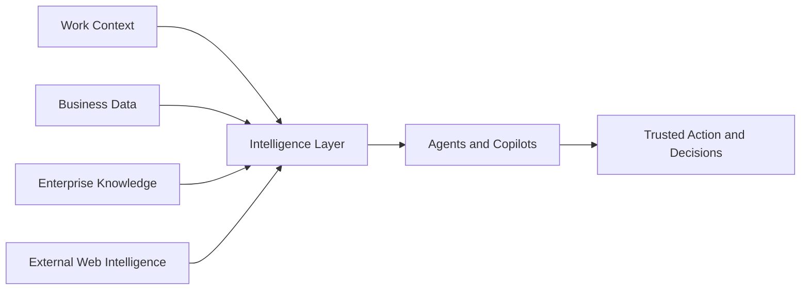

# Amplify Your Intelligence Technical Workshop - End-to-End Execution Guide

> **Audience:** Microsoft Solution Engineers, Global Black Belts, Specialists, partners, and customer technical teams  
> **Workshop level:** L300  
> **Primary theme:** Build context-aware AI solutions with Microsoft IQ across **Fabric IQ**, **Foundry IQ**, **Work IQ**, and **Web IQ**  
> **Delivery model:** Instructor-led, self-paced, or modular customer engagement  
> **Recommended duration:** Full-day or modular delivery based on customer maturity and priority use case

## 📘 Table of contents

- [1. What this workshop is about](#1-what-this-workshop-is-about)
- [2. Why this workshop matters](#2-why-this-workshop-matters)
- [3. Who should use this guide](#3-who-should-use-this-guide)
- [4. What participants will learn](#4-what-participants-will-learn)
- [5. The main idea: one intelligence layer](#5-the-main-idea-one-intelligence-layer)
- [6. The four layers of the story](#6-the-four-layers-of-the-story)
- [7. The end-to-end workshop flow](#7-the-end-to-end-workshop-flow)
- [8. Module 1: Context that enables smarter agents](#8-module-1-context-that-enables-smarter-agents)
- [9. Module 2: Quality results your business can trust](#9-module-2-quality-results-your-business-can-trust)
- [10. Suggested workshop flow for facilitators](#10-suggested-workshop-flow-for-facilitators)
- [11. Discovery questions to guide the conversation](#11-discovery-questions-to-guide-the-conversation)
- [12. Architecture whiteboarding guidance](#12-architecture-whiteboarding-guidance)
- [13. Hands-on assets and how to use them](#13-hands-on-assets-and-how-to-use-them)
- [14. Supporting assets and pitch decks](#14-supporting-assets-and-pitch-decks)
- [15. Suggested agenda for delivery](#15-suggested-agenda-for-delivery)
- [16. Prototype and MVP planning](#16-prototype-and-mvp-planning)
- [17. Practical notes for the facilitator](#17-practical-notes-for-the-facilitator)
- [18. Recommended next steps](#18-recommended-next-steps)
- [19. Summary](#19-summary)
- [20. Appendix B - Source references for facilitators](#20-appendix-b---source-references-for-facilitators)

---

## 1. What this workshop is about

Amplify Your Intelligence is a hands-on technical workshop that helps organizations move from fragmented AI experimentation to a more grounded, trusted, and useful approach.

In practical terms, the workshop answers a simple question:

> How can an organization help AI systems understand the business the way people do?

The answer is not a single product feature. It is an end-to-end approach that connects:

- Work context: what people are doing, what matters now, and how work flows
- Business data: trusted data that supports decisions and action
- Enterprise knowledge: policies, documents, processes, and expert know-how
- External intelligence: current information from the web, market, and public sources

When these are connected properly, AI becomes more relevant, more accurate, and more helpful.

---

## 2. Why this workshop matters

Many AI projects stall because the system lacks the right context.

Typical challenges include:

- Teams use different systems and tools, so information is scattered
- Business terms are defined differently in different departments
- Knowledge lives in documents, emails, chats, and processes but is not reused well
- AI tools do not understand the flow of work or the real business priorities
- Systems cannot easily use fresh external information when it matters

This workshop helps participants build a shared intelligence layer so agents and copilots can reason from a connected foundation.

---

## 3. Who should use this guide

This guide is useful for:

- Business leaders who want to understand the business value of intelligent agents
- Product owners and program managers
- Architects and solution designers
- Customer-facing technical teams
- Partners who need a narrative to explain the workshop flow

---

## 4. What participants will learn

By the end of the workshop, participants should be able to:

- Explain why context is essential for successful AI
- Describe how Microsoft IQ brings together different forms of context
- Understand the role of Fabric IQ, Foundry IQ, Work IQ, and Web IQ
- Connect a business scenario to an end-to-end architecture
- Use whiteboarding, labs, accelerators, and prototypes to move from idea to proof of value
- Identify a realistic path to a pilot or MVP

---

## 5. The main idea: one intelligence layer

The workshop is built around a simple idea:

> AI becomes much more powerful when it is grounded in the same context that people use to make decisions.

That means the solution should connect:

1. Trusted business data
2. Shared business meaning
3. Enterprise knowledge
4. Current external signals
5. Work context and process awareness

This is the foundation of the workshop.

### 5.1 🧭 Architecture at a glance

A simple way to explain the workshop to audience is to show that the solution is built around one shared layer of understanding.

In plain language:

- Work context brings in the rhythm of the business and the flow of daily work.
- Business data brings trusted facts and operational reality.
- Enterprise knowledge brings policies, procedures, and accumulated experience.
- External intelligence brings fresh signals from the outside world.
- The intelligence layer then helps AI systems act in a more informed and useful way.

### 5.2 🎯 Why this matters for business teams

This workshop is not only about technology. It is about helping people and teams make better decisions with less rework.

The business value comes from:

- faster access to context
- fewer handoffs and repeated questions
- better quality from AI-generated responses
- stronger confidence in recommendations and actions
- a clearer path from workshop outcomes to pilot or MVP

---

## 6. The four layers of the story

### 6.1 Work context
This is the layer of people, tasks, workflows, and business rhythm.

It helps answer questions such as:

- What is happening right now?
- Who owns this work?
- What action should happen next?
- What decisions are urgent?

This is where Work IQ is most relevant.

### 6.2 Business data
This is the trusted source of business truth.

It includes operational data, financial information, customer signals, and business events.

This is where Fabric IQ plays a key role.

### 6.3 Enterprise knowledge
This is the internal knowledge that helps people make better decisions.

It includes:

- Policies
- Standard operating procedures
- Product documentation
- Subject matter expertise
- Past decisions and guidance

This is where Foundry IQ helps connect agents to enterprise knowledge.

### 6.4 External web intelligence
This is current information from outside the organization.

It can include:

- Market changes
- News updates
- Regulatory information
- Supplier or competitor signals
- Public sentiment

This layer helps agents stay current and useful in dynamic situations.

---

## 7. The end-to-end workshop flow

The workshop follows a simple journey:

1. Start with a real business problem
2. Identify where context is missing or fragmented
3. Create shared business meaning
4. Connect data, knowledge, and work context
5. Add external signals where needed
6. Build agents and intelligent experiences
7. Evaluate quality and trust
8. Prototype and plan the next step

This flow is reflected in the workshop modules and the supporting assets.

---

## 8. Module 1: Context that enables smarter agents

### 8.1 Business purpose
This module helps participants see that agents become much more useful when they are grounded in real business context.

It is about moving beyond a model or a prompt and thinking about the environment the agent needs in order to behave like a helpful teammate.

### 8.2 What this module helps participants do

- Understand the importance of grounding agents in business context
- Connect work, knowledge, and data to the AI experience
- Use architecture whiteboarding to map the solution journey
- Explore reusable assets for prototype and pilot work

### 8.3 Core assets for this module

- [Execution Guide](https://microsoft.sharepoint.com/:p:/t/CAIPTechExperiencesTeam/cQpglbAX5ITQR7r8nJGA5tvGEgUDlFb5xMNzTpdTvHJGSZ1GSQ)
- [Whiteboarding Architectures](https://fy27-caip-whiteboard-experiences.azurewebsites.net/amplify)
- [Build your IQ — context across people, business & knowledge](https://accelerators.ms/)
- [Ground AI in shared business meaning](https://github.com/microsoft/microsoft-iq-solution-accelerator)
- [Fabric IQ Hands on Labs](https://aka.ms/FabricIQLab)
- [Foundry IQ Hands on Labs](https://aka.ms/foundryiqlab)
- [Work IQ Hands on Labs](https://aka.ms/workiqlab)
- [Fabric IQ GitHub Repo](https://github.com/TechExperiences/Microsoft-Fabric-and-Foundry-IQ-v2/tree/FabricIQ/Lab/Lab%20Building%20Fabric%20IQ)
- [Foundry IQ GitHub Repo](https://github.com/TechExperiences/Microsoft-Fabric-and-Foundry-IQ-v2/tree/FoundryIQ/Lab/Lab%20Building%20Foundry%20IQ)
- [Work IQ GitHub Repo](https://github.com/TechExperiences/Microsoft-Fabric-and-Foundry-IQ-v2/tree/WorkIQ/Lab/Lab%20Building%20Work%20IQ)
- [Combined Fabric + Foundry + Work IQ Repo](https://github.com/TechExperiences/Microsoft-Fabric-and-Foundry-IQ-v2/tree/FabricIQ-FoundryIQ-WorkIQ/Lab)
- [Test Drive](https://ai-solutions-lab-generator-uat.azurewebsites.net/)
- [Sample Prototype Package](https://sttechexperiencesassets.blob.core.windows.net/techexperience/Amplify_Artifacts.zip)

### 8.4 Plain-language explanation
This module answers questions like:

- What context does the agent need to be genuinely useful?
- Where is that context today and how can it be reused?
- What should be connected first to create real value?

---

## 9. Module 2: Quality results your business can trust

### 9.1 Business purpose
The second module focuses on trust, quality, and responsible AI. It helps participants move beyond experimentation and design systems that can be used with confidence.

This matters because adoption will not happen if the solution is not reliable and understandable.

### 9.2 What this module helps participants do

- Understand the need for evaluation, guardrails, and governance
- See how trust becomes a business enabler, not a technical afterthought
- Connect quality outcomes to business confidence and adoption
- Prepare for pilot readiness and MVP planning

### 9.3 Core assets for this module

- [Execution Guide](https://microsoft.sharepoint.com/:p:/t/CAIPTechExperiencesTeam/cQpglbAX5ITQR7r8nJGA5tvGEgUDlFb5xMNzTpdTvHJGSZ1GSQ)
- [Whiteboarding Architectures](https://fy27-caip-whiteboard-experiences.azurewebsites.net/amplify)
- [Build your IQ — context across people, business & knowledge](https://accelerators.ms/)
- [Ground AI in shared business meaning](https://github.com/microsoft/microsoft-iq-solution-accelerator)
- [Fabric IQ Hands on Labs](https://aka.ms/FabricIQLab)
- [Foundry IQ Hands on Labs](https://aka.ms/foundryiqlab)
- [Work IQ Hands on Labs](https://aka.ms/workiqlab)
- [Fabric IQ GitHub Repo](https://github.com/TechExperiences/Microsoft-Fabric-and-Foundry-IQ-v2/tree/FabricIQ/Lab/Lab%20Building%20Fabric%20IQ)
- [Foundry IQ GitHub Repo](https://github.com/TechExperiences/Microsoft-Fabric-and-Foundry-IQ-v2/tree/FoundryIQ/Lab/Lab%20Building%20Foundry%20IQ)
- [Work IQ GitHub Repo](https://github.com/TechExperiences/Microsoft-Fabric-and-Foundry-IQ-v2/tree/WorkIQ/Lab/Lab%20Building%20Work%20IQ)
- [Combined Fabric + Foundry + Work IQ Repo](https://github.com/TechExperiences/Microsoft-Fabric-and-Foundry-IQ-v2/tree/FabricIQ-FoundryIQ-WorkIQ/Lab)
- [Test Drive](https://ai-solutions-lab-generator-uat3.azurewebsites.net/)
- [Sample Prototype Package](https://sttechexperiencesassets.blob.core.windows.net/techexperience/Amplify_Artifacts.zip)

### 9.4 Plain-language explanation
This module helps the audience understand that a good AI experience is not only smart, but also safe, traceable, and useful in the real world.

It answers:

- How do we know the agent gives good answers?
- What happens when the information is incomplete or ambiguous?
- How do we make sure the solution can be trusted at scale?

---

## 10. Suggested workshop flow for facilitators

### 10.1 Opening narrative
Open with this simple message:

> We are not just talking about AI features. We are talking about how an organization can give AI the right context to make better decisions, improve productivity, and act with confidence.

### 10.2 Recommended sequence

1. Introduce the business problem
2. Explain why context matters
3. Show the four layers of the intelligence story
4. Walk through the architecture and whiteboard approach
5. Demonstrate the labs and accelerators
6. Move to prototype planning and next steps

### 10.3 Recommended workshop duration

- Short executive session: 60–90 minutes
- Technical workshop: 2–4 hours
- Full customer engagement: half day or full day

### 10.4 🗣️ Simple facilitator script for audience

A helpful way to introduce the workshop is:

> “Today we are not just talking about AI features. We are talking about helping an organization give AI the same kind of context that people use every day to make good decisions. We will look at how work information, business data, internal knowledge, and current external information can come together so that agents and copilots can be more useful, more trusted, and more action-oriented.”

A follow-up explanation could be:

> “If a team is trying to use AI but the system does not understand the business context, the output will often be generic or disconnected. This workshop shows how to create a stronger foundation so the experience becomes practical and grounded in real business needs.”

---

## 11. Discovery questions to guide the conversation

Use these questions with customers or stakeholders:

- Where do teams spend time re-establishing context today?
- Which business terms are not consistently defined?
- What knowledge is trapped in documents, chats, and processes?
- Where do agents need fresh information from outside the organization?
- What would make the solution trustworthy enough to use in real operations?
- What would success look like in the first pilot or prototype?

---

## 12. Architecture whiteboarding guidance

### 12.1 Objective
Co-design an architecture that maps customer business outcomes to Microsoft IQ components and supporting workloads.

### 12.2 Whiteboarding flow

1. Capture the current-state business problem
2. Identify target personas and workflows
3. List the data, knowledge, work, and external signals that matter
4. Map each context type to the right component
5. Define agent responsibilities and boundaries
6. Identify the integrations and actions that are required
7. Validate governance, identity, security, and compliance
8. Define the prototype scope and MVP success criteria

### 12.3 Suggested mapping

| Context type | Component | Example input | Example outcome |
|---|---|---|---|
| Business data and semantic meaning | Fabric IQ | Lakehouse, semantic models, ontology | Shared business concepts and trusted analytics |
| Enterprise knowledge | Foundry IQ | Policies, knowledge bases, documents | Reusable grounded responses |
| Work context | Work IQ | Emails, meetings, files, workflows | Context-aware action and coordination |
| External signals | Web IQ | News, market, regulatory inputs | Fresh source-backed grounding |
| Governance and control | Entra, Purview, Foundry | Identity, permissions, monitoring | Trusted and secure operations |

---

## 13. Hands-on assets and how to use them

### 13.1 Execution guide
Use this to walk through the workshop narrative, structure, and sequencing.

- [Execution Guide](https://microsoft.sharepoint.com/:p:/t/CAIPTechExperiencesTeam/cQpglbAX5ITQR7r8nJGA5tvGEgUDlFb5xMNzTpdTvHJGSZ1GSQ)

### 13.2 Whiteboarding architecture
Use this to help customers visualize how the solution fits together.

- [Whiteboarding Architectures](https://fy27-caip-whiteboard-experiences.azurewebsites.net/amplify)

### 13.3 Solution accelerators
These help accelerate prototyping and show how reusable patterns can shorten time to value.

- [Build your IQ — context across people, business & knowledge](https://accelerators.ms/)
- [Ground AI in shared business meaning](https://github.com/microsoft/microsoft-iq-solution-accelerator)

### 13.4 Hands-on labs
Use these to show practical implementation paths.

- [Fabric IQ Hands on Labs](https://aka.ms/FabricIQLab)
- [Foundry IQ Hands on Labs](https://aka.ms/foundryiqlab)
- [Work IQ Hands on Labs](https://aka.ms/workiqlab)

### 13.5 GitHub repositories
Use these for deeper technical exploration and reference implementation.

- [Fabric IQ GitHub Repo](https://github.com/TechExperiences/Microsoft-Fabric-and-Foundry-IQ-v2/tree/FabricIQ/Lab/Lab%20Building%20Fabric%20IQ)
- [Foundry IQ GitHub Repo](https://github.com/TechExperiences/Microsoft-Fabric-and-Foundry-IQ-v2/tree/FoundryIQ/Lab/Lab%20Building%20Foundry%20IQ)
- [Work IQ GitHub Repo](https://github.com/TechExperiences/Microsoft-Fabric-and-Foundry-IQ-v2/tree/WorkIQ/Lab/Lab%20Building%20Work%20IQ)
- [Combined Fabric + Foundry + Work IQ Repo](https://github.com/TechExperiences/Microsoft-Fabric-and-Foundry-IQ-v2/tree/FabricIQ-FoundryIQ-WorkIQ/Lab)

### 13.6 Sample prototype and test drive
Use these to bring the story to life with a working experience.

- [Test Drive](https://ai-solutions-lab-generator-uat.azurewebsites.net/)
- [Sample Prototype Package](https://sttechexperiencesassets.blob.core.windows.net/techexperience/Amplify_Artifacts.zip)

---

## 14. Supporting assets and pitch decks

These materials are helpful for narrative support, customer conversations, and executive storytelling.

### 14.1 Pitch decks

- [Fabric IQ L100 Pitch Deck](https://microsoft.seismic.com/apps/doccenter/a5266a70-9230-4c1e-a553-c5bddcb7a896/doc/%25252Fdde0caec0e-9236-f21b-2991-5868e63d3984%25252FdfYTZjNDRiZDMtMzEwZS1kNWZkLTNjOGEtNjliYWJjMjhmMmUw%25252CPT0%25253D%25252CUHJvZHVjdCBQaXRjaCBEZWNr%25252Flf3440f703-a8ce-40e3-9ac5-9c023f09cf20/?mode=view&searchId=fe504df8-8f6a-4896-90df-121e9c0999cd)
- [Foundry Agent Service L100 Pitch Deck](https://microsoft.seismic.com/apps/doccenter/a5266a70-9230-4c1e-a553-c5bddcb7a896/doc/%25252Fdde0caec0e-9236-f21b-2991-5868e63d3984%25252FdfYTZjNDRiZDMtMzEwZS1kNWZkLTNjOGEtNjliYWJjMjhmMmUw%25252CPT0%25253D%25252CUHJvZHVjdCBQaXRjaCBEZWNr%25252Flf669fec9e-6913-4977-a9e7-9e6e1e31d95a/?mode=view&searchId=fe504df8-8f6a-4896-90df-121e9c0999cd)
- [Microsoft Agent Framework L150 Pitch Deck](https://microsoft.seismic.com/apps/doccenter/a5266a70-9230-4c1e-a553-c5bddcb7a896/doc/%25252Fdde0caec0e-9236-f21b-2991-5868e63d3984%25252FdfYTZjNDRiZDMtMzEwZS1kNWZkLTNjOGEtNjliYWJjMjhmMmUw%25252CPT0%25253D%25252CUHJvZHVjdCBQaXRjaCBEZWNr%25252Flf669fec9e-6913-4977-a9e7-9e6e1e31d95a/?mode=view&searchId=fe504df8-8f6a-4896-90df-121e9c0999cd)
- [Foundry IQ L200 Pitch Deck](https://microsoft.seismic.com/apps/doccenter/a5266a70-9230-4c1e-a553-c5bddcb7a896/doc/%25252Fdde0caec0e-9236-f21b-2991-5868e63d3984%25252FdfYTZjNDRiZDMtMzEwZS1kNWZkLTNjOGEtNjliYWJjMjhmMmUw%25252CPT0%25253D%25252CUHJvZHVjdCBQaXRjaCBEZWNr%25252Flfcb2a5eab-a0a9-4172-abcf-64c678114815/?mode=view&searchId=fe504df8-8f6a-4896-90df-121e9c0999cd)
- [Building Agents with Microsoft – Customer Pitch Deck (L200)](https://microsoft.seismic.com/apps/doccenter/a5266a70-9230-4c1e-a553-c5bddcb7a896/doc/%25252Fdde0caec0e-9236-f21b-2991-5868e63d3984%25252FdfYTZjNDRiZDMtMzEwZS1kNWZkLTNjOGEtNjliYWJjMjhmMmUw%25252CPT0%25253D%25252CUHJvZHVjdCBQaXRjaCBEZWNr%25252Flfcc23e948-47d0-4645-8f6d-102615b0a5f7/?mode=view&searchId=fe504df8-8f6a-4896-90df-121e9c0999cd)

### 14.2 Demos

- [Azure Hero Demos](https://cdx.transform.microsoft.com/experience-detail/284d4172-8be4-4771-89dd-ac59c00aed3e)
- [Responsible AI Integration with AI Foundry](https://cdx.transform.microsoft.com/experience-detail/7ac8a100-a098-48d4-9f24-c3c96708164a)
- [Multi-Agent Workflows in Foundry Agent Service](https://cdx.transform.microsoft.com/experience-detail/852b3e00-4102-4f7b-aa3b-689dea1538db)
- [End-to-End Agent Control using Foundry Control Plane](https://cdx.transform.microsoft.com/experience-detail/a499ca6d-0087-4b00-a334-62a02867d086)
- [Manufacturing IQ Demo – Simulated](https://cdx.transform.microsoft.com/experience-detail/473c0aab-d1bb-46d4-887e-58f2d68210dc)
- [Manufacturing IQ Demo – Live](https://cdx.transform.microsoft.com/experience-detail/3ae07b12-f292-4944-8046-f9c94b0a2f85)
- [Retail IQ Demo – Simulated](https://cdx.transform.microsoft.com/experience-detail/2bdd2b91-f071-495b-91da-019f24e52d86)
- [Retail IQ Demo – Live](https://cdx.transform.microsoft.com/experience-detail/3717c99a-b321-4c49-9d32-1d2fa29b1537)
- [Telco IQ Demo – Simulated](https://cdx.transform.microsoft.com/experience-detail/bc2db2e9-f7ac-455e-ae8f-9ba87a8d0957)
- [Telco IQ Demo – Live](https://cdx.transform.microsoft.com/experience-detail/7a795c50-e124-4b88-adba-ce3bece21bf3)
- [FSI IQ Demo – Simulated](https://cdx.transform.microsoft.com/experience-detail/38e7a8c9-93ae-4c45-ae11-95249362f193)
- [FSI IQ Demo – Live](https://cdx.transform.microsoft.com/experience-detail/ff60de3a-31b7-48d8-b6d5-bc60d32e9021)

---

## 15. Suggested agenda for delivery

### 15.1 Executive-style version
- 5 minutes: What problem are we solving?
- 10 minutes: Why context matters for AI
- 15 minutes: How Fabric IQ, Foundry IQ, Work IQ, and Web IQ fit together
- 15 minutes: Whiteboard the solution journey
- 10 minutes: Show the demo and prototype assets
- 5 minutes: Close with next steps and pilot ideas

### 15.2 Technical workshop version
- 15 minutes: Business context and workshop goals
- 20 minutes: Architecture discussion and whiteboarding
- 30 minutes: Lab walkthrough or hands-on module selection
- 20 minutes: Prototype and accelerators review
- 15 minutes: Trust, governance, and MVP planning

---

## 16. Prototype and MVP planning

### 16.1 When to use a prototype path
Use a prototype path when the customer wants to validate the idea quickly without committing to a full deployment.

### 16.2 MVP checklist

| Area | Questions to answer |
|---|---|
| Business outcome | What business decision or workflow will improve? |
| Users | Who will use this first? |
| Data | What data sources are required? |
| Knowledge | What documents or policies are required? |
| Work context | What workflows, tasks, or Microsoft 365 context matter? |
| External signals | What web or market signals are needed? |
| Security | What controls are required? |
| Success measure | How will the pilot be measured? |
| Owner | Who owns each workstream? |

### 16.3 Suggested closing message

> The goal is not just to show a new AI capability. The goal is to help the organization create a foundation where agents can reason with the same context that people use to make good decisions.

---

## 17. Practical notes for the facilitator

- Keep the story simple and business-oriented
- Translate technical concepts into everyday language
- Connect each component to a business need
- Focus on the journey from fragmented context to trusted action
- Use the assets as navigation tools, not as a script
- Leave time for discussion because the architecture conversation is often the most valuable part of the workshop

---

## 18. Recommended next steps

After the workshop, the next phase should focus on one of the following paths:

- Prototype path: use the labs, accelerators, and sample assets to create a working experience
- Pilot path: validate the solution with real users and a narrow business scenario
- MVP path: move from proof of concept to a structured, governed implementation plan
- Enablement path: train teams on the architecture, assets, and delivery model

---

## 19. Summary

Amplify Your Intelligence is a workshop about building the right foundation for AI adoption. It helps organizations move from disconnected tools and fragmented context to a connected, trusted, and useful intelligence experience.

The core message is simple:

> Better context leads to better decisions, better agents, and better business outcomes.

---

## 20. Appendix B - Source references for facilitators

Use these only as facilitator references and validate access before delivery.

- CAIP Technical Workshops site: https://aka.ms/AmplifyTechWorkshops
- CAIP whiteboards: https://aka.ms/CAIPWhiteboards
- DREAM whiteboards: https://aka.ms/DREAMWhiteboards
- Microsoft IQ: aka.ms/MicrosoftIQ
- Work IQ: aka.ms/WorkIQ
- Fabric IQ: aka.ms/FabricIQ
- Foundry IQ: aka.ms/FoundryIQ
- Web IQ: aka.ms/WebIQ
- Fabric IQ lab: https://aka.ms/fabriciqlab
- Foundry IQ lab: https://aka.ms/foundryiqlab
- Work IQ lab: https://aka.ms/WorkIQLab
- Microsoft IQ solution accelerator GitHub: https://github.com/microsoft/microsoft-iq-solution-accelerator
- Microsoft Learn KQL reference structure: https://learn.microsoft.com/en-us/training/modules/query-data-kql-database-microsoft-fabric/1-introduction

---
