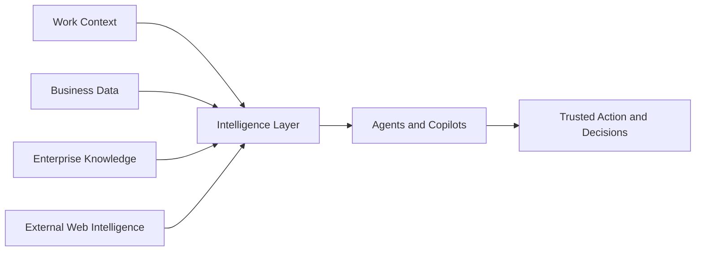

# Update Plan

This file is intended as the next version of the execution guide.

## Source Integration Strategy

- Use the existing Markdown as the base.

- Expand every workshop module with the corresponding content from the guidance deck.

- Preserve all links, GitHub repositories, HOLs, whiteboards, demos, accelerators, and workshop assets.

- Add facilitator guidance, execution flow, discovery questions, business outcomes, architecture guidance, rapid prototyping, MVP guidance, and CTA.

## Example Expansion – Fabric IQ Hands-on Lab

- Establish a governed data foundation in OneLake.

- Ingest batch, historical, and streaming data using Lakehouse and Eventhouse.

- Define entities and relationships through a Fabric IQ ontology.

- Apply real-time signals to enrich business context.

- Enable natural-language interaction through Fabric Data Agents.

## PDF Structure Detected

- Page 1: Amplify your Intelligence Technical Workshop  Execution Guidance Deck A hands-on Technical Workshop to architect end -to-end solutions that unify work context, business data, enterprise knowledge, and external web intelligence into a single intellige...

- Page 2: Amplify Your  Intelligence  Workshop Agenda 2 Activities: • Build Prototypes and/or MVPs faster with: • Whiteboarding • HOLs  • Solution Accelerators • GitHub Repos • Rapid Prototyping • MVPs • Technical Workshops Overview for the sellers • Amplify y...

- Page 3: Technical Workshops Overview for the Sellers

- Page 4: AI 02.24 DE (POC) Yellow FFB900 Green #8DE971 Light Red #FFB3BB Teal #49C5B1 Ligh Magenta #D59ED7 Light Blue #8DC8E8 Magenta #C03BC4 Blue #0078D4 Dark Purple #444791 Light Purple #9299F7 Purple #5B5Fc7 Pure Black #000000 Warm White #FFF8F3 Technical ...

- Page 5: W O R KS H O P  D E E P  D I V E Example Technical Workshop L200 DISCUSSION TECHNICAL WORKSHOP Pre-requisites Specialist gathers the inputs  that SEs need to scope and run  a successful workshop. • Expected timelines and technical  success metrics • ...

- Page 6: Workshop purpose Purpose This workshop helps technical teams design and deliver integrated  Microsoft IQ solutions that unify work context, business data, enterprise  knowledge, and external web intelligence into a single intelligence layer. Particip...

- Page 7: B E F O R E  Y O U  B E G I N Audience & pre-work Recommended audience who will  deliver these workshops: Microsoft Solution Engineers,  GBBs, other FTEs Partners Pre-work & inputs needed Access to the hosted workshop environment (pre-configured). Su...

- Page 8: T H E  A R C How the workshop unfolds 1 Ground Start in a real customer  scenario and explore how  fragmented context limits  the impact of AI. ›  2 Introduce Introduce Microsoft IQ and  its core components  including demos - Fabric  IQ, Foundry IQ, ...

- Page 9: Execution guidance for the sellers 1 Ground in the scenario Confirm the business problem, priority use case, target users,  and success criteria first. 2 Introduce and Qualify with  discovery Introduce Microsoft IQ and its core components including  ...

- Page 10: D I S C O V E R Y Core discovery questions 1 CR O S S-CU T T I NG Where is fragmented context — across how people work, how the business operates, and what systems know - preventing AI  from delivering on its full promise? 2 W O RK How much time do t...

- Page 11: Technical Workshop- Amplify your Intelligence  Technical Workshop modules Workshop  Package Outcomes Scenario modules Module Description Lead product(s)/Workloads Amplify your  intelligence Context that enables  smarter agents  (Context) Build your I...

- Page 12: Build Context-Aware AI Solutions with Microsoft IQ AMPLIFY  YOUR I NTELL IGENCE L300 WHA T IT IS Amplify Your Intelligence helps technical teams design, prototype, and validate AI solutions grounded in work context, busine ss data, enterprise knowled...

- Page 13: Technical Workshops Site Content Overview

- Page 14: CAIP Technical Workshop Site Overview of the site This site provides a “one stop shop” experience for sellers to: 1. Identify the conversation/s most relevant for their customers business  outcomes 2. Search for execution guides, HOLs and any other c...

- Page 15: Now available for Sellers: T echnical Envisioning Whiteboard OLT! Technical Envisioning Whiteboard Practice:  Unify Your Data Platform  This field-built and field-tested on-demand course gives Solution Engineers (SE) the opportunity to  refresh and t...

---

## Existing Markdown (preserved below)

# Amplify Your Intelligence Technical Workshop - End-to-End Execution Guide (v2)

> **Audience:** Microsoft Solution Engineers, Global Black Belts, Specialists, Partners, and Customer Technical/Business Teams   
> **Workshop Level:** L300 (Translating Deep Technical Capabilities into Strategic Business Value)   
> **Primary Theme:** Building context-aware, trusted AI solutions with Microsoft IQ across Fabric IQ, Foundry IQ, Work IQ, and Web IQ   
> **Delivery Model:** Instructor-led, self-paced, or modular customer engagement   
---

## 🌟 Executive Summary & Welcome

Welcome to the **Amplify Your Intelligence Technical Workshop Execution Guide**. Whether you are a business leader, a project manager, or a solution architect, this guide will help you understand how to move enterprise AI from a simple chatbot to a highly capable, autonomous corporate assistant.

> 💡 In short, most enterprise AI projects stall because the AI lacks context. It may be able to chat, but it may not understand your company’s specific definitions, your standard operating procedures, who owns which responsibilities, or what is happening in the market right now.

**Microsoft IQ** addresses this by creating a single, shared "intelligence layer." This guide explains the full workshop in plain English, helping non-technical stakeholders understand what is being built, why it matters, and how to navigate the supporting assets, interactive demos, hands-on labs, and solution accelerators.

---

## 🗂️ Table of Contents

1. [Workshop Overview](#workshop-overview)
2. [The Core Concept: What is Microsoft IQ?](#microsoft-iq)
3. [Workshop Structure & Navigation Matrix](#workshop-structure-navigation-matrix)
4. [Target Audience & Required Inputs](#target-audience-required-inputs)
5. [Learning Objectives & Expected Outcomes](#learning-objectives-expected-outcomes)
6. [Business Scenario & Personas: The Retail Disruption Case](#business-scenario-personas-the-retail-disruption-case)
7. [Workshop Execution Models & Agendas](#workshop-execution-models-agendas)
8. [Discovery & Architecture Whiteboarding Framework](#discovery-architecture-whiteboarding-framework)
9. [Deep Dive: Pillar 1 - Context that Enables Smarter Agents](#pillar-1-context-that-enables-smarter-agents)
10. [Deep Dive: Pillar 2 - Quality Results Your Business Can Trust](#pillar-2-quality-results-your-business-can-trust)
11. [Supporting Assets: Pitch Decks & Interactive Demos](#supporting-assets-pitch-decks-interactive-demos)
12. [Hands-On Labs Walkthrough](#hands-on-labs-walkthrough)
13. [Rapid Prototyping & MVP Planning](#rapid-prototyping-mvp-planning)
14. [Troubleshooting, Risks, & Delivery Notes](#troubleshooting-risks-delivery-notes)
15. [Facilitator Delivery Playbook](#facilitator-delivery-playbook)
16. [Final Call to Action & Next Steps](#final-call-to-action-next-steps)
17. [Appendix B - Source References for Facilitators](#appendix-b-source-references-for-facilitators)

---

## 1. Workshop Overview

### 1.1 🌟 What This Workshop Is
The **Amplify Your Intelligence** workshop is a guided session designed to move an organization from a fuzzy business problem to a clear, working AI prototype. Think of it as a bridge between business leaders, who understand the problems, and engineers, who know how to build the solution. It combines interactive architecture discussions, real-world scenario simulations, and pre-built code templates to help your company create AI tools that are grounded in your actual business data.

### 1.2 🎯 Workshop Purpose
AI solutions frequently fail because they are built in silos. The data team builds a data warehouse, the software team builds an app, and the operations team writes policy documents. The AI is left in the middle, without the full picture. This workshop helps technical and business teams:
* 🔎 Identify where fragmented information is slowing down decisions.
* 🧩 See how a unified intelligence layer can connect these dots.
* 🗺️ Design a conceptual visual map (architecture) of how these tools fit together.
* ⚡ Deploy operational code templates to launch a trial version (Minimum Viable Product or MVP) quickly.

### 1.3 🧭 Workshop Positioning Statement
Instead of building isolated chatbots that constantly forget who you are or what your data means, this workshop teaches you to unify your company’s files, databases, human workflows, and external web research into a shared corporate memory layer. The result is an ecosystem of AI agents that provide accurate answers, make consistent decisions, and take secure actions.

---

## 2. The Core Concept: What is Microsoft IQ?

To understand this workshop, you don't need to know how to write code. You just need to understand the four core pillars of **Microsoft IQ**, which act like different departments in a human company.

### 2.1 🧠 Fabric IQ: The Data Brain
* **What it is in simple terms:** Fabric IQ is the part of the AI that connects directly to your company’s databases, sales spreadsheets, and live inventory systems. 
* **The problem it solves:** Normally, an AI does not know the difference between "net profit" and "gross revenue" unless you explain it every single time. 
* **Key concept (ontology):** Fabric IQ uses an *ontology*. Think of an ontology as a company blueprint or a family tree. It tells the AI: *"A store has a manager, a store contains inventory, and if inventory drops below critical levels, it creates an operational risk."* This common map helps ensure the AI never misinterprets your corporate data.

### 2.2 📚 Foundry IQ: The Corporate Library
* **What it is in simple terms:** Foundry IQ is where your company’s documents, rulebooks, policies, and text knowledge live. 
* **The problem it solves:** If an employee asks an AI, *"What is our policy on replacing a broken refrigerator in a retail store?"*, the AI should not guess or make up an answer. 
* **How it works:** It uses a pattern called *RAG (Retrieval-Augmented Generation)*, which simply means: *"Look up the answer in our official PDF manual before answering."* It also includes strict safety guardrails so the AI does not leak private information.

### 2.3 ⚙️ Work IQ: The Operations Manager
* **What it is in simple terms:** Work IQ is the operational muscle. It connects the AI directly to Microsoft 365 tools such as Outlook, Teams, Word, and Excel.
* **The problem it solves:** Most AI tools can tell you what is wrong, but they cannot fix it. You still have to copy the answer, open Outlook, write an email, and send it yourself.
* **How it works:** Work IQ gives the AI the authority to act. If an inventory crisis is detected, Work IQ allows the AI to draft an emergency alert email to the store manager, create a calendar invite for a sync meeting, and track tasks in Teams automatically.

### 2.4 🌐 Web IQ: The Digital Researcher
* **What it is in simple terms:** Web IQ is the AI’s window to the live outside world. 
* **The problem it solves:** Enterprise data tells you what happened inside your walls yesterday, but it will not tell you that a major storm is hitting your supplier’s shipping port right now.
* **How it works:** Web IQ safely searches the internet for fresh news, weather conditions, supplier issues, or competitor changes, providing the AI with live evidence to adjust its internal decisions.

### 2.5 🧭 Architecture at a Glance
A simple way to explain the workshop to an audience is to show that the solution is built around one shared layer of understanding.

In plain language:
- Work context brings in the rhythm of the business and the flow of daily work.
- Business data brings trusted facts and operational reality.
- Enterprise knowledge brings policies, procedures, and accumulated experience.
- External intelligence brings fresh signals from the outside world.
- The intelligence layer then helps AI systems act in a more informed and useful way.

### 2.6 🎯 Why This Matters for Business Teams
This workshop is not only about technology. It is about helping people and teams make better decisions with less rework.

The business value comes from:
- faster access to context
- fewer handoffs and repeated questions
- better quality from AI-generated responses
- stronger confidence in recommendations and actions
- a clearer path from workshop outcomes to pilot or MVP

---

## 3. Workshop Structure & Navigation Matrix

The workshop is organized systematically into two major strategic pillars (Context and Trust) supported by pre-built resources. Below is your master navigation map containing all the direct internal links to the deployment repositories and guides.

| Workshop Component | Target Objective | Key Master Asset Link |
|---|---|---|
| **Pillar 1: Context** | Grounding AI in business meaning and data streams | [Execution Guide App Link](https://microsoft.sharepoint.com/:p:/t/CAIPTechExperiencesTeam/cQpglbAX5ITQR7r8nJGA5tvGEgUDlFb5xMNzTpdTvHJGSZ1GSQ)  |
| **Pillar 2: Trust** | Safety evaluation, guardrails, and compliance | [Trust Execution Guide](https://microsoft.sharepoint.com/:p:/t/CAIPTechExperiencesTeam/cQpglbAX5ITQR7r8nJGA5tvGEgUDlFb5xMNzTpdTvHJGSZ1GSQ)  |
| **Architectural Visuals** | Interactive design layouts for whiteboarding | [Visual Envisioning Whiteboard](https://fy27-caip-whiteboard-experiences.azurewebsites.net/amplify)  |
| **Fabric IQ Lab** | Technical practice building data foundations | [Fabric IQ Hands-on Lab](https://aka.ms/FabricIQLab)  |
| **Foundry IQ Lab** | Technical practice building knowledge libraries | [Foundry IQ Hands-on Lab](https://aka.ms/foundryiqlab)  |
| **Work IQ Lab** | Technical practice building workflow automations | [Work IQ Hands-on Lab](https://aka.ms/workiqlab)  |
| **Fabric Code Base** | Raw engineering blueprints for Fabric data | [Fabric IQ GitHub Repository](https://github.com/TechExperiences/Microsoft-Fabric-and-Foundry-IQ-v2/tree/FabricIQ/Lab/Lab%20Building%20Fabric%20IQ)  |
| **Foundry Code Base** | Raw engineering blueprints for AI configuration | [Foundry IQ GitHub Repository](https://github.com/TechExperiences/Microsoft-Fabric-and-Foundry-IQ-v2/tree/FoundryIQ/Lab/Lab%20Building%20Foundry%20IQ)  |
| **Work Code Base** | Raw engineering blueprints for office integration | [Work IQ GitHub Repository](https://github.com/TechExperiences/Microsoft-Fabric-and-Foundry-IQ-v2/tree/WorkIQ/Lab/Lab%20Building%20Work%20IQ)  |
| **Full Combined Code** | Unified end-to-end multi-agent environment | [Complete Microsoft IQ GitHub Repo](https://github.com/TechExperiences/Microsoft-Fabric-and-Foundry-IQ-v2/tree/FabricIQ-FoundryIQ-WorkIQ/Lab)  |
| **Interactive Test Drive** | Live clickable browser sandbox environment | [Pillar 1 Live Prototype Sandbox](https://ai-solutions-lab-generator-uat.azurewebsites.net/)  |
| **Trust Test Drive** | Live clickable guardrail evaluation playground | [Pillar 2 Live Trust Sandbox](https://caip-tech-workshops.azurewebsites.net/)  |
| **Downloadable Assets** | Pre-packed blueprint zip with exercise assets | [Amplify Artifacts Package (.zip Download)](https://sttechexperiencesassets.blob.core.windows.net/techexperience/Amplify_Artifacts.zip)  |

---

## 4. Target Audience & Required Inputs

### 4.1 👥 Who Should Participate?
This workshop is not intended only for computer scientists. It is most effective when it brings together a mixed group of people:
1.  **Business Owners & Operations Leads:** The people who understand which processes are broken and what information they need faster.
2.  **Data Engineers & Architects:** The people who manage the company’s databases and spreadsheets.
3.  **AI/Software Engineers:** The people who build applications and connect systems together.
4.  **Solution Engineers & Facilitators:** The guides who help orchestrate the workshop design path.

### 4.2 🧾 Required Inputs Before the Session Begins
To get the most out of this session, participants should gather a few key business inputs beforehand:
* **The Focus Scenario:** A real business problem (for example, "Our order delivery system breaks whenever there is bad weather, and it takes us four hours to notify customers manually").
* **Target Users:** The exact personas who will interact with the solution (for example, store managers or customer support representatives).
* **Information Sources:** A clear list of where your documentation and data live (for example, SharePoint folders, SQL databases, or public news feeds).
* **Rules & Compliance Guidelines:** Any privacy restrictions (for example, "The AI must never see credit card numbers or personal identity details").

---

## 5. 🎯 Learning Objectives & Expected Outcomes

By the end of this journey, both non-technical and technical participants will be able to achieve the following milestones:
* **Spot Context Gaps:** You will be able to look at any broken corporate process and say, *"The AI failed here because it has a Fabric IQ data gap or a Work IQ communication gap."* 
* **Co-Design a Visual Blueprint:** You will collaborate on an architectural drawing that shows exactly how data flows from a raw document to an automated email action.
* **Build a Tangible Test Run:** Through guided exercises, you will deploy a basic working version of these agents that can talk, search, and send tasks.
* **Formulate an MVP (Minimum Viable Product) Action Plan:** You will leave with a practical checklist that defines what to build in the next 30 days, who owns it, and how to measure success.

---

## 6. 🌐 Business Scenario & Personas: The Retail Disruption Case

To keep the workshop practical, everything is framed through a real-world story. Let’s look at the company case study used throughout the exercises.

### 6.1 🧭 The Scenario Overview
Imagine a large retail company with hundreds of physical stores. A massive thunderstorm hits a regional distribution hub. Delivery trucks are delayed, causing refrigeration units to fail and inventory for milk and ice cream to drop to zero. 

* **The Old Way:** The store manager does not know why the truck has not arrived. She calls the corporate office. Corporate looks at a logistics dashboard. The safety team reviews the refrigeration manual to see whether the food is spoiled. Hours pass. Customers face empty shelves, and the company loses thousands of dollars because of slow coordination.
* **The Microsoft IQ Way:** An automated data monitor detects the supply line failure. It passes this to an intelligence layer. The system automatically reads the safety manual, looks up the store manager’s schedule, drafts an advisory notice, and coordinates a replacement shipment automatically.

### 6.2 👥 The Characters (Personas)
We follow four key personas during the workshop exercises:
* **Ashley (Store Manager):** Needs clear, prioritized action text when operational disruptions happen.
* **Eva (Data Engineer):** Needs clean, organized data maps to feed the AI brains correctly.
* **Miguel (AI System Engineer):** Needs safe, non-hallucinating models with strict compliance guardrails.
* **Operations Lead:** Business executive who requires lower operational costs, faster response times, and higher customer trust.

---

## 7. 🗓️ Workshop Execution Models & Agendas

Organizations have different amounts of time and maturity levels. The workshop can be configured in three flexible ways.

### 7.1 🧭 End-to-End Workshop Flow
The workshop follows a simple journey:
1. Start with a real business problem.
2. Identify where context is missing or fragmented.
3. Create shared business meaning.
4. Connect data, knowledge, and work context.
5. Add external signals where needed.
6. Build agents and intelligent experiences.
7. Evaluate quality and trust.
8. Prototype and plan the next step.

This flow is reflected in the workshop modules, the labs, and the supporting assets.

### 7.2 🧭 Option 1: The Full-Day Engagement (7.5 Hours)
Best for teams ready to design an architectural solution and complete real code labs on the same day.
* **Hour 0.0 - 0.5:** Welcome, goals setup, and aligning on the business problem.
* **Hour 0.5 - 1.0:** Introduction to Microsoft IQ concepts in simple terms.
* **Hour 1.0 - 2.0:** Context Gap Assessment (Discovery game to find where information is broken).
* **Hour 2.0 - 3.0:** Whiteboarding Session (Drawing the visual layout of your new AI solution).
* **Hour 3.0 - 4.5:** Hands-on Exercise 1 (Building the Data and Meaning Layer with Fabric IQ).
* **Hour 4.5 - 6.0:** Hands-on Exercise 2 (Building the Knowledge Library and Rules with Foundry IQ).
* **Hour 6.0 - 6.75:** Rapid Prototyping (Selecting pre-built templates to assemble the final product).
* **Hour 6.75 - 7.25:** MVP Planning (Assigning deadlines, owners, and building the pilot roadmap).
* **Hour 7.25 - 7.5:** Action Closing (Final commitment and scheduling the follow-up review).

### 7.3 🏢 Option 2: The Half-Day Executive Briefing (3.5 Hours)
Best for business executives who want to understand the technology and design the visual concept, but will delegate the actual coding labs to their engineering teams later.
* **0:00 - 0:30:** High-level executive story pitch and business challenge framing.
* **0:30 - 1:00:** The Core Value Flow: How Work, Fabric, Foundry, and Web IQ integrate.
* **1:00 - 1:45:** Visual Whiteboarding (Mapping out your company’s high-priority workflow).
* **1:45 - 2:45:** Live Interactive Demonstration (Clicking through real pre-built retail scenario solutions).
* **2:45 - 3:30:** Strategic Roadmap Session (Defining MVP boundaries and immediate next actions).

### 7.4 🧩 Option 3: Modular Delivery Track
If your company is struggling with one specific bottleneck, you can run isolated 90-minute sub-workshops:
* **Fabric IQ Session:** Focus strictly on cleaning up messy business terms and real-time streaming data tracking.
* **Foundry IQ Session:** Focus strictly on legal document search, AI evaluation safety, and multi-agent coordination.
* **Work IQ Session:** Focus strictly on office automation, Outlook email drafting, and Microsoft 365 action triggers.

---

## 8. 🧠 Discovery & Architecture Whiteboarding Framework

Before writing code, teams must sit at a digital or physical whiteboard. This section outlines the exact human conversation structure to lead.

### 8.1 ❓ The Core Discovery Questions
To find where your organization is bleeding time and money, ask these questions during the envisioning hour:
1.  **The Context Fragmentation Gap:** *"When a critical business disruption happens, how many separate screens, emails, and dashboards does an employee have to open to understand what is going on?"* 
2.  **The Language Definition Gap:** *"Do our systems all mean the same thing when they look at a term like 'High Risk Product' or 'Delayed Status'?"* 
3.  **The Reusability Gap:** *"Are we building a separate custom AI tool for every small problem, or can we build one shared enterprise library that handles all customer queries?"* 
4.  **The Live Information Gap:** *"Does our AI make blind decisions based on old data, or does it have the power to look at real-time external realities like changing weather or supply chain news?"* 

### 8.2 🗺️ The Mapping Strategy
Draw four columns on the whiteboard and connect them with arrows:
* **Column A (Inputs):** Where does raw reality live? (for example, shipping spreadsheets, policy PDFs, or Teams chats).
* **Column B (The Intelligence Layers):** Which IQ piece manages it? (Numbers → Fabric IQ, PDFs → Foundry IQ, Chats → Work IQ).
* **Column C (The Logic Brains):** What must the AI calculate? (for example, calculate food spoilage risk based on elapsed transit time).
* **Column D (The Outcomes):** What action happens in the real office? (for example, send a red-flag alert email to Ashley the Store Manager).

---

## 9. 🧱 Deep Dive: Pillar 1 - Context that Enables Smarter Agents

Now let’s examine the first major track of the workshop as outlined in the module flow blueprints. This pillar focuses entirely on making sure your AI is not clueless about your business setup.

### 9.1 🎯 Strategic Objective
The purpose of this module is to move away from isolated AI bots and create a foundational system that grows smarter over time. Every time you clean up a data dictionary, update a policy document, or add a team member, the AI automatically absorbs that structural update.

### 9.2 🛠️ What Gets Built and Validated
During this phase of the workshop, participants use the [Pillar 1 Live Prototype Sandbox](https://ai-solutions-lab-generator-uat.azurewebsites.net/) and the raw assets inside the [Amplify Artifacts Package (.zip Download)](https://sttechexperiencesassets.blob.core.windows.net/techexperience/Amplify_Artifacts.zip) to experience a live end-to-end prototype. 

You will witness how an operational agent dynamically reads a simulated business environment:
* **Step 1:** The system ingests operational store metrics.
* **Step 2:** An automated network map connects these metrics to product inventories.
* **Step 3:** The AI uses the organizational structure map to find the correct point of contact and formulate a smart response.

### 9.3 📦 Master Asset Resources for Pillar 1
To deliver or walk through this pillar, engineers and business teams use these explicit assets:
* **The Strategic Roadmap:** Access the full [Execution Guide App Link](https://microsoft.sharepoint.com/:p:/t/CAIPTechExperiencesTeam/cQpglbAX5ITQR7r8nJGA5tvGEgUDlFb5xMNzTpdTvHJGSZ1GSQ) to align presentation slides and talk tracks.
* **The Blueprint Accelerators:** Use the [Enterprise IQ Context Accelerator Site](https://accelerators.ms/) and the [Shared Business Meaning Accelerator Repo](https://github.com/microsoft/microsoft-iq-solution-accelerator) to download production-tested code frameworks that connect Fabric data to Foundry models.

---

## 10. 🛡️ Deep Dive: Pillar 2 - Quality Results Your Business Can Trust

Context is useless if the AI behaves like an unguided rocket. Pillar 2 focuses entirely on safety, validation, accuracy, and enterprise reliability.

### 10.1 🎯 Strategic Objective
If an AI agent accidentally emails a customer incorrect pricing or leaks sensitive HR records to an external vendor, the business faces massive legal and financial liability. This pillar ensures that the system includes strict guardrails, automated accuracy test scores, and transparent tracking.

### 10.2 🧪 What Gets Built and Validated
Participants leverage the [Pillar 2 Live Trust Sandbox](https://ai-solutions-lab-generator-uat.azurewebsites.net/) to explore how corporate AI operations are strictly governed:
* **Automated Evaluation Checkpoints:** Every answer generated by the AI is scored on a scale from 0 to 1 for "Groundedness" (Is it actually backed by a real company manual?) and "Relevance" (Did it actually answer the user’s specific problem?).
* **Safety Filtering:** If a user tries to trick the AI into giving away confidential corporate secrets, a defense filter instantly blocks the request.
* **Audit Trails:** Business leaders can look at an execution dashboard to see exactly why an agent chose a specific action, ensuring everything is auditable and transparent.

### 10.3 📦 Master Asset Resources for Pillar 2
* **Trust Architecture Layout:** Use the [Visual Envisioning Whiteboard](https://fy27-caip-whiteboard-experiences.azurewebsites.net/amplify) to design how your company’s security filters sit between your company records and the AI models.
* **Full End-to-End Governance Blueprint:** Engineers can jump directly to the [Complete Microsoft IQ GitHub Repo](https://github.com/TechExperiences/Microsoft-Fabric-and-Foundry-IQ-v2/tree/FabricIQ-FoundryIQ-WorkIQ/Lab) to inspect pre-written Python code structures designed to execute automated model evaluation and prevent text hallucinations.

---

## 11. 📚 Supporting Assets: Pitch Decks & Interactive Demos

To help sell these ideas inside your company, the workshop provides pre-packaged presentation resources and clickable, high-fidelity mock environments.

### 11.1 🎤 Narrative Pitch Decks
These materials are located within core corporate storage libraries and help explain technical concepts to different audiences:
* [Fabric IQ L100 Pitch Deck](https://microsoft.seismic.com/apps/doccenter/a5266a70-9230-4c1e-a553-c5bddcb7a896/doc/%25252Fdde0caec0e-9236-f21b-2991-5868e63d3984%25252FdfYTZjNDRiZDMtMzEwZS1kNWZkLTNjOGEtNjliYWJjMjhmMmUw%25252CPT0%25253D%25252CUHJvZHVjdCBQaXRjaCBEZWNr%25252Flf3440f703-a8ce-40e3-9ac5-9c023f09cf20/?mode=view&searchId=fe504df8-8f6a-4896-90df-121e9c0999cd): Introduces data democratization and live analytics fundamentals to business executives.
* [Foundry Agent Service L100 Pitch Deck](https://microsoft.seismic.com/apps/doccenter/a5266a70-9230-4c1e-a553-c5bddcb7a896/doc/%25252Fdde0caec0e-9236-f21b-2991-5868e63d3984%25252FdfYTZjNDRiZDMtMzEwZS1kNWZkLTNjOGEtNjliYWJjMjhmMmUw%25252CPT0%25253D%25252CUHJvZHVjdCBQaXRjaCBEZWNr%25252Flf669fec9e-6913-4977-a9e7-9e6e1e31d95a/?mode=view&searchId=fe504df8-8f6a-4896-90df-121e9c0999cd): Explains how autonomous software agents act as virtual coworkers.
* [Microsoft Agent Framework L150 Pitch Deck](https://microsoft.seismic.com/apps/doccenter/a5266a70-9230-4c1e-a553-c5bddcb7a896/doc/%25252Fdde0caec0e-9236-f21b-2991-5868e63d3984%25252FdfYTZjNDRiZDMtMzEwZS1kNWZkLTNjOGEtNjliYWJjMjhmMmUw%25252CPT0%25253D%25252CUHJvZHVjdCBQaXRjaCBEZWNr%25252Flf669fec9e-6913-4977-a9e7-9e6e1e31d95a/?mode=view&searchId=fe504df8-8f6a-4896-90df-121e9c0999cd): Provides a mid-level technical breakdown of multi-agent handoffs.
* [Foundry IQ L200 Pitch Deck](https://microsoft.seismic.com/apps/doccenter/a5266a70-9230-4c1e-a553-c5bddcb7a896/doc/%25252Fdde0caec0e-9236-f21b-2991-5868e63d3984%25252FdfYTZjNDRiZDMtMzEwZS1kNWZkLTNjOGEtNjliYWJjMjhmMmUw%25252CPT0%25253D%25252CUHJvZHVjdCBQaXRjaCBEZWNr%25252Flfcb2a5eab-a0a9-4172-abcf-64c678114815/?mode=view&searchId=fe504df8-8f6a-4896-90df-121e9c0999cd): A deeper engineering look at Azure AI Foundry's enterprise toolsets.
* [Building Agents with Microsoft Customer Pitch Deck (L200)](https://microsoft.seismic.com/apps/doccenter/a5266a70-9230-4c1e-a553-c5bddcb7a896/doc/%25252Fdde0caec0e-9236-f21b-2991-5868e63d3984%25252FdfYTZjNDRiZDMtMzEwZS1kNWZkLTNjOGEtNjliYWJjMjhmMmUw%25252CPT0%25253D%25252CUHJvZHVjdCBQaXRjaCBEZWNr%25252Flfcc23e948-47d0-4645-8f6d-102615b0a5f7/?mode=view&searchId=fe504df8-8f6a-4896-90df-121e9c0999cd): An architectural review mapping out code libraries and deployment steps.

### 11.2 🖱️ Core Platform Demos
Click through these interactive sandbox experiences to see the platform features live:
* [Azure Hero Interactive Experience](https://cdx.transform.microsoft.com/experience-detail/284d4172-8be4-4771-89dd-ac59c00aed3e): Clickable overview of primary data and AI workflows.
* [Responsible AI Control Center](https://cdx.transform.microsoft.com/experience-detail/7ac8a100-a098-48d4-9f24-c3c96708164a): Visual sandbox demonstrating live model content filtering and toxicity guardrails.
* [Multi-Agent Workflow Simulation](https://cdx.transform.microsoft.com/experience-detail/852b3e00-4102-4f7b-aa3b-689dea1538db): Interactive interface showing how different AI agents delegate sub-tasks to each other.
* [Foundry Governance Control Plane](https://cdx.transform.microsoft.com/experience-detail/a499ca6d-0087-4b00-a334-62a02867d086): Executive administrative screen dashboard for cost, security, and access metrics tracking.

### 11.3 🏭 Industry Vertical Deep Dives
These links provide access to tailored environments demonstrating pre-built sector scenarios:
* **Manufacturing IQ (Factory Operations & Asset Management):**
    * [Simulated Manufacturing Factory Automation Sandbox](https://cdx.transform.microsoft.com/experience-detail/473c0aab-d1bb-46d4-887e-58f2d68210dc) 
    * [Live Active Manufacturing Data Pipeline Stream](https://cdx.transform.microsoft.com/experience-detail/3ae07b12-f292-4944-8046-f9c94b0a2f85) 
* **Retail IQ (Inventory Optimizations & Disruption Handling):**
    * [Simulated Retail Assistant Store Sandbox](https://cdx.transform.microsoft.com/experience-detail/2bdd2b91-f071-495b-91da-019f24e52d86) 
    * [Live Active Retail Operations Stream](https://cdx.transform.microsoft.com/experience-detail/3717c99a-b321-4c49-9d32-1d2fa29b1537) 
* **Telco IQ (Network Infrastructure Management & Remediation):**
    * [Simulated Telco Outage Analysis Operations Sandbox](https://cdx.transform.microsoft.com/experience-detail/bc2db2e9-f7ac-455e-ae8f-9ba87a8d0957) 
    * [Live Active Telecommunications Infrastructure Stream](https://cdx.transform.microsoft.com/experience-detail/7a795c50-e124-4b88-adba-ce3bece21bf3) 
* **Financial Services (FSI) IQ (Lending Analysis & Risk Approvals):**
    * [Simulated FSI Commercial Lending Agent Sandbox](https://cdx.transform.microsoft.com/experience-detail/38e7a8c9-93ae-4c45-ae11-95249362f193) 
    * [Live Active Financial Underwriting Operations Stream](https://cdx.transform.microsoft.com/experience-detail/ff60de3a-31b7-48d8-b6d5-bc60d32e9021) 

---

## 12. 🧪 Hands-On Labs Walkthrough 

During the hands-on building window, the engineers in the room will move from architecture discussion into real implementation. These labs are designed to show how the workshop story becomes a working experience: trusted data first, grounded reasoning second, and coordinated action third.

### 12.1 🚀 The Master Launch Sequence
To start any exercise, the team typically follows this sequence:
1. Open the designated lab portal and sign in with the pre-provisioned workshop credentials.
2. Choose the correct path for the audience: Fabric IQ for data grounding, Foundry IQ for reasoning and knowledge, or Work IQ for action and workflow automation.
3. Start the sandbox environment and confirm that the lab is ready before moving forward.
4. Follow the step-by-step instructions, capture screenshots or outputs, and pause at the checkpoint to discuss what the result means for the business.

> Facilitator tip: the goal is not to perfect every click. The goal is to help participants connect each step to a real business problem.

### 12.2 📊 Lab Module 1: Building the Data Meaning Layer (Fabric IQ)
* **Direct Path Link:** [Fabric IQ Hands-on Lab](https://aka.ms/FabricIQLab)
* **Raw Code Blueprints:** [Fabric IQ GitHub Repository](https://github.com/TechExperiences/Microsoft-Fabric-and-Foundry-IQ-v2/tree/FabricIQ/Lab/Lab%20Building%20Fabric%20IQ)

**What happens in plain English:**
This lab creates the foundation for trusted business context. Participants ingest sample data, organize it into a governed storage layer, and define the relationships that make the data meaningful. In practice, this means turning raw rows of operational information into a structure that the AI can reason over safely.

**What participants typically do:**
- Create or open a Fabric workspace.
- Load sample business data into a Lakehouse or related Fabric data environment.
- Build an ontology or semantic model that defines entities, relationships, and business meaning.
- Create a simple data agent experience that can answer questions using that structured context.

**Why this matters:**
Without a strong data meaning layer, AI can produce answers that sound plausible but are not grounded in the business reality of the organization. This lab is where the team learns that context is not just a nice-to-have; it is the starting point for useful AI.

**Checkpoint output:**
A working example where a user can ask a natural-language question and receive an answer based on structured, governed business data rather than a generic response.

### 12.3 📚 Lab Module 2: Building the Rule Library and Grounded Reasoning (Foundry IQ)
* **Direct Path Link:** [Foundry IQ Hands-on Lab](https://aka.ms/foundryiqlab)
* **Raw Code Blueprints:** [Foundry IQ GitHub Repository](https://github.com/TechExperiences/Microsoft-Fabric-and-Foundry-IQ-v2/tree/FoundryIQ/Lab/Lab%20Building%20Foundry%20IQ)

**What happens in plain English:**
This lab shifts the experience from raw data to intelligent reasoning. Participants connect their solution to policies, manuals, procedures, and other knowledge sources so the AI can answer questions with grounding rather than guesswork. It is where the workshop begins to feel like a true agent experience rather than a simple chatbot.

**What participants typically do:**
- Provision or connect to an AI Foundry-based environment.
- Bring in documentation, policy content, or knowledge assets that matter to the scenario.
- Configure grounding, orchestration, and retrieval so the model can reason over the right information.
- Build or test agents that handle specific sub-tasks such as data review, compliance checks, or answer synthesis.
- Add evaluation or guardrails so the experience is safer and more reliable.

**Why this matters:**
This is the point where the business starts to see the difference between AI that can talk and AI that can reason responsibly. The lab highlights how grounded knowledge, prompt orchestration, and evaluation combine to create trustworthy output.

**Checkpoint output:**
An agent that can answer a question using enterprise knowledge and policy context, with better reliability and less risk of hallucination.

### 12.4 ⚙️ Lab Module 3: Building the Coordinated Automation Layer (Work IQ)
* **Direct Path Link:** [Work IQ Hands-on Lab](https://aka.ms/workiqlab)
* **Raw Code Blueprints:** [Work IQ GitHub Repository](https://github.com/TechExperiences/Microsoft-Fabric-and-Foundry-IQ-v2/tree/WorkIQ/Lab/Lab%20Building%20Work%20IQ)

**What happens in plain English:**
This final lab turns insight into action. The team connects the AI experience to workflows, productivity tools, and operational processes so that the output is not just visible on a screen, but can trigger real next steps. This is where the experience becomes a true business assistant rather than a passive demo.

**What participants typically do:**
- Connect the solution to Microsoft 365 or workflow-enabled environments.
- Create a workflow that can route alerts, draft messages, assign tasks, or notify the right people.
- Combine the intelligence from prior labs with automation logic so the result can be acted on quickly.
- Run a complete scenario from question to response to action.

**Why this matters:**
This is the most visible business value moment in the workshop. The team sees how a tightly designed AI experience can reduce manual effort, speed response time, and help employees focus on decisions rather than paperwork.

**Checkpoint output:**
A complete end-to-end scenario where the agent detects an issue, prepares a useful response, and triggers follow-up action in the workflow environment.

### 12.5 🧭 How to Frame the Labs for the Audience
When presenting the labs, keep the message simple:
- Fabric IQ is about building a trusted foundation of business context.
- Foundry IQ is about making that context usable through grounded reasoning and agent behavior.
- Work IQ is about turning the output into a real operational action.

This progression helps the audience understand the workshop as one connected journey: data becomes meaning, meaning becomes intelligence, and intelligence becomes action.

---

## 13. ⚡ Rapid Prototyping & MVP Planning

The final milestone of the workshop is moving from educational exercises to a customized plan for your own enterprise.

### 13.1 🧭 Moving to a Working Blueprint
Instead of writing an enterprise solution completely from scratch over six months, teams use the [Complete Microsoft IQ GitHub Repo](https://github.com/TechExperiences/Microsoft-Fabric-and-Foundry-IQ-v2/tree/FabricIQ-FoundryIQ-WorkIQ/Lab) architecture patterns. These pre-built code frameworks provide the underlying pipes for data ingestion, agent safety, and email creation. Engineers simply swap out the sample retail datasets for your company’s actual database links.

### 13.2 🧩 The MVP (Minimum Viable Product) Scoping Blueprint
Use this standard fill-in-the-blank template to structure your immediate 30-day pilot scope before concluding the session:

### 📝 Official MVP Action Plan Blueprint

#### 1. 🎯 Target Business Milestone
**Template:** [State the exact corporate metric or human task process we aim to accelerate or fix.]

*Example: Reduce the time it takes to notify store managers about supply chain shipping blockages from 3 hours to under 5 minutes.*

#### 2. 👤 Selected User Persona Focus
**Template:** [Name the exact internal employee group who will test this pilot first.]

*Example: Regional operational store supervisors across our top 10 metropolitan locations.*

#### 3. 📦 Data & Knowledge Grounding Inventory
**Template:** [List the exact databases, internal spreadsheets, and policy document folders the AI needs access to.]

*Example: Live warehouse logistics SQL tables and our official 2026 Store Disruption Operating Procedure PDF manuals.*

#### 4. 🔐 Designated Agent Operational Boundaries
**Template:** [Define exactly what the AI is allowed to do, and what requires a human manager signature.]

*Example: The AI is authorized to draft an email alert and find replacement inventory options. The AI is not authorized to execute a warehouse shipment purchase order without human approval.*

#### 5. 📈 Measurable Metrics of Success
**Template:** [Write down the clear metrics that prove the solution works.]

*Example: 95% accuracy scores on automated safety evaluations and an 80% reduction in supervisor manual lookup time.*

#### 6. ✅ Immediate Operational Next Steps
* **Action A:** Link the primary logistics data streams into the Fabric data bucket. (Owner: Eva / Target Due: Week 1)
* **Action B:** Assemble the core safety evaluation guardrails within the AI Foundry portal. (Owner: Miguel / Target Due: Week 2)
* **Action C:** Review the solution interface security with our security and compliance teams. (Owner: Operations Lead / Target Due: Week 3)

---

## 14. 🧭 Troubleshooting, Risks, & Delivery Notes

A strong workshop delivery depends on preparation as much as content. Keep these points in mind:

* **Technical readiness:** Confirm lab access, identity permissions, and sandbox availability before the session.
* **Business alignment:** Make sure the scenario is relevant to the audience and tied to a real pain point.
* **Governance clarity:** Be explicit about what the AI can and cannot do.
* **Time management:** Keep the conversation practical so participants leave with a clear path forward.

---

## 15. 🧭 Facilitator Delivery Playbook

To make the workshop land well with a mixed audience, facilitators should keep the story simple and business-oriented. The goal is not to teach every technical detail. The goal is to help participants understand where the value is, why context matters, and what they should do next.

### 15.1 🎤 Opening Narrative
Open with this simple message:

> We are not just talking about AI features. We are talking about helping an organization give AI the same kind of context that people use every day to make good decisions.

### 15.2 🗣️ Simple Facilitator Script
A helpful follow-up explanation could be:

> If a team is trying to use AI but the system does not understand the business context, the output will often be generic or disconnected. This workshop shows how to create a stronger foundation so the experience becomes practical and grounded in real business needs.

### 15.3 ✅ Facilitation Tips
- Keep the discussion grounded in one real business challenge.
- Translate technical concepts into everyday language.
- Use the labs, demos, and whiteboard as navigation tools rather than a script.
- Leave time for conversation because the architecture discussion is often the most valuable part of the session.
- Be explicit about governance, permissions, and what the AI can and cannot do.

### 15.4 ⚠️ Common Pitfalls to Avoid
- Trying to cover every technical feature in depth.
- Losing the business narrative behind the architecture.
- Over-scoping the first pilot.
- Treating the workshop as a demo-only event rather than a co-design session.

---

## 16. 🚀 Final Call to Action & Next Steps

Bring the session to a close by helping participants turn inspiration into action:

* Summarize the business problem, the proposed solution, and the value of a shared intelligence layer.
* Highlight the most relevant assets, labs, and demo paths for the audience.
* Ask each participant to identify one next step they can take within the next 7 days.
* Confirm the owners, timeline, and success metrics for the next phase.

> 💡 The goal is not just to explain the technology. The goal is to help the audience leave with a clear, practical path to build something useful.

---

## 17. Appendix B - Source References for Facilitators

Use these only as facilitator references and validate access before delivery.

- CAIP Technical Workshops site: https://aka.ms/AmplifyTechWorkshops
- CAIP whiteboards: https://aka.ms/CAIPWhiteboards
- DREAM whiteboards: https://aka.ms/DREAMWhiteboards
- Microsoft IQ: https://aka.ms/MicrosoftIQ
- Work IQ: https://aka.ms/WorkIQ
- Fabric IQ: https://aka.ms/FabricIQ
- Foundry IQ: https://aka.ms/FoundryIQ
- Web IQ: https://aka.ms/WebIQ
- Fabric IQ lab: https://aka.ms/fabriciqlab
- Foundry IQ lab: https://aka.ms/foundryiqlab
- Work IQ lab: https://aka.ms/WorkIQLab
- Microsoft IQ solution accelerator GitHub: https://github.com/microsoft/microsoft-iq-solution-accelerator
- Microsoft Learn KQL reference structure: https://learn.microsoft.com/en-us/training/modules/query-data-kql-database-microsoft-fabric/1-introduction
