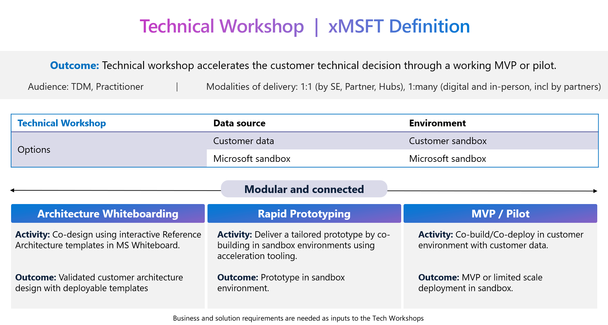
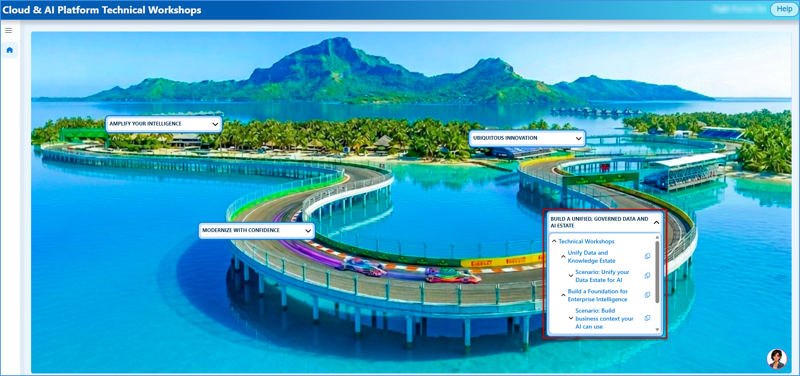
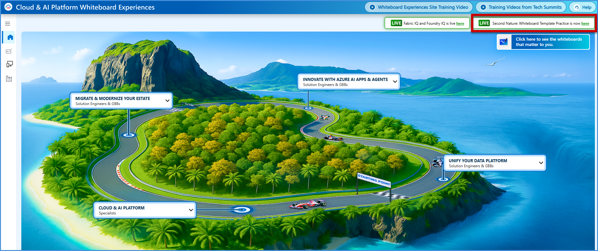
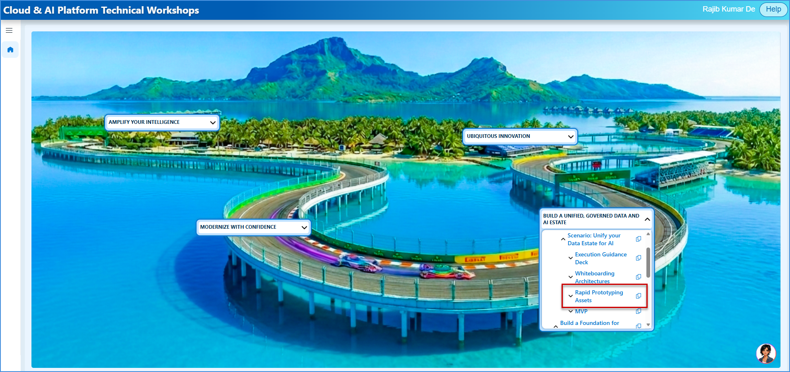
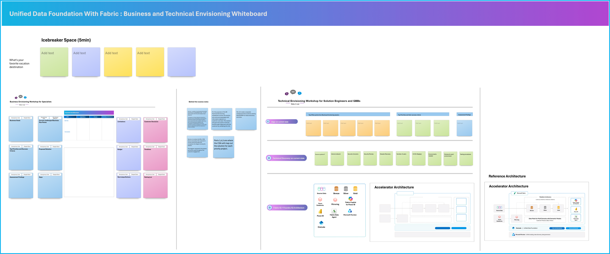
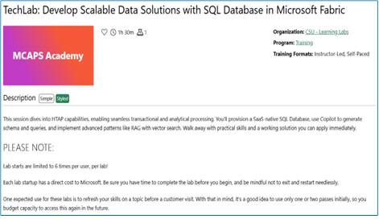
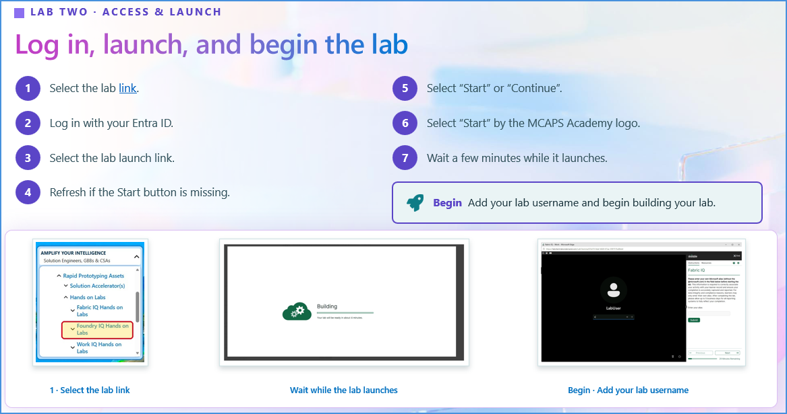
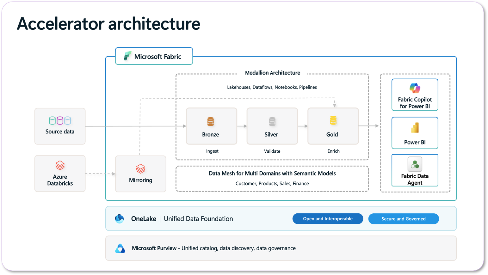

# Build a Unified, Governed Data and AI Estate — Technical Workshop Execution Guide

> **Audience:** Microsoft Solution Engineers, GBBs, other FTEs, and Partners who deliver this workshop.\
> **Workshop Level:** L300 \
> **Primary Theme:** Bring data, applications, and AI together on **one unified, governed foundation** — built on **Microsoft Fabric**, **Microsoft Foundry**, and the Purview/Entra governance stack, with Microsoft IQ (Fabric IQ, Foundry IQ, Work IQ, Web IQ) as the intelligence layer\
> **Delivery Model:** Instructor-led, self-paced, or modular customer engagement — eight self-contained scenario-modules, deliverable together or individually

---

## 🌟 Executive Summary & Welcome

**The Opportunity:** Organizations struggle to scale AI due to fragmented data, AI, and governance across disconnected systems — slowing adoption and increasing cost, risk, and complexity.

**How we solve it:** Microsoft brings data, AI, context, and governance together on one foundation — eliminating silos and saving cost: unified scale (OneLake + 200+ connectors, 11,000+ models in Foundry), business context (Fabric IQ + Foundry IQ across 1,400+ systems), and a trusted data and AI foundation by design, delivering **up to 70% savings on AI inference**.

**The Microsoft differentiation:** Microsoft is the only platform providing an end-to-end foundation to become Frontier — unify data in Fabric with 200+ connectors, build and scale agents in Foundry across 11,000+ models, and layer in Microsoft IQ so AI reasons over real business context from 1,400+ systems. Foundry IQ delivers **36% better answer quality** than traditional RAG, and Power BI is ranked **#1 in the Gartner Magic Quadrant** — all governed end-to-end by Microsoft Security.

> **The narrative:** Establish a Unified, Trusted Data and AI Foundation for Your Frontier Transformation.
> *Your AI is only as good as your data. Your AI is only as impactful as your context. Your AI is only as scalable as its trust.*

---

## 🗂️ Table of Contents

1. [Overview for the Sellers](#overview-for-the-sellers)
    - 1.1 [Technical Workshop | xMSFT Definition](#xmsft-definition)
    - 1.2 [Workshop Deep Dive — Example Technical Workshop](#example-technical-workshop)
2. [Unify Tech Workshop Overview](#unify-tech-workshop-overview)
    - 2.1 [A Unified, Governed Data and AI Platform — Customer Conversation](#customer-conversation)
    - 2.2 [Narrative & Business Metrics](#narrative-business-metrics)
    - 2.3 [Identifying High-Impact Scenarios](#identifying-high-impact-scenarios)
    - 2.4 [Workshop Purpose](#workshop-purpose)
    - 2.5 [One Platform, Not a Collection of Experiences](#one-platform)
    - 2.6 [The Problem This Workshop Addresses](#the-problem)
    - 2.7 [How to Frame It for Customers](#how-to-frame-it)
    - 2.8 [The Workshop at a Glance](#workshop-at-a-glance)
    - 2.9 [Audience & Pre-Work](#audience-pre-work)
    - 2.10 [Recommended Audience & Expected Outputs](#audience-expected-outputs)
    - 2.11 [The Arc — How the Workshop Unfolds](#the-arc)
    - 2.12 [Execution Guidance for the Sellers](#execution-guidance)
    - 2.13 [Delivering the Session — Suggested Workshop Flow](#suggested-workshop-flow)
    - 2.14 [Token Spend: Questions to Ask](#token-spend-questions)
    - 2.15 [Optional Modular Deep-Dive Tracks (A–L)](#modular-deep-dive-tracks)
    - 2.16 [How to Use This Content](#how-to-use-this-content)
    - 2.17 [Technical Workshop Modules](#technical-workshop-modules)
    - 2.18 [Personas & Outcomes](#personas-outcomes)
3. [Technical Workshops Site Content Overview](#site-content-overview)
    - 3.1 [CAIP Technical Workshop Site](#caip-site)
    - 3.2 [Technical Envisioning Whiteboard OLT](#te-whiteboard-olt)
4. [Outcome: Unify Data and Knowledge Estate](#outcome-unify-data-estate)
    - 4.1 [Scenario 01 — Unify your Data Estate for AI](#scenario-01)
    - 4.2 [Key Discussion Areas](#scenario-01-discussion)
    - 4.3 [What Good Looks Like](#scenario-01-good)
5. [Microsoft Fabric](#microsoft-fabric)
    - 5.1 [The Unified Data Platform for AI Transformation](#fabric-platform)
    - 5.2 [OneLake — Bring All Your Data Together](#onelake-bring-together)
    - 5.3 [Ingest Data into OneLake with Data Factory](#data-factory-ingest)
    - 5.4 [Build a Governed Data Mesh with OneLake](#governed-data-mesh)
    - 5.5 [Open Delta & Iceberg — One Copy for All Computes](#one-copy-computes)
    - 5.6 [Data Warehouse & Databases Built on OneLake](#warehouse-databases)
    - 5.7 [Discover, Govern and Protect Data with OneLake](#discover-govern-protect)
    - 5.8 [End-to-End Platform Capability Coverage](#capability-coverage)
    - 5.9 [Technical Deep Dives](#technical-deep-dives)
6. [Demos](#demos-1)
    - 6.1 [Build a Unified Governed Data and AI Platform Demos](#caldova-demo)
    - 6.2 [Additional Interactive Demos (CDX Experiences)](#additional-cdx-demos)
7. [Activities](#activities)
    - 7.1 [Rapid Prototyping](#rapid-prototyping-1)
    - 7.2 [Whiteboarding Experience](#whiteboarding-1)
    - 7.3 [Hands-on Labs — Outcome 1](#hands-on-labs-1)
    - 7.4 [Solution Accelerators — Unified Data Foundation with Fabric](#unified-data-foundation-accelerator)
8. [Outcome: Build a Foundation for Enterprise Intelligence](#outcome-enterprise-intelligence)
    - 8.1 [Scenario 02 — Build business context your AI can use](#scenario-02)
    - 8.2 [Key Discussion Areas](#scenario-02-discussion)
    - 8.3 [What Good Looks Like](#scenario-02-good)
    - 8.4 [Suggested Workshop Flow](#scenario-02-flow)
    - 8.5 [Optional Modular Deep-Dive Tracks (A–D)](#scenario-02-tracks)
    - 8.6 [Expected Outputs](#scenario-02-outputs)
    - 8.7 [Intelligence + Trust — Microsoft IQ Platform](#microsoft-iq-platform)
    - 8.8 [The Challenge — Why AI Stalls Without Unified Context](#the-challenge)
    - 8.9 [AI Adoption Is Accelerating](#ai-adoption)
    - 8.10 [Essentials for High-Performance Agents](#essentials-agents)
    - 8.11 [What Every Employee and Every Agent Needs to Know](#employee-agent-context)
9. [Fabric IQ](#fabric-iq)
10. [Work IQ](#work-iq)
11. [Web IQ](#web-iq)
12. [Foundry IQ](#foundry-iq)
13. [Demos — Microsoft IQ Demos](#demos-2)
14. [Workshop Activities](#workshop-activities)
    - 14.1 [Rapid Prototyping](#rapid-prototyping-2)
    - 14.2 [Whiteboarding Experience](#whiteboarding-2)
15. [Hands on Labs — Microsoft IQ](#hands-on-labs-2)
    - 15.1 [Program Overview — Three Labs, One Intelligence Journey](#labs-program-overview)
    - 15.2 [Lab One · Fabric IQ](#lab-one-fabric-iq)
    - 15.3 [Lab Two · Foundry IQ](#lab-two-foundry-iq)
    - 15.4 [Lab Three · Work IQ](#lab-three-work-iq)
16. [Solution Accelerator — Microsoft IQ](#solution-accelerator-2)
17. [GitHub Repos](#github-repos)
    - 17.1 [Microsoft IQ GitHub Repos — Quick Access](#github-repos-quick-access)
    - 17.2 [Summary: Key Outcomes](#summary-key-outcomes)
    - 17.3 [Resources](#resources)

---

## 1. Overview for the Sellers

*(Welcome — Speaker introduces the SE Track, ≈1 minute; sets the tone around collaboration, orchestration, and customer impact.)*

### 1.1 🧭 Technical Workshop | xMSFT Definition

**Outcome:** The technical workshop accelerates the customer's technical decision through a working MVP or pilot.

  

| Technical Workshop Option | Data Source | Environment |
|---|---|---|
| Option A | Customer data | Customer sandbox |
| Option B | Microsoft sandbox | Microsoft sandbox |

**Modular and connected** across three linked stages:

| Stage | Activity | Outcome |
|---|---|---|
| **Architecture Whiteboarding** | Co-design using interactive Reference Architecture templates in MS Whiteboard. | Validated customer architecture design with deployable templates. |
| **Rapid Prototyping** | Deliver a tailored prototype by co-building in sandbox environments using acceleration tooling. | Prototype in sandbox environment. |
| **MVP / Pilot** | Co-build/co-deploy in customer environment with customer data. | MVP or limited-scale deployment in sandbox. |

- **Audience:** TDM (Technical Decision Maker), Practitioner.
- **Modalities of delivery:** 1:1 (by SE, Partner, Hubs); 1:many (digital and in-person, including by partners).
- Business and solution requirements are needed as **inputs** to the Tech Workshops.
- **Note:** Demos are part of the "L200 Discussion" phase, which occurs *prior to* the Tech Workshop.

### 1.2 🔍 Workshop Deep Dive — Example Technical Workshop

| Phase | What Happens |
|---|---|
| **L200 Discussion — Pre-requisites** | The Specialist gathers the inputs SEs need to scope and run a successful workshop: expected timelines and technical success metrics; platform architecture requirements (UI, agent, and knowledge layers, plus governance); compliance requirements; AI readiness across governance, cloud, workforce, and data. |
| **Architecture Whiteboarding** | Co-design session to map an architecture tailored to the customer's needs. Build a customer-specific architecture diagram using interactive Reference Architecture templates. Delivered on Microsoft Whiteboard via Teams, or in person. |
| **Rapid Prototyping** | Create a rapid prototype using Solution Accelerators, GitHub Repos, Cora (AI Agent), etc. Uses Solution Accelerators or GitHub Repos to generate deployable infrastructure-as-code templates. Produces synthetic data and a data relationship schema. Code is exported to VS Code with instructions to review and deploy in sandbox. |
| **MVP / Pilot** | Limited-scale deployment in a sandbox for the customer to test. Test the prototype and create a functional MVP. Customer validates the MVP against defined success criteria. Hands off to CSU or partner for follow-through. |

---

## 2. Unify Tech Workshop Overview

### 2.1 🌐 A Unified, Governed Data and AI Platform — Customer Conversation

**The Opportunity:** Organizations struggle to scale AI due to fragmented data, AI, and governance across disconnected systems — slowing adoption and increasing cost, risk, and complexity.

**How we solve it:** Microsoft brings data, AI, context, and governance together on one foundation — eliminating silos and saving cost: unified scale (OneLake + 200+ connectors, 11K+ models in Foundry), business context (Fabric IQ + Foundry IQ across 1,400+ systems), and a trusted data and AI foundation by design, delivering up to 70% savings on AI inference.

**The Microsoft differentiation:** Microsoft is the only platform providing an end-to-end foundation to become Frontier — unify data in Fabric with 200+ connectors, build and scale agents in Foundry across 11,000+ models, and layer in Microsoft IQ so AI reasons over real business context from 1,400+ systems — Foundry IQ delivering 36% better answer quality and Power BI ranked #1 in the Gartner Magic Quadrant, all governed end-to-end by Microsoft Security.

**The Two customer outcomes:**

| Outcome | Description | Decision Makers | Business Metrics |
|---|---|---|---|
| **Unify Data and Knowledge Estate** | Bring your data, applications, and AI together on a unified foundation — no silos, no seams, no starting over. | CDO / CAIO / CIO | # of >$100K/month Fabric customers; data estate unified & governed in OneLake (≥100TB); Fabric RTI and Power BI usage growth. |
| **Build a Foundation for Enterprise Intelligence** | Turn your data into business context that flows to every app, agent, and decision across your organization. | Data & AI Professionals, Enterprise Architect | # of customers adopting Foundry; Fabric IQ semantic models & ontologies deployed. |

### 2.2 📖 Narrative & Business Metrics

**Narrative:** Establish a unified, trusted data and AI foundation for your Frontier Transformation.

Lead with data and differentiate with a connected + trusted Data and Intelligence value proposition — help customers become Frontier by responding to their needs, positioning Microsoft as the integrated Data + AI platform for building agentic AI. A unified data + AI platform enables organizations to accelerate the development and deployment of intelligent agents, ensuring they operate with the reliability, compliance, and scalability needed to drive meaningful business outcomes.

This is achieved through modern frontier capabilities including unified data, real-time intelligence, and security + trust — bringing together data management, model orchestration, agent hosting, integration services, and governance under a single unified platform.

**Build a unified, governed data and AI estate:** Scale agentic AI through a governed platform to deliver trusted, integrated, production-ready agent workflows — building a unified and trusted data foundation to accelerate your Frontier Transformation.

**Business metrics:**
- Azure Accelerate as an E2E customer benefit and deal-making engine, including delivery.
- **# of >$100K/month Fabric customers** ($10K SMEC, $20K MG, $50K UM).
- **# of customers adopting Foundry** (Foundry adoption metric).

| Decision Makers | Goal |
|---|---|
| CDO / CIO / Data Professionals | Establish a data foundation for AI |
| CAIO / CTO / AI Professionals | Establish an Agentic AI Platform |

### 2.3 🎯 Identifying High-Impact Scenarios

This spans three outcomes: 

 **A. Unify your Data and AI Platform**  

**⚠️ Read the signal:**
- Data estates fragmented across clouds, apps, and data types: **50% of CEOs** say AI and data systems remain fragmented; **59%** report data fully siloed.
- Data that exists in the organization is not yet accessible for AI use cases.
- Lock-in concerns on the data platform or model vendor.
- Concerns with agent sprawl and how to manage them.
- Engineers spend most time moving and reconciling data, not building.

**Use the hooks:**
- **Unify every source on one foundation — OneLake, no ETL, no duplication. Open platform: freedom of choice of analytics engines and 11K+ models.**
  - Leverage existing data across M365, Azure, Dynamics 365, Snowflake, Databricks and multi-cloud: no rip-and-replace.
  - 200+ connectors, shortcuts & mirroring; open Delta + Iceberg, no egress fees.

**✓ Identify high-impact scenarios:**
- Unify your Data Estate for AI.
- Run agents on your terms — across any model and environment.
- Turn your data into real-time operational and business intelligence.

**B. Build a Foundation for Enterprise Intelligence** 

**⚠️ Read the signal:**
- Agents reason over raw tables and dashboards, not business meaning.
- Connector sprawl and bespoke integration projects.
- No shared semantic foundation across the enterprise.
- Low accuracy on AI use cases / users getting different answers to the same question.

**Use the hooks:**
- **Build your shared business context for every agent — Fabric IQ + Foundry IQ — that connects seamlessly with your Work IQ to create your own enterprise IQ with complete business context.**
  - Foundry IQ: 36% better quality than traditional RAG.
  - Fabric IQ semantics on 400K+ orgs' semantic models; Power BI #1 in Gartner MQ.

**Identify high-impact scenarios:**
  - Build business context your AI can use.

**C. Achieve AI and Data Trust that Drives Adoption**.

**⚠️ Read the signal:**
- Agent sprawl without centralized identity, governance, observability, or cost management.
- Avg. **12 disparate tools** to secure the data estate; **67% lack visibility** into sensitive data.

**Use the hooks:**

- **Run agents on a platform you control and trust.**
  - Purview: unified DSPM, DLP, Information Protection provides end-to-end data governance vs. multiple disjointed tools that add complexity and cost.
  - Foundry, Agent 365, AI Gateway deliver granular observability, policy enforcement across agents, tools, MCP servers — giving full control of agent workflows.

**Identify high-impact scenarios:**

- Govern your AI and Data on a platform you trust.
- Continuously optimize cost and performance.

**⇄ Connect to other conversations:**
- If you hear they need a platform to build and operate agents and AI-native apps → ask discovery questions for the **Ubiquitous Innovation** conversation.
- If you hear agents reason over raw tables and dashboards, not business meaning → ask discovery questions for the **Amplify your Intelligence** conversation.
- If you hear data is trapped in legacy operational databases and needs modernizing → ask discovery questions for the **Modernize with Confidence** conversation.

### 2.4 🎯 Workshop Purpose

**Why we run this workshop:** Bring data, applications, and AI together on one unified, governed foundation — then turn that data into business context for every app and agent, and govern the entire data and AI estate end-to-end.

| Pillar | Description |
|---|---|
| **A clear end-to-end view** | Leaders, architects, and technical teams see how Fabric, Foundry, and the governance stack come together as one platform. |
| **From fragmented to execution-ready** | Move from disconnected tooling and data to a governed, modular, execution-ready architecture for production AI. |
| **Modular by design** | Eight self-contained scenario-modules — delivered together as one story or selected individually by priority. |
| **Updatable in place** | Because modules are independent, any one can be updated when leadership or product changes an outcome — without reworking the rest. |

### 2.5 🧱 One Platform, Not a Collection of Experiences

**The platform narrative:** Position the platform — Fabric, Foundry, and the governance stack — as the operational backbone for unified data, analytics, context, and trusted AI. The modular design matters, but the end-to-end architecture must remain visible throughout.

| Pillar | What It Delivers |
|---|---|
| **Unify** | OneLake is the shared foundation; Data Factory, shortcuts & mirroring connect and land data; Lakehouse, Warehouse & SQL shape and serve it under one governance model. |
| **Build Intelligence** | Fabric IQ & Foundry IQ turn data into governed business context; Real-Time Intelligence brings operational signals; Power BI + data agents deliver in the flow of work. |
| **Earn Trust** | OneLake Catalog governs the data estate while the Foundry APIM AI Gateway governs AI traffic — the trust required to move AI and agents to production. |

> The intention is not to walk customers through disconnected features — it is to give them a credible end-to-end path to production AI.

### 2.6 ⚠️ The Problem This Workshop Addresses

**Current state & discovery — the fragmentation tax:**
- Fragmented data estates across clouds, apps, and data types.
- Disconnected pipelines and duplicated storage layers.
- Inconsistent semantic definitions and delayed time-to-insight.
- Agent sprawl without unified identity, observability, or cost control.

> Engineers spend most of their time reconciling data rather than building.

**Core discovery questions:**
- Is the current data estate unified and governed enough to support both analytics modernization and AI-driven outcomes?
- Where is fragmentation creating friction across integration, analytics, operational intelligence, and decision-making?
- Which scenarios benefit most from a modular Fabric approach connecting data, analytics, real-time, and AI context?
- How is data from existing applications used across analytics and AI today?
- Can legacy platforms provide the data needed for modern AI transformation?

### 2.7 🗣️ How to Frame It for Customers (External Positioning)

**Suggested workshop title:** *Build a Unified, Governed Data and AI Platform with Microsoft Fabric and Foundry.*

**Positioning:** Move customers from a fragmented data, analytics, and AI estate to a unified, governed data and AI platform — connecting data integration, engineering, warehousing, real-time intelligence, BI, databases, Fabric IQ, Foundry IQ, agent delivery, and end-to-end governance into one modular architecture that supports both immediate business value and longer-term AI readiness.

**Recommended audience:** Executive (CIO / CDO / CTO / CISO) · Enterprise architects · Analytics, BI & data engineering leads · Data science & AI leaders · Business stakeholders tied to operational intelligence and decision systems.

**Pre-work / inputs:** Source slides, account notes, current-state data-estate architecture and inventory, customer priorities, and demo/lab requirements.

### 2.8 🧩 The Workshop at a Glance

Deliver together as one end-to-end story, or select individually by customer priority — while preserving a coherent platform narrative.

| # | Module |
|---|---|
| 1 | Unify a Trusted Data Estate for your AI |
| 2 | Transform your Data & Analytics |
| 3 | Timely Operational & Business Intelligence |
| 4 | Implement your Context Layer (AI-Ready Data) |
| 5 | Deliver Intelligence in the Flow of Work |
| 6 | Run Agents your Way: Model Choice & Hosting |
| 7 | Govern your Data and AI |
| 8 | Drive Continuous Optimization |

### 2.9 👥 Audience & Pre-Work (Before You Begin)

**Recommended audience who will deliver these workshops:** Microsoft Solution Engineers, GBBs, other FTEs, Partners.

**Pre-work & inputs needed:**
- Access to the hosted workshop environment (pre-configured).
- Supporting materials and setup guidance and assets on the CAIP Technical Workshops site: [https://aka.ms/CAIPTechWorkshops](https://aka.ms/CAIPTechWorkshops)
- When available: customer scenario, data context, or architecture inputs for alignment.

### 2.10 🎯 Recommended Audience & Expected Outputs (Who Attends & What They Leave With)

**Recommended audience:**
- CIO / CDO / CTO
- Data and AI platform leaders
- Enterprise architects
- Analytics, BI, and data engineering leads
- Data science and AI innovation leaders
- Business stakeholders in operational intelligence & decision systems

**Expected outputs:**
- Current-state data & analytics assessment summary.
- Outcome-aligned target architecture across Fabric, Foundry & governance.
- Prioritized workload and module recommendations.
- Clear alignment between business outcomes and platform capabilities.
- Phased roadmap across unify → intelligence → trust.
- Recommended next-step assets: architecture sessions, demos, labs, or deeper workshops.

### 2.11 🧭 The Arc — How the Workshop Unfolds

| Step | Name | What Happens |
|---|---|---|
| **1** | **Ground** | Start in a real customer scenario and explore how fragmented context limits the impact of AI. |
| **2** | **Introduce** | Introduce Microsoft Fabric and various data ingestion & transformation options; introduce Microsoft IQ and its core components including demos — Fabric IQ, Foundry IQ, Work IQ, and Web IQ. |
| **3** | **Connect** | Through technical envisioning session discussions using configurable reference Whiteboard architectures and Hands-on Labs (optional). |
| **4** | **Build & validate** | Build and validate an integrated scenario through Rapid Prototyping using Solution Accelerators, GitHub Repos, Cora (AI Agent). MVP using best practices from GBBs and solutions like Agentic Loop. |

### 2.12 ✅ Execution Guidance for the Sellers

| # | Step | Guidance |
|---|---|---|
| 1 | **Ground in the scenario** | Confirm the business problem, priority use case, target users, and success criteria first. |
| 2 | **Introduce and qualify with discovery** | Introduce Microsoft Fabric, Microsoft IQ and its core components including demos — Fabric IQ, Foundry IQ, Work IQ, and Web IQ. Find where the customer needs better work context, shared meaning, reusable knowledge, or fresh web signals. |
| 3 | **Whiteboard the architecture** | Map how Fabric, Foundry, Work, and Web IQ work together for the selected agentic scenario. |
| 4 | **Select lab modules** | Don't run every module by default — choose labs that match the use case and desired outcome. |
| 5 | **Use Solution Accelerators and leverage reusable patterns** | Use Solution Accelerators and show how components connect end-to-end, emphasizing patterns the customer can reuse. |
| 6 | **Use Agents deliberately** | Highlight where agents need fresh web, news, market, regulatory, or competitive signals. |
| 7 | **Validate the approach** | Confirm data sources, grounding, integration points, security, and dependencies. |
| 8 | **Build Rapid Prototypes faster** | Use GitHub Repos, Accelerators, and Cora (AI Agent) to prove the components that matter most. |
| 9 | **Close with a path** | Define the MVP, pilot scope, owners, success measures, and follow-up actions. |

### 2.13 🧭 Delivering the Session — Suggested Workshop Flow

| # | Step | What Happens |
|---|---|---|
| 1 | **Executive framing & problem definition** | Align on the business challenge, cost concerns, and target scenarios. |
| 2 | **Current-state review** | Assess token-usage reporting and gaps; identify agents running and token consumption for each. |
| 3 | **Demo token reporting** | Show token usage from the APIM AI Gateway (FinOps framework lab) — live or via a prepared walk-through. |
| 4 | **Prototype in the customer environment** | Understand current token metrics and spend; identify the top token-consuming agents to optimize. |
| 5 | **Baseline & optimize one agent** | Use Foundry observability, evaluations, and Agent Optimizer on one production agent to baseline and improve. |
| 6 | **Layer in optimization** | Add Foundry Model Router, Foundry & Fabric IQ, and semantic caching to cut spend; show before/after in AI Gateway reporting. |
| 7 | **Action plan & next steps** | Define quick wins, a phased adoption path, technical follow-ups, and recommended hands-on or proof-oriented next steps. |

### 2.14 💰 Token Spend: Questions to Ask

*Current-state discovery · FinOps — use these to surface where AI inference cost is invisible or uncontrolled: the opening for Module 8.*

- How are you tracking and optimizing LLM token spend across teams today?
- Can finance answer "who consumed what?" per team or app?
- How much of your context/retrieval is wasted tokens?
- Which apps are using the most tokens — and why?
- Are simple prompts running on your most expensive models?
- Can one team's batch job throttle everyone else's?
- Can you tie AI spend to a business outcome or ROI?

### 2.15 🧩 Optional Modular Deep-Dive Tracks (A–L)

*Plug-in workload tracks — these workload-level tracks plug into the scenario-modules; use them for customer deep dives, internal readiness, or follow-on technical engagements. They are not the modules themselves.*

| Track | Focus |
|---|---|
| **A** | OneLake & open data foundation |
| **B** | Data Factory & orchestration patterns |
| **C** | Data Engineering & Lakehouse design |
| **D** | Data Warehouse & SQL analytics patterns |
| **E** | SQL Database in Fabric & operational data |
| **F** | Real-Time Intelligence & event-driven architecture |
| **G** | Data Science & advanced analytics integration |
| **H** | Power BI & semantic consumption |
| **I** | Fabric IQ — entities, metrics, graph, planning |
| **J** | Fabric + Foundry integration |
| **K** | Microsoft Foundry — models, frameworks, hosting |
| **L** | AI trust & FinOps — Catalog, Purview, AI Gateway |

### 2.16 📘 How to Use This Content (Two Modes, One Document)

| Mode | Guidance |
|---|---|
| **External · Customer-facing** | Deliver the body — the three outcomes, eight scenarios, capability coverage, and workshop flow — plus the Technical Workshop appendix, as an Architecture / Whiteboarding workshop. Remove the Internal Seller Guidance section first. |
| **Internal · Solution Engineers** | Use the full document, including the Internal Seller Guidance — execution plays, governance direction, and objection handling — as L300 enablement. |
| **Modular updates** | Each scenario is a self-contained module (1–8). When leadership or product changes an outcome or scenario, update only that module — objective, discussion areas, capability mapping, and execution play — and mirror it in the workshop. |

### 2.17 📋 Technical Workshop Modules

**Workshop package:** Build a unified, governed data and AI estate.

| Outcome | Scenario Modules | Module Description | Lead Product(s)/Workloads |
|---|---|---|---|
| **Unify Data and Knowledge Estate** | Unify a Trusted Data Estate for your AI | Setup an operational and analytical data estate, connected and governed for AI. Assess and optimize for price + performance to meet scale needs. | Fabric, Foundry, Power BI, Azure Integration Services, Databases |
| | Run agents your way — model choice & deployment flexibility | Standardize evaluation/memory/orchestration to ensure predictability, stability, and cost discipline as you scale agents in production. | |
| | Modernize your data and analytics for performance and cost efficiency | Apply policy-driven guardrails to ensure predictability, stability, and cost discipline as you scale agents in production. | |
| | Turn your data to timely operational and business intelligence | Ensure your AI has access to your real-time operational and business intelligence from your data. | |
| **Build a Foundation for Enterprise Intelligence** | Implement your context layer to make your data AI ready | Bring fragmented context across your business updates. | Foundry IQ, Web IQ, Fabric IQ |
| | Deliver intelligence to your AI agents and users in the flow of work | Ground AI in trusted enterprise data — no new infrastructure — so Copilot and agents deliver real-time answers in the flow of work. | |
| **Achieve AI and Data Trust that Drives Adoption** | Govern your data and AI on a platform you control and trust | Keep every agent and data workload auditable and policy-governed end to end with Fabric, Purview, and Foundry — trust by design. | Fabric OneLake Catalog, Microsoft Security, Foundry Control Plane, APIM AI Gateway |
| | Drive continuous optimization for cost & performance | Enable scalable, governed, and AI-ready insights across the enterprise. | |

**Technical Workshop Narrative:** The Build a Unified Governed Data and AI Estate Technical Workshop helps organizations establish a connected, governed data foundation and scale trustworthy AI agents that deliver real-time answers in the flow of work. Through scenarios spanning data estate setup, agent evaluation and orchestration, policy-driven guardrails, real-time business intelligence, enterprise data grounding, and end-to-end governance, participants will learn how to govern their data for AI, ground Copilot and agents in trusted enterprise data with no new infrastructure, and run agents in production with predictability, stability, and cost discipline. Built on Fabric, Purview, and Foundry, the workshop enables organizations to optimize for price and performance at scale, unify fragmented context, keep every agent and data workload auditable and policy-governed, and unlock scalable, AI-ready insights across the enterprise — with trust by design.

**Modularity / flexibility:** The workshop can be delivered end-to-end as a structured engagement or broken into targeted modules focused on work context, business context, or knowledge integration depending on customer priorities.

### 2.18 👥 A Unified, Governed Data & AI Platform: Personas & Outcomes

*Align the unify conversation to buyer personas, their data and AI transformation challenges & desired outcomes.*

| Audience | Focus Area | Key Pain Points | Solution | Customer Outcomes & Value |
|---|---|---|---|---|
| **CIO + CTO** | Enterprise data & AI platform consolidation; AI transformation strategy & ROI; TCO reduction through platform unification. | Data sprawl across siloed tools, inefficient agent workflows inflates token costs and slows AI initiatives; we can't operationalize AI because our data estate is fragmented; managing multiple analytics vendors drains budget and talent. | **Unify and Govern your Data & AI with Microsoft Fabric and Foundry** — OneLake eliminates data duplication (leverage your data where it is, multi-cloud, one copy, governed everywhere); SaaS Data Platform for analytics, data engineering, data science & AI in Fabric; AI Platform with Model Router, built-in evaluation tools, e2e Agent mgmt. in Foundry. | Reduction in data and AI platform TCO through consolidation; accelerated time-to-AI-value with a unified, governed foundation; simplified vendor management & licensing. |
| **CDO + Data Professionals** | Data governance & quality at scale; unified analytics & BI; AI-ready data pipelines. | Data is scattered across warehouses, lakes & lakehouses with no unified governance; data quality issues erode trust and block AI adoption; teams spend 80% of time on data prep, not insights. | **Govern & democratize with Fabric + OneLake Catalog** — unified governance with Microsoft Purview integration across OneLake; real-time analytics, data warehousing & data science in one platform; Copilot-assisted data transformation & natural language analytics. | Single source of truth with end-to-end data lineage & governance; 80% faster time-to-insight with unified data workflows; trusted, AI-ready data accessible to all business users. |
| **CAIO + Solution Architects** | Building AI-powered applications and agents; AI model development & deployment. | Building production AI apps requires stitching together too many tools; no standardized way to ground AI models on enterprise data; prompt engineering, RAG, and fine-tuning workflows are fragmented; increasing token costs, agent optimization. | **Build and optimize AI apps and agents with Foundry** — model catalog with 11,000+ models (open & frontier); Model Router, built-in evaluation tools, Agent Optimizer in Foundry; enterprise context with grounding on OneLake; run agents your way — model choice & deployment flexibility. | Enable continuous agent optimization for cost & performance; production-grade AI apps grounded on enterprise data. |
| **CIO + CISO** | AI governance & responsible AI; data security & access control; regulatory compliance for AI workloads. | AI introduces new risks — hallucinations, data leakage, shadow AI; we lack unified policies to govern who accesses what data across AI & analytics; compliance requirements (EU AI Act, GDPR) demand auditability we don't have. | **Operate with unified AI governance & security** — AI Gateway for run-time policy enforcement across agents, tools, MCP servers, A2A; Entra ID, observability, built-in responsible AI controls in Foundry; Fabric security with row/column-level access, sensitivity labels & Purview. | Unified audit trail across data & AI workloads; single chokepoint where all traffic is inspected, routed, and governed for consistent policy enforcement across AI services; responsible AI at scale with built-in guardrails; zero-trust data access across analytics & AI workloads; regulatory readiness for EU AI Act, GDPR & industry mandates. |

---

## 3. Technical Workshops Site 

### 3.1 🖥️ CAIP Technical Workshop Site

**Overview of the site:** This site provides a "one stop shop" experience for sellers to:

1. Identify the conversation(s) most relevant for their customer's business outcomes.
2. Search for execution guides, HOLs, and any other content for the relevant conversations.
3. Leverage configurable reference Whiteboard architectures and create proposed future-state customer architectures.
4. Identify solution accelerators which align with business outcomes.
5. Quickly create rapid prototypes with solution accelerators, Hands-on Labs, GitHub Repos, Sample Prototype (test drive & prototype package) review, and finally leverage Cora (AI agent) live for rapid prototype creation.
6. Leverage best practices as well as GBB tools such as Agentic Loop for MVP creation.

**Link:** [https://aka.ms/UnifyTechWorkshops](https://aka.ms/UnifyTechWorkshops)

### 3.2 🖊️ Now Available for Sellers: Technical Envisioning Whiteboard OLT!

**Technical Envisioning Whiteboard Practice: Unify Your Data Platform**

This field-built and field-tested on-demand course gives Solution Engineers (SE) the opportunity to refresh and then practice delivering a Technical Envisioning (TE) session using the new TE whiteboard template.

- During this practice experience, the SE will share their screen and conduct a TE session for an AI customer persona by navigating through the TE whiteboard.
- After the session, the SE will receive feedback on their talk track as well as their whiteboard navigation.
- This is a generative AI-enabled course built on **Azure OpenAI Service**.

**Link:** [https://aka.ms/DREAMwhiteboards](https://aka.ms/DREAMwhiteboards)

---

## 4. Outcome: Unify Data and Knowledge Estate

**Outcome:** Unify your Data and AI Platform\
**Scenario:** Unify a Trusted Data Estate for your AI

### 4.1 📦 Scenario 01 — Unify your Data Estate for AI

**Objective:** Establish a unified, governed, reusable data foundation across analytical and operational data — open and interoperable, with no data movement, modernizing incrementally to eliminate silos, duplication, and licensing cost.

**Relevant components & assets:** OneLake · Data Factory & Mirroring · Lakehouse & SQL in Fabric · Power BI semantic models · OneLake Catalog · Azure Integration Services

**Discussion focus:** Current-state fragmentation, duplicated data movement, governance gaps, open data access and interoperability, operational-to-analytical convergence, and how OneLake becomes the shared foundation across workloads.

### 4.2 🔍 Key Discussion Areas — One Governed Foundation for Data & AI

| Focus Area | Guiding Question | Current Challenge | Decision Criteria | Capabilities |
|---|---|---|---|---|
| **Data foundation — Land once, govern once** | How many data platforms, warehouses, and lakes are your teams working across — and where is data duplicated or incurring egress? | Estates fragmented across clouds, apps, and data types — teams reconcile more than they build. | Shortcut vs. mirror vs. one governed copy per source; open formats (Delta, Iceberg) over lock-in. | OneLake · 200+ connectors · shortcuts & mirroring · Delta / Iceberg · Snowflake & Databricks. |
| **Unified governance — Govern data and AI in one place** | Does your governance extend to what AI agents can access and do — or do data and AI governance live in two systems? | Governance gaps and multi-cloud sprawl across the estate. | OneLake Catalog to govern & secure in Fabric; Purview for security, compliance & AI governance; Entra for identity. | OneLake Catalog (Explore · Govern · Secure) · Microsoft Purview · Entra ID. |

### 4.3 ✅ What Good Looks Like

| Principle | Description |
|---|---|
| **Land once** | Data lands a single time in OneLake — no duplicated copies, no egress, open table formats. |
| **Govern once** | One governance model spans the estate — OneLake Catalog and Purview govern data and AI together. |
| **Reusable everywhere** | The same foundation serves engineering, warehousing, real-time, BI, and AI — without rebuilding each time. |

---

## 5. Data estate modernization with Microsoft Fabric

### 5.1 🏗️ Microsoft Fabric — The Unified Data Platform for AI Transformation

### 5.2 🌊 Bring All Your Data Together with OneLake

**OneLake** is the single unified data layer — with OneLake catalog, OneLake security, OneLake diagnostics, and Delta Parquet and Iceberg formats — connecting Azure Databricks, Snowflake, and industry/vertical data sources.

**All roads lead to OneLake — creating data gravity:**

| Capability | Description |
|---|---|
| **Shortcuts** | Give instant access to internal or external data in OneLake using symbolic links — no movement or duplication. |
| **Shortcut transformations** | Apply enrichment or analysis to shortcut data without moving it. |
| **Mirroring** | Replicates entire databases into OneLake in near real time for secure, governed access. |
| **Open mirroring** | Lets nearly any database sync with OneLake using open APIs and the Delta format. |

### 5.3 🔌 Ingest Data into OneLake with Data Factory

- Write directly into Delta format tables.
- Use shortcuts to reference external data without any data movement.
- Use low-code transformations that directly output into OneLake.
- Coordinate data ingestion, transformation, and loading into lakehouses or warehouses.

### 5.4 🗺️ Build a Governed Data Mesh with OneLake

*Logically organize data with domains, workspaces, and federated governance.*

**Unified Security and Governance:**
- Logically group data with domains to align to business areas.
- Assign domain admins and associate workspaces for delegated governance.
- Achieve federated governance by delegating settings to domain admins.
- Simplify discovery and data sharing across the organization with domains.
- Endorse and promote trusted data to drive reuse and consistency.

### 5.5 🔓 Powering OneLake with Open Delta Parquet and Iceberg — One Copy for All Computes

**Real separation of compute and storage:**

- All compute engines store data automatically in OneLake, eliminating duplication and movement.
- Data is stored in single, open Delta Parquet and Iceberg formats for all tabular data.
- **Delta – Parquet and Iceberg** standardize storage and enable interoperability across Fabric engines and external tools.
- All engines are fully optimized to deliver consistent performance on this shared foundation.
- Transparent simultaneous support for Delta Lake and Iceberg formats.

- All compute engines store their data automatically in OneLake as data items.
- You are able to choose the right engine for the right job.
- All compute engines have been fully optimized to work with Delta as their native format.
- Shared universal security model is enforced across all engines with OneLake security.

### 5.6 🏢 Data Warehouse & Databases Built on OneLake

**Data Warehouse, built on OneLake:**
- Store all warehouse data in OneLake using Delta Lake format.
- Define structured tables using SQL.
- Load curated Delta tables from the lake into Data Warehouse tables.
- Build virtual warehouses by creating lakehouses with shortcuts to data in the lake.
- Query with high-performance auto-scaling to meet analytical demand.

**Databases, built on top of lake-native data:**
- Define and query lake-native Delta tables directly in OneLake.
- Benefit from near real-time replication to OneLake.
- Use the same tables everywhere — in notebooks, pipelines, and BI tools.
- Work seamlessly with Spark using the shared Delta Lake format.
- Build dashboards directly on Power BI semantic models with zero data movement.

**Discover, Govern and Protect Data with OneLake**

- Get a unified view of your data estate with OneLake catalog.
- Manage metadata, lineage, and sensitivity without moving data.
- Gain a flexible data security model with OneLake security.
- Enforce security policies across workspaces and domains from a central location.
- Control access with roles down to the table, folder, or column level.

### 5.8 🧩 End-to-End Platform Capability Coverage

**1 — Data Foundation & Integration**

| Capability | Description |
|---|---|
| **OneLake** | The shared data foundation — reuse, interoperability, zero-copy access patterns, and open data access through shortcutting. |
| **Data Factory / Integration** | Pipelines, orchestration, 200+ connectors, no-code/low-code dataflows landing data into OneLake. Standardize on Fabric Data Factory (successor to ADF). |
| **Mirroring** | Low-friction operational analytics for SQL Server, Azure SQL, Cosmos DB, PostgreSQL, Snowflake, Databricks — plus Open Mirroring (Oracle, MongoDB). |
| **Data Engineering / Lakehouse** | Scalable engineering, medallion architecture, reusable data products, and Rayfin for agentic development and operations of data apps. |
| **Data Warehouse** | Governed SQL-based analytics, curation, structured consumption, and enterprise analytical patterns. |
| **SQL / Databases in Fabric** | Operational and mixed-workload scenarios, database-centric design points, and integration into broader Fabric architectures. |

**2 — Intelligence & Context**

| Capability | Description |
|---|---|
| **Data Science** | Model development and advanced analytics connected to the broader data estate — not isolated from it. |
| **Real-Time Intelligence** | Event-driven analytics, operational monitoring, reduced decision latency — powering agents and real-time ontologies. |
| **Power BI** | Business-facing analytics, semantic consumption, Copilot chat-with-your-data, and Direct Lake for import-speed queries over OneLake Delta tables. |
| **Fabric IQ** | Data-context layer spanning ontology, graph, plan, data agents, operations agents, and semantic models — shared meaning across the business. |
| **Data Agents** | AI-powered interaction with data — autonomous and guided workflows leveraging real-time, governed context from Fabric IQ. |
| **Foundry IQ** | Knowledge-context layer that orchestrates intelligence across sources and grounds AI in enterprise content — 36% better quality than traditional RAG. |

**3 — Governance, Agents & Optimization**

| Capability | Description |
|---|---|
| **OneLake Catalog** | The built-in catalog for the Fabric data estate — discover (Explore), govern (Govern), and secure (Secure) the data you own, surfaced in Teams, Excel, and Copilot Studio. |
| **Microsoft Foundry** | The platform to build and run agents: 11,000+ models, Model Router, uniform inference API, Agent Framework, Hosted Agents, ACA/AKS, and Foundry Local. |
| **Microsoft Purview & Entra** | AI governance, DLP, and information protection (Purview), with identity-bound agents and full auditability (Entra Agent ID, Agent 365). |
| **APIM AI Gateway & Optimization** | Token FinOps (up to 70% inference savings; up to 30% token reduction via semantic caching), plus Evaluations, Agent Optimizer, observability, and runtime content safety. |

### 5.9 🔬 Technical Deep Dives

**Deep dive · Unify (Module 1–2) — OneLake Shortcuts:  Virtualize Without Copying**

*What it is:* Objects in OneLake that point to other storage locations (like symbolic links), making OneLake the single virtual data lake across domains, clouds, and accounts. OneLake manages permissions and credentials, eliminates edge copies, and auto-synchronizes schemas.

- **Supported external sources:** ADLS Gen2 · Azure Blob · Amazon S3 · S3-compatible · Google Cloud Storage · Dataverse · Apache Iceberg · OneDrive & SharePoint — plus on-premises via the on-premises data gateway (OPDG).
- **How it works:** Shortcuts appear as folders; any engine with OneLake access can use them. Apache Spark, SQL analytics endpoint, Real-Time Intelligence, and Analysis Services (Direct Lake) all query them in place.
- **Caching cuts egress:** Cross-cloud reads (GCS, S3, on-premises) are cached in the workspace with a 1–28 day retention window, reducing egress cost and latency on repeat reads.
- **Scale & sync:** Table schemas sync automatically for shortcut tables. Up to **100,000 shortcuts** per item; Delta-format shortcuts in the Tables folder are recognized as managed tables.

**Deep dive · Unify (Module 1–2) — Mirroring in Fabric: Low-Cost, Low-Latency Replication**

*What it is:* A fully managed, turnkey way to continuously replicate your existing data estate into OneLake in open Delta format — no ETL pipelines, no compute to manage. Changes can publish as fast as every 15 seconds.

| Mode | Description |
|---|---|
| **Database mirroring** | Replicates entire databases and tables into OneLake as analytics-ready Delta. |
| **Metadata mirroring** | Syncs only metadata via shortcuts; data stays in source; supports cross-tenant sharing. |
| **Open mirroring** | Open Delta APIs let any app write its change data directly into a mirrored database. |

- **Supported sources:** Azure SQL Database & Managed Instance · SQL Server · Azure Cosmos DB · Azure Database for PostgreSQL / MySQL (preview) · Snowflake · Azure Databricks · Google BigQuery (preview) · Oracle · SAP · Dremio (preview) · Fabric SQL database — plus Open Mirroring for additional sources.
- **Generous free tier:** 1 free terabyte of mirroring storage per capacity unit (e.g., an F64 gets 64 TB). Background replication compute is free and does not consume your capacity — you pay only for querying via SQL, Power BI, or Spark.

**Deep dive · Timely BI (Module 3) — Direct Lake: Import Speed, No Import Copy**

*What it is:* A Power BI semantic-model storage mode that loads Delta tables from OneLake directly into memory and processes queries with the VertiPaq engine — delivering Import-mode performance without maintaining a separate import/refresh copy of the data.

- **Refresh = framing, not copying:** A Direct Lake refresh copies only metadata (framing) and updates references to the latest OneLake files — seconds, not the minutes and CPU an Import refresh consumes.
- **Loads only what a query needs:** Analyzed volumes can exceed the capacity's max memory because only the columns a query touches are paged into memory — maximizing ROI.
- **Minimized data latency:** The model synchronizes with its sources automatically, making new data available to business users without refresh schedules.
- **Reuses Fabric investments:** An ideal choice for the gold layer of a medallion lakehouse; data prep moves upstream to Spark, T-SQL, dataflows, and pipelines in OneLake.
- Requires a Fabric capacity (F-SKU). Import and DirectQuery tables remain valid and can be combined in composite models.

**Deep dive · Govern (Module 1 & 7) — OneLake Catalog: Explore · Govern · Secure**

*What it is:* A centralized place in Fabric to find, explore, and govern the data you own — accessible from the Fabric nav pane and embedded in Microsoft Teams, Excel, and Copilot Studio, with a Catalog Search REST API for programmatic discovery.

| Capability | Description |
|---|---|
| **Explore** | Browse and validate items with an in-context details view; selectors and filters narrow the list; work across multiple workspaces side by side via the object explorer. |
| **Govern** | Insights into the governance posture of data you own, with recommended actions — including sensitivity-label coverage and DLP coverage — plus links to tools and learning resources. |
| **Secure** | A unified view of workspace roles and OneLake security roles across items; audit permissions and create, edit, or delete security roles from a single location. |

> **The division of labor:** Use OneLake Catalog for in-Fabric data governance, and Microsoft Purview for enterprise-wide governance, DLP, and AI governance. The two are complementary — not an either/or.

**Deep dive · Modernize (Module 2) — Migrating ADF & Synapse Pipelines to Fabric**

*More than lift-and-shift:* An opportunity to simplify governance, standardize patterns, and adopt built-in CI/CD, OneLake integration, and Copilot. Choose the path by pipeline complexity and feature parity.

1. **Mount ADF in Fabric** — Add the Azure Data Factory as a native item for a live, read-only view — ideal for discovery, ownership assignment, and side-by-side testing during gradual migration.
2. **Built-in upgrade experience** — Assess pipeline & activity readiness in the ADF canvas (Ready / Needs review / Coming soon / Not compatible), then migrate supported pipelines with a guided UX — no scripts.
3. **PowerShell / manual rebuild** — Use the FabricPipelineUpgrade module for bulk & CI-CD-driven migration, or rebuild complex low-parity pipelines to modernize the architecture.

**Plan for these component changes:**

| From Azure Data Factory | To Fabric Data Factory |
|---|---|
| Mapping Data Flows (Spark) | Dataflow Gen2 (Power Query, fast copy) |
| Linked services | Connections |
| Global parameters | Fabric Variable Library |
| Self-hosted / VNet Integration Runtimes | On-premises / Virtual Network Data Gateways |

---

## 6. Demos

### 6.1 🎬 Build a Unified Governed Data and AI Platform — Microsoft IQ Demos

*Microsoft Demo eXperiences | Build a Unified, Governed Data and AI Estate*

**Caldova** is modernizing its infrastructure, applications, data, and AI capabilities in Azure to reduce operational complexity, unlock new efficiencies, and accelerate innovation. Rather than treating AI as a separate initiative, Caldova is building a unified Data and AI estate where **Microsoft Fabric** serves as the trusted data platform, and **Microsoft Foundry** serves as the enterprise AI platform. Together, they enable the organization to build, govern, and scale intelligent agents grounded in trusted business context, helping teams move from insight to action faster while delivering measurable business outcomes.

The journey begins with consolidating data from operational systems, databases, files, and multi-cloud platforms into a single governed foundation in OneLake. Trusted semantic models and business-ready data products are then created to provide a consistent understanding of enterprise data for both users and AI. Building on this foundation, AI Platform Engineers develop and deploy grounded, context-aware agents in Microsoft Foundry that leverage trusted business data to generate reliable recommendations. Developers embed these AI capabilities directly into operational applications and workflows, enabling real-time, actionable intelligence. Business users consume insights through dashboards, applications, and Microsoft 365 experiences, turning data-driven recommendations into immediate action.

Throughout the entire lifecycle, Microsoft Purview, Entra ID, and Foundry governance capabilities provide end-to-end security, compliance, observability, and responsible AI controls, ensuring the platform remains trusted, scalable, and AI-ready.

### 6.2 🎬 Additional Interactive Demos (CDX Experiences)

*Live, clickable CDX experiences*

| Demo | Context | Link |
|---|---|---|
| **Azure Hero Demo: Unify your Data Platform** | Interactive demonstration of unifying your data platform with Microsoft Azure and Fabric. | [cdx.transform.microsoft.com/experience-detail/284d4172-8be4-4771-89dd-ac59c00aed3e](https://cdx.transform.microsoft.com/experience-detail/284d4172-8be4-4771-89dd-ac59c00aed3e) |
| **Microsoft Fabric + Azure Databricks DREAM Demo 2.0 with Unity Catalog** | Interactive DREAM Demo of Microsoft Fabric + Azure Databricks 2.0 with Unity Catalog for unified AI and analytics. | [cdx.transform.microsoft.com/experience-detail/aded8565-fbdd-4304-9e0f-d5ae298e4e1e](https://cdx.transform.microsoft.com/experience-detail/aded8565-fbdd-4304-9e0f-d5ae298e4e1e) |
| **Real-Time Intelligence in Microsoft Fabric Snackable DREAM Demo** | Snackable DREAM Demo showcasing Real-Time Intelligence capabilities in Microsoft Fabric. | [cdx.transform.microsoft.com/experience-detail/ab5e9af3-2742-418c-96f6-759f9e2e6e0a](https://cdx.transform.microsoft.com/experience-detail/ab5e9af3-2742-418c-96f6-759f9e2e6e0a) |

---

## 7. Activities

### 7.1 ⚡ Rapid Prototyping

Sellers have a spectrum of Rapid Prototyping Assets to choose from, such as:

1. **Solution Accelerators** — Re-usable, tested, and GBB/Engineering-recommended code components that can be quickly integrated.
2. **Hands-on Labs** — Step-by-step walkthrough of relevant scenarios for customers to get hands-on experience.
3. **GitHub Repos** — A wide choice of ready-to-use GitHub code repositories to fast-track custom prototype creation.
4. **Sample Prototype – Test Drive** — Learn via an actual test drive how to easily provide simple prompts to arrive at a sample prototype package. (https://ai-solutions-lab-generator-uat4.azurewebsites.net/)
5. **Sample Prototype Package** — Download a sample package which is pre-created for an example business scenario. **Download:** [Build&Govern_Artifacts.zip](https://sttechexperiencesassets.blob.core.windows.net/techexperience/Build&Govern_Artifacts.zip)
6. **Prototyping using Cora** — After test drive and sample prototype package review, sellers work live with Cora (AI agent) to get their custom prototype. *(Live experience — accessed through the CAIP site below, not a standalone link.)*

 

**Link:** [https://aka.ms/UnifyTechWorkshops](https://aka.ms/UnifyTechWorkshops)

### 7.2 🖊️ Whiteboarding Experience

**Cloud & AI Platform Whiteboard Experiences for the sellers:**
- A single site for our Solution Engineers, GBBs & Specialists with Microsoft Whiteboard templates for top CAIP reference architectures for 3 solution plays.
- Customer-facing whiteboards curated from GBBs, Engineering, Gold Standard Accelerators team, Azure Architecture site, SEs, and partners.
- During business and technical envisioning, sellers can collaborate with customers and partners to design tailored architectures for specific scenarios.
- Sellers can export these architectures and use Whiteboard Copilot or VS Code to create deployable ARM/Bicep templates for rapid pilots/POCs.

**Where is it?** [aka.ms/CAIPWhiteboards](https://aka.ms/CAIPWhiteboards) *(CAIP DREAM Whiteboard Templates Experience)*

**The four-stage whiteboarding journey:**

| Stage | Owner | Steps |
|---|---|---|
| **Positioning Session** | Account Executive / ATS | The account team works with customer leadership to understand business context and position business and technical envisioning. Outcomes include an envisioning charter and internal alignment. Details are in the CAIP Envisioning Reference guide. |
| **Whiteboard-Enabled Business Envisioning** | Specialist | The Cloud & AI specialist gains commitment from the customer for the workshop and facilitates a ~90-minute session with business and IT stakeholders. Whiteboard templates map current pain points, brainstorm future-state ideas, and prioritize 3–5 high-value business scenarios. Relevant SEs may be included. |
| **Whiteboard-Enabled Assessment** | SE | For each chosen priority scenario, the team conducts in-depth assessments to recommend the best-fit solution. Whiteboards enable data collection & tooling, interviews/workshops, gap analysis, and solution options. Outcomes include an Assessment Report & Recommendations and Business Case updates. |
| **Co-Design Technical Solution Architecture & Phased Plan** | SE | SEs leverage info from business envisioning and assessments for technical requirements & gap analysis, co-design solution architecture, and develop a phased implementation plan. Technical Envisioning turns the recommendations into a detailed solution design and execution roadmap, co-created with the customer's technical stakeholders. Outcomes include the future-state architecture diagram (via updated whiteboards), an implementation roadmap, solution design documentation, an action plan/overview, and exec buy-off. Accelerate Pilot/POCs: export whiteboards and upload into VS Code for Bicep/ARM templates for quick deployments. Outcome includes "project go ahead" from the customer. |

**Live whiteboard architecture** — [fy27-caip-whiteboard-experiences.azurewebsites.net/unify](https://fy27-caip-whiteboard-experiences.azurewebsites.net/landing/demo2/unified-data-foundation-fabric)

**Now available for Sellers:** Technical Envisioning Whiteboard OLT

### 7.3 🧪 Hands-on Labs — Outcome 1: Unify your Data Estate for AI

**Analytics with Microsoft Fabric: Data to AI-Powered Insights — Hands-on Lab**

In this lab you'll help a coffee shop unify their operational and analytical workloads with Cosmos DB in Microsoft Fabric. You'll blend operational data with curated sources using cross-database SQL, stream and visualize real-time POS events, and create a gold layer for personalization. Finally, you'll implement reverse ETL to Cosmos for lightning-fast serving and train a lightweight Spark notebook model to deliver the right offer at the right time before your customer's order is ready.

**Develop Scalable Data Solutions with SQL Database in Microsoft Fabric — Hands-on Lab**

In this lab, you'll get hands-on experience with SQL database in Microsoft Fabric, exploring how to design, build, and operationalize scalable data solutions. You'll learn to leverage Copilot-assisted querying, implement Retrieval-Augmented Generation (RAG) applications with Azure OpenAI, build GraphQL APIs, and create Power BI reports — all integrated within the Microsoft Fabric ecosystem.

**Access & launch (Lab Two):**

### 7.4 🏗️ Solution Accelerators — Outcome 1: Unified Data Foundation with Fabric

**Scenario: from fragmented data to governed insights** — Create a reusable data foundation that supports analytics, AI agents, and business users.

**Business challenge:**
- Data is spread across domains, teams, and platforms.
- Analytics teams need a reliable medallion lakehouse foundation.
- Business users need natural language access to governed data.
- Leaders need faster sales and finance insights without rebuilding every time.

**Accelerator response:** Deploy a Fabric-centered data foundation with Bronze, Silver, and Gold lakehouses, domain schemas, notebooks, semantic models, Power BI reports, optional Purview governance, and optional Azure Databricks integration.

**User journey — design, deploy, govern, analyze:**

| Step | Name | Description |
|---|---|---|
| 1 | **Define data domains** | Customer, product, sales and finance data models establish shared meaning. |
| 2 | **Deploy Fabric foundation** | Bronze, Silver, and Gold lakehouses, notebooks, scripts, and Power BI assets. |
| 3 | **Add governance and scale** | Optionally add Purview governance and Azure Databricks integration. |
| 4 | **Activate insights** | Use Fabric Data Agent, semantic models, dashboards, and Copilot for Power BI. |
| 5 | **Extend to AI apps** | Use the governed foundation as context for agentic applications and workflows. |

**Outcome:** Reusable governed data context that accelerates analytics, PoCs, dashboards, and AI agent scenarios.

**Key features:**

| # | Feature | Description |
|---|---|---|
| 1 | **Build core lakehouse** | Bronze, Silver, and Gold lakehouses with automated notebook execution and SQL scripts. |
| 2 | **Unify domains** | Shared customer and product models, plus sales and finance data foundation. |
| 3 | **Analyze in Power BI** | Semantic models and dashboards for sales analysis and business insights. |
| 4 | **Ask data naturally** | Fabric Data Agent and Copilot for Power BI enable conversational exploration. |
| 5 | **Govern and integrate** | Optional Purview governance and Databricks mirroring or shortcuts without unnecessary movement. |

**Business value and personas:**

| Persona | Role |
|---|---|
| **Data Engineer** | Create and update PySpark notebooks, manage data flows across Bronze, Silver, and Gold, and validate end-to-end processing. |
| **Sales Analyst** | Use semantic models and Power BI dashboards to analyze sales performance, products, customers, and segments. |
| **Business User** | Ask questions with Fabric Data Agent and Copilot for Power BI to explore trusted data in natural language. |

> **Value story:** Modern lakehouse + governed data + semantic models + natural language exploration = faster data modernization and reusable business context.

**How to get started:**
- **Recommended motion:** Start with Fabric-only to establish the required foundation. Add Purview when the customer needs governance, scanning and discovery. Add Databricks when the customer needs cross-platform analytics and integration. Use dashboards and natural language experiences to demonstrate quick value.
- **Primary asset — GitHub repository:** `microsoft/unified-data-foundation-with-fabric-solution-accelerator` — [https://aka.ms/UnifiedData](https://aka.ms/UnifiedData)
- **Deck usage:** Use this deck for leadership overview, seller enablement, and workshop framing. Pair it with architecture whiteboards, solution accelerator links, and hands-on lab guidance.

---

## 8. Outcome: Build a Foundation for Enterprise Intelligence

**Outcome:** Build a Foundation for Enterprise Intelligence
**Scenario:** Build business context your AI can use

### 8.1 📦 Scenario 02 — Build business context your AI can use

**Objective:** Build a governed context layer — semantic models activated with Foundry to unlock Microsoft IQ — and deliver that trusted business context to users and agents in the flow of work, with no new infrastructure or bespoke plumbing.

**Relevant components & assets:** Fabric IQ · Foundry IQ · Web IQ · Power BI semantic models · Data Agents · M365 Copilot & Apps

**Discussion focus:** Turn a unified estate into AI-ready business context and deliver it in the flow of work — Fabric IQ and Foundry IQ build shared meaning; Power BI grounds Copilot and agents with no bespoke plumbing.

### 8.2 🔍 Key Discussion Areas — From Shared Meaning to the Flow of Work

| Focus Area | Guiding Question | Current Challenge | Decision Criteria | Capabilities |
|---|---|---|---|---|
| **Build the context — Climb the IQ stack to shared meaning** | When agents see only raw tables and schemas, how much business meaning is lost? | Data is accessible but not AI-ready — no shared semantic layer, so meaning is re-derived each time. | Activate semantic models and Fabric IQ (ontology, graph); Foundry IQ grounds knowledge beyond the estate. | Fabric IQ · Foundry IQ · Web IQ · Power BI semantic models · 36% better than traditional RAG. |
| **Deliver in the flow of work — Trusted context where people & agents work** | Can Copilot and agents reach trusted business context without custom grounding for every app? | Copilot and agents lack a governed data layer, so answers are stale or ungrounded. | Make Power BI semantic models the intelligence layer — instant grounding, no new infrastructure, no bespoke plumbing. | Power BI semantic models · Data Agents · M365 Copilot & Apps · Microsoft Foundry. |

### 8.3 ✅ What Good Looks Like

| Principle | Description |
|---|---|
| **More than model access** | AI readiness isn't just model access — it's a governed semantic layer with clear business meaning. |
| **Grounded in the flow of work** | Trusted context reaches users and agents in M365 Copilot, Apps, and Foundry — without bespoke plumbing. |
| **Defined once, reused** | Context is defined once and reused consistently across analytics, data agents, and downstream AI. |

### 8.4 🧭 Suggested Workshop Flow

| # | Step |
|---|---|
| 1 | Introduce the customer scenario and establish current-state challenges. |
| 2 | Explore Microsoft IQ and the role of work, business, and knowledge context. |
| 3 | Conduct discovery and whiteboarding aligned to customer scenarios. |
| 4 | Demonstrate key capabilities — Fabric IQ, Foundry IQ, Work IQ, Web IQ. |
| 5 | Execute hands-on labs to build and validate integrated solutions. |
| 6 | Connect outputs into a unified end-to-end intelligence scenario. |
| 7 | Summarize findings and identify next steps. |

### 8.5 🧩 Optional Modular Deep-Dive Tracks (A–D)

*Run the full engagement, or select the tracks that best match the customer's priorities, maturity, and desired outcome.*

| Module | Focus |
|---|---|
| **Module A — Fabric IQ** | Data foundation and semantic modeling. |
| **Module B — Foundry IQ** | Agent reasoning and knowledge integration. |
| **Module C — Work IQ** | Work context and productivity integration. |
| **Module D — Web IQ** | External grounding and real-world intelligence. |

### 8.6 🎯 Expected Outputs

- A defined approach for unifying work, business, and knowledge context.
- An identified external grounding pattern — where Web IQ is required in the target agent scenario.
- A conceptual architecture for an integrated Microsoft IQ solution.
- Hands-on experience building components of the solution.
- A clear path to a customer-specific proof-of-concept (PoC).

### 8.7 🤝 Intelligence + Trust — Microsoft IQ Platform

Microsoft IQ sits at the center of the Microsoft AI stack, bridging **Intelligence + Trust**: Microsoft 365 Copilot and Agent 365 flank the platform (interactive ↔ autonomous); Copilot Studio and GitHub Copilot sit above Microsoft IQ; Microsoft Fabric and Microsoft Foundry sit below, on top of Microsoft Azure; Security underpins the entire platform.

**Microsoft IQ Platform — Unified intelligence for enterprise AI:**

| Pillar | Tagline | What It Provides |
|---|---|---|
| **Work IQ** | How your employees work | Context on people, collaboration, and workflows |
| **Fabric IQ** | How your business operates | Context on business entities, systems of record, and actions |
| **Foundry IQ** | How your agents unlock knowledge | Context on policies, authoritative documents, and knowledge bases |
| **Web IQ** | How you connect to web intelligence | Context from the web, news, images, and video |

Reference: [aka.ms/MicrosoftIQ](https://aka.ms/MicrosoftIQ)

### 8.8 🧩 The Challenge — Why AI Stalls Without Unified Context

Organizations struggle to apply AI effectively because critical context is fragmented across systems, teams, and data sources. Without a unified intelligence layer, AI solutions lack the context required to deliver accurate, trusted, and scalable outcomes.

| Problem | Description |
|---|---|
| **Fragmented context** | Work context, business definitions, and enterprise knowledge sit disconnected across systems and teams. |
| **Meaning re-established** | Teams repeatedly rebuild context and definitions before AI can actually be useful. |
| **Inconsistent & duplicated** | Inconsistent outputs, duplicated effort, and slow progress from experimentation to production. |
| **Missing external signals** | Agents also need current external signals not captured in internal systems or model training data. |

### 8.9 📈 AI Adoption Is Accelerating — Agents Are at the Forefront

- **1.3B AI agents by 2028** *(Source: IDC FutureScape / IDC Info Snapshot research, 2025)*
- **82% of organizations** intend to integrate agents within 1–3 years *(Source: Capgemini Research Institute, "Harnessing the Value of Generative AI: Unlocking Scalable Advantage," July 2024)*
- **40% of enterprise apps** will be integrated with task-specific AI agents by 2026 *(Source: Gartner, August 2025)*

### 8.10 ⚙️ Essentials for High-Performance Agents

1. Rich, connected context
2. Unified access to data and signals
3. Low-friction development and orchestration
4. Governance, observability, and trust

*Intelligence + Trust:* Intelligence enables informed action; Trust ensures governance, transparency, and alignment with organizational values and policies.

> **Key framing question:** How do you make your AI agents as trusted and productive as your best employees?

### 8.11 🧠 What Every Employee and Every Agent Needs to Know

*"You empower your AI agents with the same knowledge and context."*

Both a human employee and an AI agent depend on the same three pillars of context:
- **Teams, roles, and workflows** — how people work.
- **State and actions of the business** — what's happening right now.
- **Curated knowledge** — the accumulated, trusted information of the organization.

> **Your people. Your agents. Your IQ.** — Microsoft IQ makes agents **interactive** (working alongside people) and **autonomous** (acting independently) across these same three pillars.

---

## 9. Fabric IQ

*"How your business operates."* 

Reference: [aka.ms/FabricIQ](https://aka.ms/FabricIQ)

**Fabric IQ value:**

| Capability | Description |
|---|---|
| **Unified business understanding** | Consistent meaning across data, models, rules, and actions. |
| **Always-on insight to action** | Understands and acts on live, context-rich data. |
| **Agents with business context** | Powers AI agents in Foundry and Fabric. |

**The three layers of Fabric IQ:**
1. **Operational intelligence** — Ontologies
2. **Business intelligence** — Semantic models
3. **Unified data** — Structured, unstructured, real-time, graph

**OneLake unifies the world's data:** Across on-prem and all clouds. All databases, apps, and files. Zero ETL — spanning Microsoft-managed data and other data providers/clouds.

**Power BI — Semantic models: grounding BI and AI in trusted business knowledge**
- Expertly curated repositories of business data and metrics.
- Key AI enablers — with industries rushing for unified semantic layers.
- **35M+ users** regularly using semantic models in Fabric.

OneLake's Semantic Models layer sits on top of Lakehouses, Databases, Warehouses, and Eventhouses, which in turn draw from Azure, AWS S3, GCP, Dataverse, Databricks, Snowflake, and on-prem sources.

**Fabric IQ — Ontologies** *(Public Preview)*: a live, unified view of your business for reasoning and decision-making. AI Agents and Teams sit above an Ontology layer, which connects Tables and streams and Operational systems:
- Define how your business works with ontologies in Fabric IQ.
- Model org-wide goals and rules across BI, real-time ops, and more.
- Jumpstart ontology creation from **20M+ semantic models**.
- Equip agents with rich context for trusted actions and outcomes.

---

## 10. Work IQ

*"How your employees work."* 

Reference: [aka.ms/WorkIQ](https://aka.ms/WorkIQ)

**Work IQ — Workplace intelligence designed for the unique needs of agents:**

| Quality | Description |
|---|---|
| **Optimized for Agentic Use** | Designed for high-volume agent reasoning and tool-calling with speed, efficiency, and scale. |
| **Comprehensive** | Continuously structures high-quality context across your data for more intelligent, up-to-date results. |
| **Secure** | Operates directly on enterprise data in place, preserving existing security and governance policies. |

**Work IQ API qualities:**

| Dimension | Description |
|---|---|
| **Intelligence** | Continuously builds and structures high-quality context across your entire data estate. |
| **Speed** | Agent-optimized retrieval that enables fewer round trips to the service and lower-latency access to rich context. |
| **Efficiency** | Handles retrieval, context assembly, and reasoning in a unified runtime rather than with iterative, token-intensive reassembly. |
| **Scale** | Designed to support the scale of agentic workloads, including high-volume reasoning and tool-calling. |
| **Security** | Operates directly on enterprise data in place, preserving existing security and governance policies. |

**Work IQ API components** — sits between **Your Agents** (connected via A2A, MCP, or REST API) and **Organizational Intelligence**:

| Component | Description |
|---|---|
| **Chat** | Returns pre-processed responses from Copilot and agents, giving programmatic access to the full Copilot experience. |
| **Context** | Returns data and context in agent-ready formats to process with your own agent orchestration. |
| **Tools** | Provide agentic access to Microsoft 365 entities and actions efficiently at scale. |
| **Workspaces** | Offer working environments for agentic reasoning and problem solving within your Microsoft 365 tenant trust boundary. |

**The difference Work IQ delivers** — Work IQ shines when work depends on context, decisions, people, and time, not just documents:

| # | Difference | Example Prompt |
|---|---|---|
| 1 | Understands real work, not just documents, where a generic RAG system would struggle or give vague answers. | *"What decisions did we make about MCP adoption, and where were they discussed?"* |
| 2 | Provides responses that show durable context over time to improve an agent's memory and reasoning across user history. | *"Remind me what we concluded last time we debated REST vs. A2A for Work IQ."* |
| 3 | Offers organizational & people context to have agents behave like teammates, not search engines. | *"Who should be looped in before we finalize the developer story?"* |
| 4 | Creates end-to-end impact by pulling from multiple sources, applying enterprise guardrails, and producing ready-to-use artifacts. | *"Turn this discussion into a customer-safe FAQ."* |

**Powering apps and agents at frontier firms (real-world examples):**

| Organization | Use Case | Description |
|---|---|---|
| **Energy company** | Operational assessments | Integrating subsurface data with M365 context for secure, cross-platform agent workflows. |
| **Leading edge device OEM** | Device experiences | Enables users to interact with documents directly on the device with capabilities like summarization, translation, and smart file naming. |
| **Project management tool** | Context for collaboration | Enabling AI features to operate on live organizational data and enhance team workflows. |

**Any framework, any runtime** — three GA protocols and just-in-time skills give every agent the same intelligence:

| Endpoint | Description |
|---|---|
| **A2A** | Agents delegate work to Copilot as a peer and receive grounded, governed results. |
| **MCP** | Remote MCP server for hosted agents that need to call Work IQ as tools. |
| **REST** | For web, device, and service-hosted applications. |

**First-party platforms:** 

- Copilot Studio (low-code agents for business users, Work IQ context built in) · 

- Microsoft Foundry (production-grade AI applications with full SDK access) · 

- GitHub Copilot (surfaces Work IQ context directly inside developer coding workflows).

**Protocol strategy:**

| Scenario | Protocol |
|---|---|
| Build intelligence into a mobile or web app *(e.g., a web app sends a question to Work IQ and renders the reply)* | REST |
| Agent collaboration *(e.g., an Ops agent asks Work IQ to investigate a regression)* | A2A |
| IDE, CLI, and platform integration scenarios *(e.g., a user asks Copilot a question and it calls Work IQ to answer)* | MCP |

---

## 11. Web IQ

*"How you connect to web intelligence."* 

Reference: [aka.ms/WebIQ](https://aka.ms/WebIQ)

**Microsoft Web IQ** — Web grounding built for the AI era: quality, speed, and token efficiency at frontier scale. \
Suite of grounding APIs: **Web · News · Images · Video · Browse**

| Dimension | Metric | Description |
|---|---|---|
| **Quality** — answers your users can trust | **+3 points GSDAT** higher grounding satisfaction, which takes some companies years to gain | Structured, citation-ready context across web, news, images, and video — improving selection quality and source attribution where it matters. |
| **Speed** — built for multi-step agents | **164 ms p95 latency** — roughly 2.5x faster | Sub-200ms p95 grounding keeps agent chains responsive. |
| **Token Efficiency** — lower total cost of ownership, at scale | Fewer tokens in, better answers out | Passage-level ranking maximizes information density per token, reducing the amount of context needed to achieve high-quality answers. |

---

## 12. Foundry IQ

*"How your agents unlock knowledge."* 

Reference: [aka.ms/FoundryIQ](https://aka.ms/FoundryIQ)

| Capability | Description |
|---|---|
| **Automated data connectivity** | Faster agent delivery with point-and-click knowledge bases, reusable across agents. |
| **Context without blind spots** | Unlock better results with agentic retrieval that finds the relevant data automatically. |
| **Respect user access permissions** | Users only see what they are allowed to — even on organization-wide retrieval. |

**How it stacks up:** Rather than each agent maintaining its own siloed knowledge base wired directly to sources, Foundry IQ inserts a shared **agentic retrieval engine** between agents and multiple knowledge bases — so agents query multiple knowledge bases through one governed layer instead of point-to-point wiring.

**Availability:**
- **Enterprise-grade security** — Available today
- **Unified governance** — Available today
- **Serverless Developer** — Public preview

**Context engineering stack:**

| Layer | Description |
|---|---|
| **Enterprise context** | Work IQ, Fabric IQ, agent memory, enriched metadata, embeddings. |
| **Context engineering** | Agentic RAG engine, knowledge bases. |
| **Knowledge sources** | Structured, unstructured, web. |

**Foundry IQ — the context engineering platform for Microsoft IQ:**
- Reusable knowledge bases.
- Indexed and remote knowledge sources.
- Agentic RAG for superior context.
- Enterprise identity and policy built in.
- Automated data transformation and embedding.

Sources and integrations connect through Microsoft 365, Bing, SharePoint, Fabric, and Foundry.

---

## 13. Demos — Microsoft IQ Demos

**Build a Unified Governed Data and AI Platform — Microsoft IQ Demos:**

| Industry | Demo Overview | Simulated Experience Link |
|---|---|---|
| **Manufacturing** — Zava Motors | Microsoft IQ Manufacturing Automation Live Demo / Simulated Demo — Shows how Zava Motors uses Fabric IQ, Foundry IQ, and Work IQ to unify factory data, deploy trusted AI agents, prioritize production issues, resolve anomalies, and optimize throughput/OEE. | [cdx.transform.microsoft.com/experience-detail/473c0aab-d1bb-46d4-887e-58f2d68210dc](https://cdx.transform.microsoft.com/experience-detail/473c0aab-d1bb-46d4-887e-58f2d68210dc) |
| **Retail** — Zava Retail | Microsoft IQ Retail Live Demo / Simulated Demo — Shows how Zava Retail uses 3IQ to link inventory gaps to churn risk, turn fragmented data into trusted insights, and connect conversational intent to Microsoft 365 workflows for seamless order fulfillment. | [cdx.transform.microsoft.com/experience-detail/2bdd2b91-f071-495b-91da-019f24e52d86](https://cdx.transform.microsoft.com/experience-detail/2bdd2b91-f071-495b-91da-019f24e52d86) |
| **Telco** — Zava Telecom | Microsoft IQ Telco Live Demo / Simulated Demo — Shows how Zava Telecom uses 3IQ to detect real-time outages, identify root causes, recommend fixes, and coordinate engineers to reduce downtime and improve customer experience. | [cdx.transform.microsoft.com/experience-detail/bc2db2e9-f7ac-455e-ae8f-9ba87a8d0957](https://cdx.transform.microsoft.com/experience-detail/bc2db2e9-f7ac-455e-ae8f-9ba87a8d0957) |
| **Financial Services (FSI)** — Zava Bank | Microsoft IQ FSI Live Demo / Simulated Demo — Shows how Zava Bank uses Work IQ, Fabric IQ, and Foundry IQ to transform mortgage operations, prioritize high-value customers, improve decisions, and increase pull-through rates, NPS, and revenue. | [cdx.transform.microsoft.com/experience-detail/38e7a8c9-93ae-4c45-ae11-95249362f193](https://cdx.transform.microsoft.com/experience-detail/38e7a8c9-93ae-4c45-ae11-95249362f193) |

---

## 14. Workshop Activities

### 14.1 ⚡ Rapid Prototyping

**Link:** [https://aka.ms/UnifyTechWorkshops](https://aka.ms/UnifyTechWorkshops)

- **Test Drive** — marked coming soon; no live link yet for this Outcome (unlike Outcome 1, where a Test Drive is live — see [§7.1](#rapid-prototyping-1)).
- **Sample Prototype Package** — same downloadable package as Outcome 1: [Build&Govern_Artifacts.zip](https://sttechexperiencesassets.blob.core.windows.net/techexperience/Build&Govern_Artifacts.zip)
- **Prototyping using Cora** — available as a live experience through the CAIP site; no standalone link.

### 14.2 🖊️ Whiteboarding Experience

**Whiteboard Template: Designing AI-Powered Solutions with Fabric IQ, Foundry IQ & Work IQ**

**Where is it?** [aka.ms/CAIPWhiteboards](https://aka.ms/CAIPWhiteboards)

---

## 15. Hands on Labs — Microsoft IQ

*Hands-on Labs : Outcome 2 — Build a Foundation for Enterprise Intelligence*

**Microsoft Foundry IQ HOL:** [https://aka.ms/foundryiqlab](https://aka.ms/foundryiqlab) — Build enterprise-ready AI agents with knowledge bases and data sources to deliver grounded, context-aware insights. *(Three-minute preview video about IQ Labs with AI Virtual Proctor.)*

**Microsoft Fabric IQ HOL:** [https://aka.ms/fabriciqlab](https://aka.ms/fabriciqlab) — Build a governed Lakehouse/Eventhouse platform, process data, and create ontologies for AI-driven insights and intelligent agents. *(Three-minute preview video about IQ Labs with AI Virtual Proctor.)*

**Microsoft Work IQ HOL:** [https://aka.ms/WorkIQLab](https://aka.ms/WorkIQLab) - This lab shows how Work IQ helps turn operational disruptions into coordinated actions within Microsoft 365. Using the **Zava Retail** scenario, participants see how an organization moves from manual, disconnected workflows to a modern, AI-supported "Frontier Organization." Zava, which runs both retail stores and e-commerce operations, faces common challenges like delayed responses, manual coordination, limited visibility, slow approvals, and disconnected workflows. With Work IQ, these challenges are addressed by unifying context, automating coordination, and streamlining approvals and execution. In the scenario, Ashley (Store Manager) uses Work IQ to handle an unexpected absence, where the system analyzes impact, recommends actions, and drives execution across Microsoft 365 — reducing manual effort and improving operational efficiency.

**Building intelligent solutions with Microsoft IQ — Fabric IQ · Foundry IQ · Work IQ:** 3 hands-on labs, 90 minutes each, self-paced & instructor-led, delivered via MCAPS Academy.

### 15.1 📊 Program Overview — Three Labs, One Intelligence Journey

*Progress from data to agents to action — each lab builds on the last.*

| Lab | Focus |
|---|---|
| **Lab One — Fabric IQ** | Turn raw enterprise data into trusted, business-aware insights — a governed, end-to-end intelligence layer. |
| **Lab Two — Foundry IQ** | Ground agents in enterprise knowledge and governance — evolve from insight to intelligence to action. |
| **Lab Three — Work IQ** | Orchestrate multi-agent automation across Microsoft 365 — turn work context into coordinated action. |

> **Fabric IQ → Foundry IQ → Work IQ** — *trusted data → grounded agents → coordinated action.*

### 15.2 📊 Lab One · Fabric IQ — An End-to-End Intelligence Layer (90 minutes)

Fabric IQ serves as an end-to-end intelligence layer within Microsoft Fabric, transforming raw enterprise data into trusted, business-aware insights. By the end you'll have a fully integrated environment combining data engineering, real-time analytics, and semantic modeling.

**You'll be able to:**
- Establish a governed data foundation in OneLake.
- Ingest batch, historical & streaming data — Lakehouse + Eventhouse.
- Define entities & relationships via a Fabric IQ ontology.
- Apply real-time signals to enrich business context.
- Enable natural-language interaction via Fabric Data Agents.

> **Eva, Data Engineer · Zava:** *"Before developing Fabric IQ capabilities, I need a governed workspace where data, analytics, and AI artifacts are stored securely — the foundation to connect Zava's data, manage access, and support the intelligence layer we'll build next."*

**Exercises:** 1. Create a workspace for Fabric IQ · 2. Generate ontology data · 3. Create ontology · 4. Create a data agent with ontology · 5. Create operation agent.

**Recap — what you did & achieved:** Created a governed Fabric workspace; generated & modeled ontology data; built a data agent on the ontology; added an operation agent. *Achievement: Fabric IQ acts as an end-to-end intelligence layer, transforming fragmented enterprise data into trusted, business-aware insights through a unified platform.*

### 15.3 📚 Lab Two · Foundry IQ — From Insight to Intelligence to Action (90 minutes)

Foundry IQ enables a single, end-to-end intelligence layer that turns enterprise signals into trusted, business-aware AI actions. Using the Zava Retail scenario, you'll see a business evolve from fragmented understanding into a Frontier Organization — human-led and AI-operated.

**You'll be able to:**
- Establish a shared business language for AI.
- Ground agent reasoning in enterprise knowledge & governance.
- Enable safe, collaborative, multi-agent execution.
- Shift from insight → intelligence → action.

> **Miguel, AI Engineer / Data Scientist:** *"Before designing agents that can reason and act, the foundation must be secure, governed, and scalable. I'll provision the Foundry environment, configure the Agent Service, and deploy the foundational models agents use — ensuring every agent is observable, auditable, and secure."*

**Exercises:** 1. Build the Foundry IQ intelligence foundation · 2. Provision the AI Foundry foundation · 3. Integrate enterprise knowledge via Foundry IQ · 4. Build intelligent agents · 5. Enable multi-agent orchestration & validation · 6. Structure observability, evaluation & guardrails.

**Recap — what you did & achieved:** Provisioned the AI Foundry foundation; integrated enterprise knowledge via Foundry IQ; built intelligent agents; enabled multi-agent orchestration & guardrails. *Achievement: A comprehensive journey from foundational setup to advanced AI orchestration and governance — building, integrating, and managing enterprise intelligence with Fabric and Foundry IQ, with business alignment and responsible AI practices.*

### 15.4 ⚙️ Lab Three · Work IQ — Intelligent Automation Across Microsoft 365 (90 minutes)

Build and orchestrate intelligent automation for a retail business with Work IQ and Fabric. Using the Zava Retail scenario, you'll design a multi-agent workflow, publish it as an app, and simulate a team member going on sick leave — then validate the automation across email, calendar, and documents.

**You'll see how AI agents:**
- Detect risks using Fabric IQ data.
- Recommend actions using Foundry IQ intelligence.
- Execute workflows using Work IQ automation.
- Learn policies for future prevention.

> **Ashley, Store Manager · Zava:** *"When a key team member is unavailable, the challenge isn't only knowing that work needs to be reassigned. The system also needs to understand responsibilities, dependencies, approvals, and service-level impact before taking action."*

**Exercises:** 1. Build the Work IQ foundation · 2. Build intelligent agents · 3. Build workflow for multi-agent orchestration · 4. Execute the end-to-end Retail IQ scenario.

**Recap — what you did & achieved:** Built the Work IQ foundation & agents; orchestrated a multi-agent workflow; published the workflow as an app; executed the end-to-end sick-leave scenario. *Achievement: An end-to-end multi-agent workflow combining Fabric data, Foundry IQ knowledge, and Microsoft 365 actions (Outlook, Teams, OneDrive) via Work IQ — detecting stockout risk, assessing impact, scheduling coverage, notifying stakeholders, and capturing a reusable SOP, all through one conversational interface.*

> **Microsoft IQ: trusted data → grounded agents → coordinated action.**

**Access & launch (all three labs):** 1. Select the lab link. 2. Log in with your Entra ID. 3. Select the lab launch link. 4. Refresh if the Start button is missing. 5. Select "Start" or "Continue". 6. Select "Start" by the MCAPS Academy logo. 7. Wait a few minutes while it launches. 8. **Begin** — add your lab username and begin building your lab.

---

## 16. Solution Accelerator — Microsoft IQ

**Outcomes 2: Build a Foundation for Enterprise Intelligence — Microsoft IQ Accelerator**

Unified intelligence for enterprise supply chain AI, connecting: **Work IQ** ("how your employees work" — context from people, collaboration, and workflows) · **Fabric IQ** ("how your business operates" — context from business entities, systems of record, and actions) · **Foundry IQ** ("how your AI unlocks knowledge" — context from policies, authoritative documents, and knowledge bases).

**Structure:** Intro → User Journey → Architecture → Key Features → GitHub Repository.

**Key features:**

| Feature | Description | Powered By |
|---|---|---|
| **Role-aware signal detection** | Work IQ monitors role-aware signals across emails, chats, meetings, and operational activity to detect early signs of disruption, surfacing what matters to the right people at the right time. | Work IQ |
| **Enable early data readiness** | Fabric IQ unifies inventory, product, demand forecast, and supplier data in OneLake using a shared semantic model and ontology to surface early disruption signals from governed data. | Fabric IQ |
| **Assess impact consistently** | Fabric IQ enables consistent impact assessment across suppliers, products, and distribution centers, so teams can understand what's at risk before decisions are made. | Fabric IQ |
| **Reason through feasible options** | Foundry IQ retrieves and reasons over supplier contracts, SLAs, lead times, policies, and historical performance to evaluate feasible sourcing and replanning paths. | Foundry IQ |
| **Execute decisions in workflow** | A supply-chain agent, orchestrated through Copilot Studio, coordinates sub-agents, people, and workflows across Microsoft 365 to validate disruptions, align stakeholders, and act. | Work IQ |

**GitHub Repository:** [github.com/microsoft/microsoft-iq-solution-accelerator](https://github.com/microsoft/microsoft-iq-solution-accelerator)

**Related accelerator hub:** **Build your IQ — context across people, business & knowledge** → [accelerators.ms](https://accelerators.ms/) — the general Microsoft AI Solution Accelerators catalog referenced alongside this accelerator in the knowledge base for both Outcome 1 and Outcome 2.

---

## 17. GitHub Repos

### 17.1 🗂️ Microsoft IQ GitHub Repos — Quick Access

*Quick access links for Fabric IQ, Foundry IQ, Work IQ and the integrated IQ GitHub Repos. Click each button to open the relevant GitHub lab folder.*

| Repo | Focus | Folder | Link |
|---|---|---|---|
| **Fabric IQ** | Business data, semantic models and ontology | `FabricIQ / Lab Building Fabric IQ` | [Open repo](https://github.com/TechExperiences/Microsoft-Fabric-and-Foundry-IQ-v2/tree/FabricIQ/Lab/Lab%20Building%20Fabric%20IQ) |
| **Foundry IQ** | Grounded reasoning, knowledge and agents | `FoundryIQ / Lab Building Foundry IQ` | [Open repo](https://github.com/TechExperiences/Microsoft-Fabric-and-Foundry-IQ-v2/tree/FoundryIQ/Lab/Lab%20Building%20Foundry%20IQ) |
| **Work IQ** | Work context and collaboration workflows | `WorkIQ / Lab Building Work IQ` | [Open repo](https://github.com/TechExperiences/Microsoft-Fabric-and-Foundry-IQ-v2/tree/WorkIQ/Lab/Lab%20Building%20Work%20IQ) |
| **Microsoft IQ** | Fabric IQ, Foundry IQ and Work IQ together | `FabricIQ-FoundryIQ-WorkIQ / Lab` | [Open repo](https://github.com/TechExperiences/Microsoft-Fabric-and-Foundry-IQ-v2/tree/FabricIQ-FoundryIQ-WorkIQ/Lab) |

### 17.2 📝 Summary: Key Outcomes

**Outcome 1: Build a Foundation for Enterprise Intelligence**
- Transform enterprise data into business context that AI can understand and act upon.
- Create reusable semantic models, ontologies, and knowledge layers with Fabric IQ and Foundry IQ.
- Integrate work, business, knowledge, and web context through Microsoft IQ.
- Ground Copilot and AI agents in trusted enterprise information.
- Improve AI accuracy, consistency, and business relevance.

**Outcome 2: Achieve AI & Data Trust that Drives Adoption**
- Govern data, agents, and AI workloads end-to-end with Purview, Foundry, and OneLake Catalog.
- Ensure security, compliance, observability, and responsible AI controls.
- Optimize AI cost, performance, and token consumption through AI Gateway and FinOps practices.
- Enable scalable, production-ready agent deployments.
- Build organizational trust that accelerates AI adoption and business value.

**Customer Journey:**

> Unified Data Foundation → Enterprise Intelligence Layer → Trusted & Governed AI → Rapid Prototype → MVP/Pilot → Production AI at Scale

**Business Outcomes:**
- Unified and governed enterprise data estate.
- AI-ready business context and intelligence layer.
- Trusted, secure, and compliant AI platform.
- Faster AI deployment and adoption.
- Lower operational and AI infrastructure costs.
- Scalable foundation for Copilot, Agents, and Frontier AI transformation.

### 17.3 📎 Resources

**Technical Workshop Sites**

| Resource | Link |
|---|---|
| CAIP Technical Workshops Portal | [https://aka.ms/CAIPTechWorkshops](https://aka.ms/CAIPTechWorkshops) |
| Unified Data & AI Technical Workshops Site | [https://aka.ms/UnifyTechWorkshops](https://aka.ms/UnifyTechWorkshops) |

**Whiteboarding & Technical Envisioning**

| Resource | Link |
|---|---|
| CAIP Whiteboard Experiences | [https://aka.ms/CAIPWhiteboards](https://aka.ms/CAIPWhiteboards) |
| Technical Envisioning Whiteboard OLT | [https://aka.ms/DREAMwhiteboards](https://aka.ms/DREAMwhiteboards) |
| Unified Data Foundation Whiteboard Template | [fy27-caip-whiteboard-experiences.azurewebsites.net/landing/demo2/unified-data-foundation-fabric](https://fy27-caip-whiteboard-experiences.azurewebsites.net/landing/demo2/unified-data-foundation-fabric) |
| Microsoft IQ Whiteboard Template | [fy27-caip-whiteboard-experiences.azurewebsites.net/landing/demo4/iq-whiteboards1](https://fy27-caip-whiteboard-experiences.azurewebsites.net/landing/demo4/iq-whiteboards1) |

**Hands-on Labs (HOLs)**

*Fabric & Data Foundation:*

| Resource | Link |
|---|---|
| Analytics with Microsoft Fabric: Data to AI-Powered Insights | [csu.learnondemand.net/Course/48599](https://csu.learnondemand.net/Course/48599) |
| Develop Scalable Data Solutions with SQL Database in Microsoft Fabric | [csu.learnondemand.net/Course/48599](https://csu.learnondemand.net/Course/48599) |

*Microsoft IQ Labs:*

| Resource | Link(s) |
|---|---|
| Fabric IQ Lab | [aka.ms/fabriciqlab](https://aka.ms/fabriciqlab) · [csu.learnondemand.net/Course/49905](https://csu.learnondemand.net/Course/49905) |
| Foundry IQ Lab | [aka.ms/foundryiqlab](https://aka.ms/foundryiqlab) · [csu.learnondemand.net/Course/50010](https://csu.learnondemand.net/Course/50010) |
| Work IQ Lab | [aka.ms/WorkIQLab](https://aka.ms/WorkIQLab) |

**Solution Accelerators**

| Resource | Link |
|---|---|
| Unified Data Foundation Accelerator — GitHub Repository | [aka.ms/UnifiedData](https://aka.ms/UnifiedData) |
| Microsoft IQ Solution Accelerator — GitHub Repository | [github.com/microsoft/microsoft-iq-solution-accelerator](https://github.com/microsoft/microsoft-iq-solution-accelerator) |
| Microsoft AI Solution Accelerators — general catalog | [accelerators.ms](https://accelerators.ms/) |

**Sample Prototypes & Cora**

| Resource | Link | Notes |
|---|---|---|
| Test Drive (Outcome 1 — Unify) | [ai-solutions-lab-generator-uat4.azurewebsites.net](https://ai-solutions-lab-generator-uat4.azurewebsites.net/) | Live for Outcome 1; coming soon for Outcome 2. |
| Sample Prototype Package (both Outcomes) | [Build&Govern_Artifacts.zip](https://sttechexperiencesassets.blob.core.windows.net/techexperience/Build&Govern_Artifacts.zip) | Same downloadable package used by both modules. |
| Prototyping using Cora | — | Available as a live experience via the CAIP site; no standalone URL in the knowledge base. |

**Narrative — Pitch Decks (Seismic)**

| Pitch Deck | Context | Link |
|---|---|---|
| Fabric L100 Pitch Deck | Introductory customer conversations about the Microsoft Fabric unified data platform. | [Open deck](https://microsoft.seismic.com/apps/doccenter/a5266a70-9230-4c1e-a553-c5bddcb7a896/doc/%2Fdde0caec0e-9236-f21b-2991-5868e63d3984%2FdfYTZjNDRiZDMtMzEwZS1kNWZkLTNjOGEtNjliYWJjMjhmMmUw%2CPT0%3D%2CUHJvZHVjdCBQaXRjaCBEZWNr%2Flf4549f60e-0f58-407a-a4be-074376b784b7/) |
| L100 – Unify Your Data Platform | L100 solution play pitch deck for unifying your data platform with Microsoft Fabric. | [Open deck](https://microsoft.seismic.com/apps/doccenter/a5266a70-9230-4c1e-a553-c5bddcb7a896/doc/%2Fdde0caec0e-9236-f21b-2991-5868e63d3984%2FdfYTZjNDRiZDMtMzEwZS1kNWZkLTNjOGEtNjliYWJjMjhmMmUw%2CPT0%3D%2CU29sdXRpb24gUGxheSBQaXRjaCBEZWNr%2Flfc15686df-a335-4a0a-85d5-c7dcc3a4937e/) |
| Unified Data Foundation with Fabric | Covers building a governed, AI-ready data estate using Fabric as the foundation. | [Open deck](https://microsoft.seismic.com/apps/doccenter/a5266a70-9230-4c1e-a553-c5bddcb7a896/doc/%2Fdde0caec0e-9236-f21b-2991-5868e63d3984%2FdfYTZjNDRiZDMtMzEwZS1kNWZkLTNjOGEtNjliYWJjMjhmMmUw%2CPT0%3D%2CUHJvZHVjdCBSZWxhdGVkIERvY3VtZW50YXRpb24%3D%2Flf627b2d20-edba-4cc8-83e3-4e2bb335d196/) |
| L200 – Unify Your Data Estate | L200 solution play pitch deck — AI-ready data governance and Fabric data integration. | [Open deck](https://microsoft.seismic.com/apps/doccenter/a5266a70-9230-4c1e-a553-c5bddcb7a896/doc/%2Fdde0caec0e-9236-f21b-2991-5868e63d3984%2FdfYTZjNDRiZDMtMzEwZS1kNWZkLTNjOGEtNjliYWJjMjhmMmUw%2CPT0%3D%2CU29sdXRpb24gUGxheSBQaXRjaCBEZWNr%2Flf83fde345-ad36-4d6d-8772-f6a51c68cff6/) |
| Fabric + Azure AI Foundry L200 Pitch Deck | The integrated data and AI Foundry platform story. | [Open deck](https://microsoft.seismic.com/apps/doccenter/a5266a70-9230-4c1e-a553-c5bddcb7a896/doc/%25252Fdde0caec0e-9236-f21b-2991-5868e63d3984%25252FdfYTZjNDRiZDMtMzEwZS1kNWZkLTNjOGEtNjliYWJjMjhmMmUw%25252CPT0%25253D%25252CUHJvZHVjdCBQaXRjaCBEZWNr%25252Flfb3a29ed5-5b5b-4f0d-bf1a-aef7057482cb/?mode=view&searchId=bf444c91-07f4-44de-a647-f3213c6a80b7) |
| Azure Databricks L100 Pitch Deck | Customer conversations about unified AI and analytics on Databricks. | [Open deck](https://microsoft.seismic.com/apps/doccenter/a5266a70-9230-4c1e-a553-c5bddcb7a896/doc/%2Fdde0caec0e-9236-f21b-2991-5868e63d3984%2FdfYTZjNDRiZDMtMzEwZS1kNWZkLTNjOGEtNjliYWJjMjhmMmUw%2CPT0%3D%2CUHJvZHVjdCBQaXRjaCBEZWNr%2Flf9bea520e-9f9d-438f-8643-dec8b9dddbf9/) |

---

