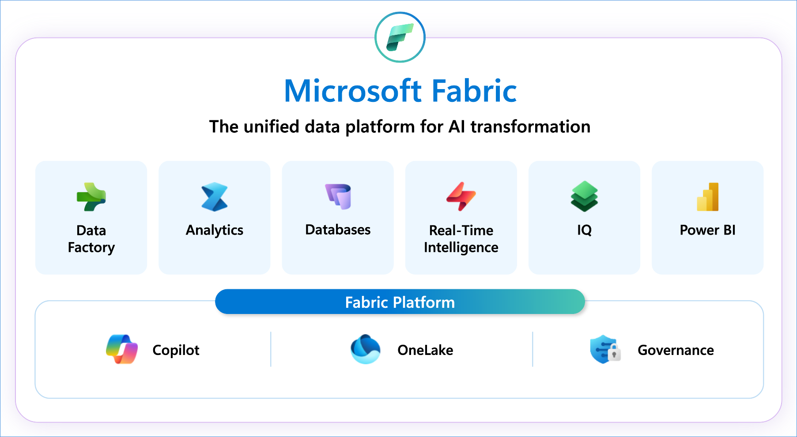
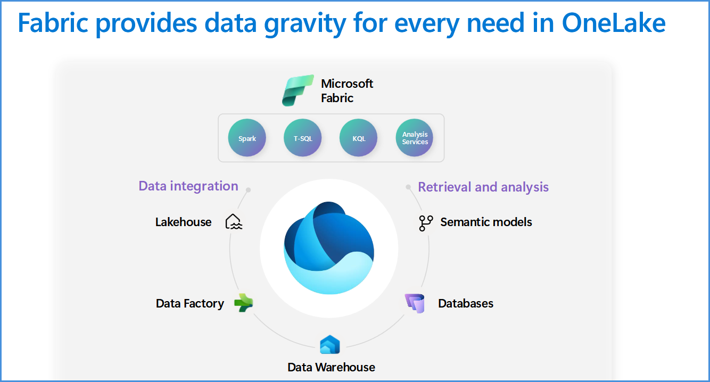
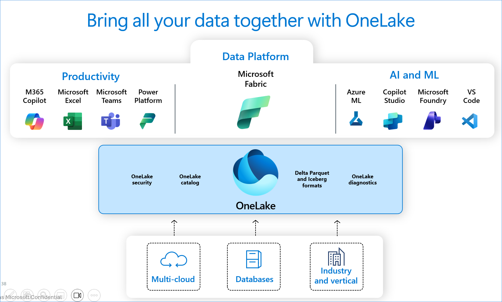
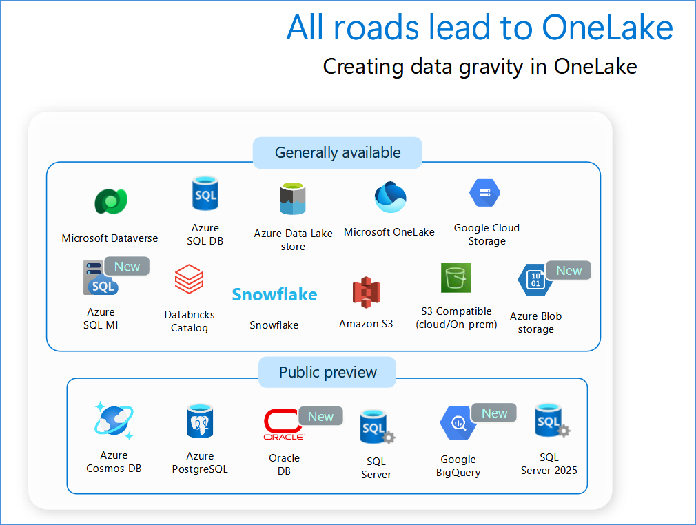
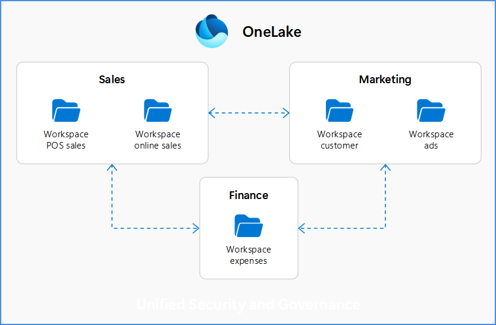
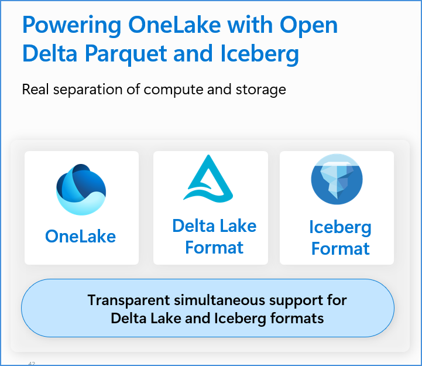
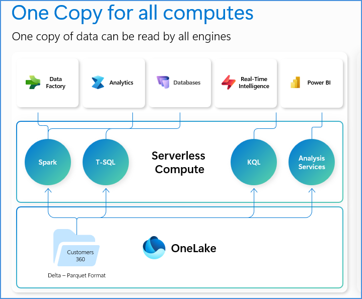

## 5. Data estate modernization with Microsoft Fabric

### 5.1 🏗️ Microsoft Fabric — The Unified Data Platform for AI Transformation

### 5.2 🌊 Bring All Your Data Together with OneLake

**OneLake** is the single unified data layer — with OneLake catalog, OneLake security, OneLake diagnostics, and Delta Parquet and Iceberg formats — connecting Azure Databricks, Snowflake, and industry/vertical data sources.

**All roads lead to OneLake — creating data gravity:**

| Capability | Description |
|---|---|
| **Shortcuts** | Give instant access to internal or external data in OneLake using symbolic links — no movement or duplication. |
| **Shortcut transformations** | Apply enrichment or analysis to shortcut data without moving it. |
| **Mirroring** | Replicates entire databases into OneLake in near real time for secure, governed access. |
| **Open mirroring** | Lets nearly any database sync with OneLake using open APIs and the Delta format. |

### 5.3 🔌 Ingest Data into OneLake with Data Factory

- Write directly into Delta format tables.
- Use shortcuts to reference external data without any data movement.
- Use low-code transformations that directly output into OneLake.
- Coordinate data ingestion, transformation, and loading into lakehouses or warehouses.

### 5.4 🗺️ Build a Governed Data Mesh with OneLake

*Logically organize data with domains, workspaces, and federated governance.*

**Unified Security and Governance:**
- Logically group data with domains to align to business areas.
- Assign domain admins and associate workspaces for delegated governance.
- Achieve federated governance by delegating settings to domain admins.
- Simplify discovery and data sharing across the organization with domains.
- Endorse and promote trusted data to drive reuse and consistency.

### 5.5 🔓 Powering OneLake with Open Delta Parquet and Iceberg — One Copy for All Computes

**Real separation of compute and storage:**

- All compute engines store data automatically in OneLake, eliminating duplication and movement.
- Data is stored in single, open Delta Parquet and Iceberg formats for all tabular data.
- **Delta – Parquet and Iceberg** standardize storage and enable interoperability across Fabric engines and external tools.
- All engines are fully optimized to deliver consistent performance on this shared foundation.
- Transparent simultaneous support for Delta Lake and Iceberg formats.

- All compute engines store their data automatically in OneLake as data items.
- You are able to choose the right engine for the right job.
- All compute engines have been fully optimized to work with Delta as their native format.
- Shared universal security model is enforced across all engines with OneLake security.

### 5.6 🏢 Data Warehouse & Databases Built on OneLake

**Data Warehouse, built on OneLake:**
- Store all warehouse data in OneLake using Delta Lake format.
- Define structured tables using SQL.
- Load curated Delta tables from the lake into Data Warehouse tables.
- Build virtual warehouses by creating lakehouses with shortcuts to data in the lake.
- Query with high-performance auto-scaling to meet analytical demand.

**Databases, built on top of lake-native data:**
- Define and query lake-native Delta tables directly in OneLake.
- Benefit from near real-time replication to OneLake.
- Use the same tables everywhere — in notebooks, pipelines, and BI tools.
- Work seamlessly with Spark using the shared Delta Lake format.
- Build dashboards directly on Power BI semantic models with zero data movement.

### 5.7 Discover, Govern and Protect Data with OneLake**

- Get a unified view of your data estate with OneLake catalog.
- Manage metadata, lineage, and sensitivity without moving data.
- Gain a flexible data security model with OneLake security.
- Enforce security policies across workspaces and domains from a central location.
- Control access with roles down to the table, folder, or column level.

### 5.8 🧩 End-to-End Platform Capability Coverage

**1 — Data Foundation & Integration**

| Capability | Description |
|---|---|
| **OneLake** | The shared data foundation — reuse, interoperability, zero-copy access patterns, and open data access through shortcutting. |
| **Data Factory / Integration** | Pipelines, orchestration, 200+ connectors, no-code/low-code dataflows landing data into OneLake. Standardize on Fabric Data Factory (successor to ADF). |
| **Mirroring** | Low-friction operational analytics for SQL Server, Azure SQL, Cosmos DB, PostgreSQL, Snowflake, Databricks — plus Open Mirroring (Oracle, MongoDB). |
| **Data Engineering / Lakehouse** | Scalable engineering, medallion architecture, reusable data products, and Rayfin for agentic development and operations of data apps. |
| **Data Warehouse** | Governed SQL-based analytics, curation, structured consumption, and enterprise analytical patterns. |
| **SQL / Databases in Fabric** | Operational and mixed-workload scenarios, database-centric design points, and integration into broader Fabric architectures. |

**2 — Intelligence & Context**

| Capability | Description |
|---|---|
| **Data Science** | Model development and advanced analytics connected to the broader data estate — not isolated from it. |
| **Real-Time Intelligence** | Event-driven analytics, operational monitoring, reduced decision latency — powering agents and real-time ontologies. |
| **Power BI** | Business-facing analytics, semantic consumption, Copilot chat-with-your-data, and Direct Lake for import-speed queries over OneLake Delta tables. |
| **Fabric IQ** | Data-context layer spanning ontology, graph, plan, data agents, operations agents, and semantic models — shared meaning across the business. |
| **Data Agents** | AI-powered interaction with data — autonomous and guided workflows leveraging real-time, governed context from Fabric IQ. |
| **Foundry IQ** | Knowledge-context layer that orchestrates intelligence across sources and grounds AI in enterprise content — 36% better quality than traditional RAG. |

**3 — Governance, Agents & Optimization**

| Capability | Description |
|---|---|
| **OneLake Catalog** | The built-in catalog for the Fabric data estate — discover (Explore), govern (Govern), and secure (Secure) the data you own, surfaced in Teams, Excel, and Copilot Studio. |
| **Microsoft Foundry** | The platform to build and run agents: 11,000+ models, Model Router, uniform inference API, Agent Framework, Hosted Agents, ACA/AKS, and Foundry Local. |
| **Microsoft Purview & Entra** | AI governance, DLP, and information protection (Purview), with identity-bound agents and full auditability (Entra Agent ID, Agent 365). |
| **APIM AI Gateway & Optimization** | Token FinOps (up to 70% inference savings; up to 30% token reduction via semantic caching), plus Evaluations, Agent Optimizer, observability, and runtime content safety. |

### 5.9 🔬 Technical Deep Dives

**Deep dive · Unify (Module 1–2) — OneLake Shortcuts:  Virtualize Without Copying**

*What it is:* Objects in OneLake that point to other storage locations (like symbolic links), making OneLake the single virtual data lake across domains, clouds, and accounts. OneLake manages permissions and credentials, eliminates edge copies, and auto-synchronizes schemas.

- **Supported external sources:** ADLS Gen2 · Azure Blob · Amazon S3 · S3-compatible · Google Cloud Storage · Dataverse · Apache Iceberg · OneDrive & SharePoint — plus on-premises via the on-premises data gateway (OPDG).
- **How it works:** Shortcuts appear as folders; any engine with OneLake access can use them. Apache Spark, SQL analytics endpoint, Real-Time Intelligence, and Analysis Services (Direct Lake) all query them in place.
- **Caching cuts egress:** Cross-cloud reads (GCS, S3, on-premises) are cached in the workspace with a 1–28 day retention window, reducing egress cost and latency on repeat reads.
- **Scale & sync:** Table schemas sync automatically for shortcut tables. Up to **100,000 shortcuts** per item; Delta-format shortcuts in the Tables folder are recognized as managed tables.

**Deep dive · Unify (Module 1–2) — Mirroring in Fabric: Low-Cost, Low-Latency Replication**

*What it is:* A fully managed, turnkey way to continuously replicate your existing data estate into OneLake in open Delta format — no ETL pipelines, no compute to manage. Changes can publish as fast as every 15 seconds.

| Mode | Description |
|---|---|
| **Database mirroring** | Replicates entire databases and tables into OneLake as analytics-ready Delta. |
| **Metadata mirroring** | Syncs only metadata via shortcuts; data stays in source; supports cross-tenant sharing. |
| **Open mirroring** | Open Delta APIs let any app write its change data directly into a mirrored database. |

- **Supported sources:** Azure SQL Database & Managed Instance · SQL Server · Azure Cosmos DB · Azure Database for PostgreSQL / MySQL (preview) · Snowflake · Azure Databricks · Google BigQuery (preview) · Oracle · SAP · Dremio (preview) · Fabric SQL database — plus Open Mirroring for additional sources.
- **Generous free tier:** 1 free terabyte of mirroring storage per capacity unit (e.g., an F64 gets 64 TB). Background replication compute is free and does not consume your capacity — you pay only for querying via SQL, Power BI, or Spark.

**Deep dive · Timely BI (Module 3) — Direct Lake: Import Speed, No Import Copy**

*What it is:* A Power BI semantic-model storage mode that loads Delta tables from OneLake directly into memory and processes queries with the VertiPaq engine — delivering Import-mode performance without maintaining a separate import/refresh copy of the data.

- **Refresh = framing, not copying:** A Direct Lake refresh copies only metadata (framing) and updates references to the latest OneLake files — seconds, not the minutes and CPU an Import refresh consumes.
- **Loads only what a query needs:** Analyzed volumes can exceed the capacity's max memory because only the columns a query touches are paged into memory — maximizing ROI.
- **Minimized data latency:** The model synchronizes with its sources automatically, making new data available to business users without refresh schedules.
- **Reuses Fabric investments:** An ideal choice for the gold layer of a medallion lakehouse; data prep moves upstream to Spark, T-SQL, dataflows, and pipelines in OneLake.
- Requires a Fabric capacity (F-SKU). Import and DirectQuery tables remain valid and can be combined in composite models.

**Deep dive · Govern (Module 1 & 7) — OneLake Catalog: Explore · Govern · Secure**

*What it is:* A centralized place in Fabric to find, explore, and govern the data you own — accessible from the Fabric nav pane and embedded in Microsoft Teams, Excel, and Copilot Studio, with a Catalog Search REST API for programmatic discovery.

| Capability | Description |
|---|---|
| **Explore** | Browse and validate items with an in-context details view; selectors and filters narrow the list; work across multiple workspaces side by side via the object explorer. |
| **Govern** | Insights into the governance posture of data you own, with recommended actions — including sensitivity-label coverage and DLP coverage — plus links to tools and learning resources. |
| **Secure** | A unified view of workspace roles and OneLake security roles across items; audit permissions and create, edit, or delete security roles from a single location. |

> **The division of labor:** Use OneLake Catalog for in-Fabric data governance, and Microsoft Purview for enterprise-wide governance, DLP, and AI governance. The two are complementary — not an either/or.

**Deep dive · Modernize (Module 2) — Migrating ADF & Synapse Pipelines to Fabric**

*More than lift-and-shift:* An opportunity to simplify governance, standardize patterns, and adopt built-in CI/CD, OneLake integration, and Copilot. Choose the path by pipeline complexity and feature parity.

1. **Mount ADF in Fabric** — Add the Azure Data Factory as a native item for a live, read-only view — ideal for discovery, ownership assignment, and side-by-side testing during gradual migration.
2. **Built-in upgrade experience** — Assess pipeline & activity readiness in the ADF canvas (Ready / Needs review / Coming soon / Not compatible), then migrate supported pipelines with a guided UX — no scripts.
3. **PowerShell / manual rebuild** — Use the FabricPipelineUpgrade module for bulk & CI-CD-driven migration, or rebuild complex low-parity pipelines to modernize the architecture.

**Plan for these component changes:**

| From Azure Data Factory | To Fabric Data Factory |
|---|---|
| Mapping Data Flows (Spark) | Dataflow Gen2 (Power Query, fast copy) |
| Linked services | Connections |
| Global parameters | Fabric Variable Library |
| Self-hosted / VNet Integration Runtimes | On-premises / Virtual Network Data Gateways |

---

<table width="100%">
  <tr>
    <td align="left">
      <a href="04-outcome-unify-data-and-knowledge-estate.md">⬅️ Previous</a>
    </td>
    <td align="right">
      <a href="06-demos.md">Next ➡️</a>
    </td>
  </tr>
</table>
