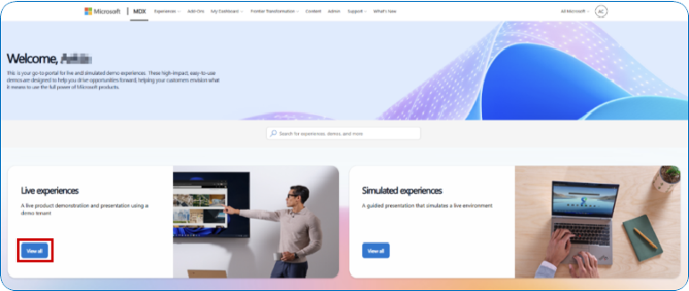

## 6. Demos

### 6.1 🎬 Build a Unified Governed Data and AI Platform — Microsoft IQ Demos

*Microsoft Demo eXperiences | Build a Unified, Governed Data and AI Estate*

**Caldova** is modernizing its infrastructure, applications, data, and AI capabilities in Azure to reduce operational complexity, unlock new efficiencies, and accelerate innovation. Rather than treating AI as a separate initiative, Caldova is building a unified Data and AI estate where **Microsoft Fabric** serves as the trusted data platform, and **Microsoft Foundry** serves as the enterprise AI platform. Together, they enable the organization to build, govern, and scale intelligent agents grounded in trusted business context, helping teams move from insight to action faster while delivering measurable business outcomes.

The journey begins with consolidating data from operational systems, databases, files, and multi-cloud platforms into a single governed foundation in OneLake. Trusted semantic models and business-ready data products are then created to provide a consistent understanding of enterprise data for both users and AI. Building on this foundation, AI Platform Engineers develop and deploy grounded, context-aware agents in Microsoft Foundry that leverage trusted business data to generate reliable recommendations. Developers embed these AI capabilities directly into operational applications and workflows, enabling real-time, actionable intelligence. Business users consume insights through dashboards, applications, and Microsoft 365 experiences, turning data-driven recommendations into immediate action.

Throughout the entire lifecycle, Microsoft Purview, Entra ID, and Foundry governance capabilities provide end-to-end security, compliance, observability, and responsible AI controls, ensuring the platform remains trusted, scalable, and AI-ready.

### 6.2 🎬 Additional Interactive Demos (CDX Experiences)

*Live, clickable CDX experiences*

| Demo | Context | Link |
|---|---|---|
| **Azure Hero Demo: Unify your Data Platform** | Interactive demonstration of unifying your data platform with Microsoft Azure and Fabric. | [cdx.transform.microsoft.com/experience-detail/284d4172-8be4-4771-89dd-ac59c00aed3e](https://cdx.transform.microsoft.com/experience-detail/284d4172-8be4-4771-89dd-ac59c00aed3e) |
| **Microsoft Fabric + Azure Databricks DREAM Demo 2.0 with Unity Catalog** | Interactive DREAM Demo of Microsoft Fabric + Azure Databricks 2.0 with Unity Catalog for unified AI and analytics. | [cdx.transform.microsoft.com/experience-detail/aded8565-fbdd-4304-9e0f-d5ae298e4e1e](https://cdx.transform.microsoft.com/experience-detail/aded8565-fbdd-4304-9e0f-d5ae298e4e1e) |
| **Real-Time Intelligence in Microsoft Fabric Snackable DREAM Demo** | Snackable DREAM Demo showcasing Real-Time Intelligence capabilities in Microsoft Fabric. | [cdx.transform.microsoft.com/experience-detail/ab5e9af3-2742-418c-96f6-759f9e2e6e0a](https://cdx.transform.microsoft.com/experience-detail/ab5e9af3-2742-418c-96f6-759f9e2e6e0a) |

---
---

<table width="100%">
  <tr>
    <td align="left">
      <a href="05-microsoft-fabric.md">⬅️ Previous</a>
    </td>
    <td align="right">
      <a href="07-activities.md">Next ➡️</a>
    </td>
  </tr>
</table>
