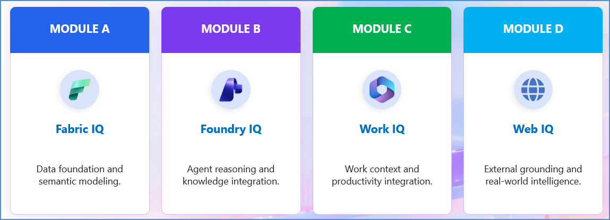
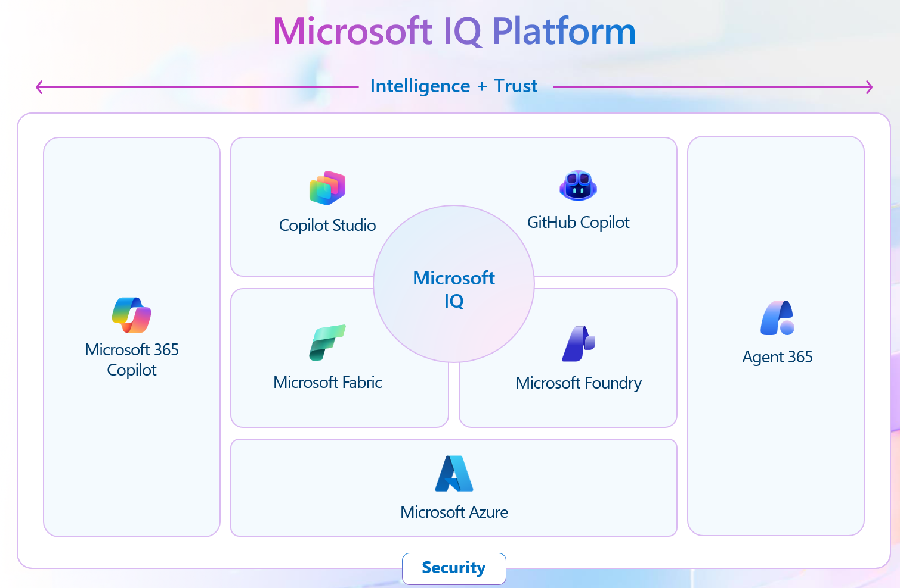

## 8. Outcome: Build a Foundation for Enterprise Intelligence

**Outcome:** Build a Foundation for Enterprise Intelligence
**Scenario:** Build business context your AI can use

### 8.1 📦 Scenario 02 — Build business context your AI can use

**Objective:** Build a governed context layer — semantic models activated with Foundry to unlock Microsoft IQ — and deliver that trusted business context to users and agents in the flow of work, with no new infrastructure or bespoke plumbing.

**Relevant components & assets:** Fabric IQ · Foundry IQ · Web IQ · Power BI semantic models · Data Agents · M365 Copilot & Apps

**Discussion focus:** Turn a unified estate into AI-ready business context and deliver it in the flow of work — Fabric IQ and Foundry IQ build shared meaning; Power BI grounds Copilot and agents with no bespoke plumbing.

### 8.2 🔍 Key Discussion Areas — From Shared Meaning to the Flow of Work

| Focus Area | Guiding Question | Current Challenge | Decision Criteria | Capabilities |
|---|---|---|---|---|
| **Build the context — Climb the IQ stack to shared meaning** | When agents see only raw tables and schemas, how much business meaning is lost? | Data is accessible but not AI-ready — no shared semantic layer, so meaning is re-derived each time. | Activate semantic models and Fabric IQ (ontology, graph); Foundry IQ grounds knowledge beyond the estate. | Fabric IQ · Foundry IQ · Web IQ · Power BI semantic models · 36% better than traditional RAG. |
| **Deliver in the flow of work — Trusted context where people & agents work** | Can Copilot and agents reach trusted business context without custom grounding for every app? | Copilot and agents lack a governed data layer, so answers are stale or ungrounded. | Make Power BI semantic models the intelligence layer — instant grounding, no new infrastructure, no bespoke plumbing. | Power BI semantic models · Data Agents · M365 Copilot & Apps · Microsoft Foundry. |

### 8.3 ✅ What Good Looks Like

| Principle | Description |
|---|---|
| **More than model access** | AI readiness isn't just model access — it's a governed semantic layer with clear business meaning. |
| **Grounded in the flow of work** | Trusted context reaches users and agents in M365 Copilot, Apps, and Foundry — without bespoke plumbing. |
| **Defined once, reused** | Context is defined once and reused consistently across analytics, data agents, and downstream AI. |

### 8.4 🧭 Suggested Workshop Flow

| # | Step |
|---|---|
| 1 | Introduce the customer scenario and establish current-state challenges. |
| 2 | Explore Microsoft IQ and the role of work, business, and knowledge context. |
| 3 | Conduct discovery and whiteboarding aligned to customer scenarios. |
| 4 | Demonstrate key capabilities — Fabric IQ, Foundry IQ, Work IQ, Web IQ. |
| 5 | Execute hands-on labs to build and validate integrated solutions. |
| 6 | Connect outputs into a unified end-to-end intelligence scenario. |
| 7 | Summarize findings and identify next steps. |

### 8.5 🧩 Optional Modular Deep-Dive Tracks (A–D)

*Run the full engagement, or select the tracks that best match the customer's priorities, maturity, and desired outcome.*

| Module | Focus |
|---|---|
| **Module A — Fabric IQ** | Data foundation and semantic modeling. |
| **Module B — Foundry IQ** | Agent reasoning and knowledge integration. |
| **Module C — Work IQ** | Work context and productivity integration. |
| **Module D — Web IQ** | External grounding and real-world intelligence. |

### 8.6 🎯 Expected Outputs

- A defined approach for unifying work, business, and knowledge context.
- An identified external grounding pattern — where Web IQ is required in the target agent scenario.
- A conceptual architecture for an integrated Microsoft IQ solution.
- Hands-on experience building components of the solution.
- A clear path to a customer-specific proof-of-concept (PoC).

### 8.7 🤝 Intelligence + Trust — Microsoft IQ Platform

Microsoft IQ sits at the center of the Microsoft AI stack, bridging **Intelligence + Trust**: Microsoft 365 Copilot and Agent 365 flank the platform (interactive ↔ autonomous); Copilot Studio and GitHub Copilot sit above Microsoft IQ; Microsoft Fabric and Microsoft Foundry sit below, on top of Microsoft Azure; Security underpins the entire platform.

**Microsoft IQ Platform — Unified intelligence for enterprise AI:**

| Pillar | Tagline | What It Provides |
|---|---|---|
| **Work IQ** | How your employees work | Context on people, collaboration, and workflows |
| **Fabric IQ** | How your business operates | Context on business entities, systems of record, and actions |
| **Foundry IQ** | How your agents unlock knowledge | Context on policies, authoritative documents, and knowledge bases |
| **Web IQ** | How you connect to web intelligence | Context from the web, news, images, and video |

Reference: [aka.ms/MicrosoftIQ](https://aka.ms/MicrosoftIQ)

### 8.8 🧩 The Challenge — Why AI Stalls Without Unified Context

Organizations struggle to apply AI effectively because critical context is fragmented across systems, teams, and data sources. Without a unified intelligence layer, AI solutions lack the context required to deliver accurate, trusted, and scalable outcomes.

| Problem | Description |
|---|---|
| **Fragmented context** | Work context, business definitions, and enterprise knowledge sit disconnected across systems and teams. |
| **Meaning re-established** | Teams repeatedly rebuild context and definitions before AI can actually be useful. |
| **Inconsistent & duplicated** | Inconsistent outputs, duplicated effort, and slow progress from experimentation to production. |
| **Missing external signals** | Agents also need current external signals not captured in internal systems or model training data. |

### 8.9 📈 AI Adoption Is Accelerating — Agents Are at the Forefront

- **1.3B AI agents by 2028** *(Source: IDC FutureScape / IDC Info Snapshot research, 2025)*
- **82% of organizations** intend to integrate agents within 1–3 years *(Source: Capgemini Research Institute, "Harnessing the Value of Generative AI: Unlocking Scalable Advantage," July 2024)*
- **40% of enterprise apps** will be integrated with task-specific AI agents by 2026 *(Source: Gartner, August 2025)*

### 8.10 ⚙️ Essentials for High-Performance Agents

1. Rich, connected context
2. Unified access to data and signals
3. Low-friction development and orchestration
4. Governance, observability, and trust

*Intelligence + Trust:* Intelligence enables informed action; Trust ensures governance, transparency, and alignment with organizational values and policies.

> **Key framing question:** How do you make your AI agents as trusted and productive as your best employees?

### 8.11 🧠 What Every Employee and Every Agent Needs to Know

*"You empower your AI agents with the same knowledge and context."*

Both a human employee and an AI agent depend on the same three pillars of context:
- **Teams, roles, and workflows** — how people work.
- **State and actions of the business** — what's happening right now.
- **Curated knowledge** — the accumulated, trusted information of the organization.

> **Your people. Your agents. Your IQ.** — Microsoft IQ makes agents **interactive** (working alongside people) and **autonomous** (acting independently) across these same three pillars.

---
---

<table width="100%">
  <tr>
    <td align="left">
      <a href="07-activities.md">⬅️ Previous</a>
    </td>
    <td align="right">
      <a href="09-fabric-iq.md">Next ➡️</a>
    </td>
  </tr>
</table>
