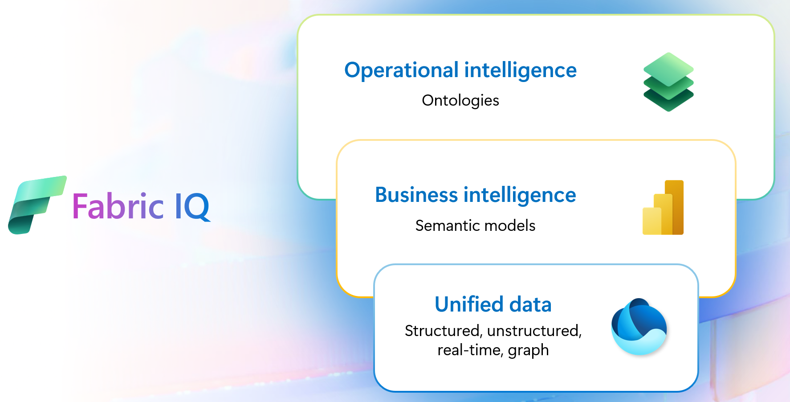
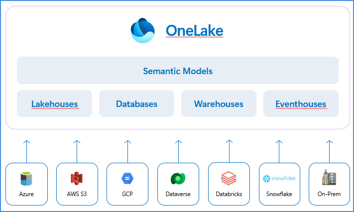
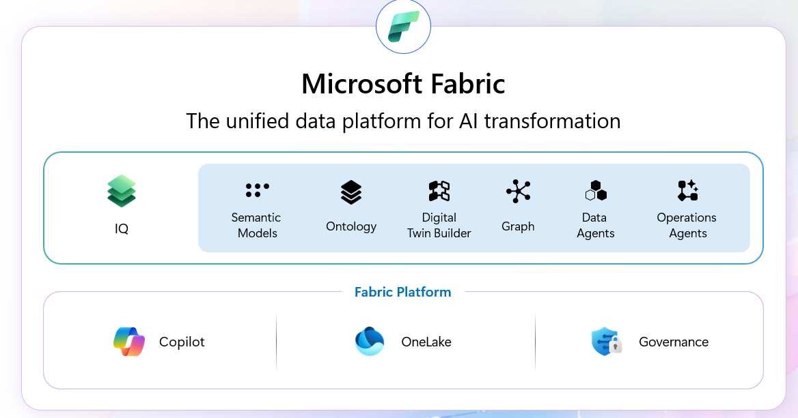

## 9. Fabric IQ

*"How your business operates."* 

Reference: [aka.ms/FabricIQ](https://aka.ms/FabricIQ)

**Fabric IQ value:**

| Capability | Description |
|---|---|
| **Unified business understanding** | Consistent meaning across data, models, rules, and actions. |
| **Always-on insight to action** | Understands and acts on live, context-rich data. |
| **Agents with business context** | Powers AI agents in Foundry and Fabric. |

**The three layers of Fabric IQ:**
1. **Operational intelligence** — Ontologies
2. **Business intelligence** — Semantic models
3. **Unified data** — Structured, unstructured, real-time, graph

**OneLake unifies the world's data:** Across on-prem and all clouds. All databases, apps, and files. Zero ETL — spanning Microsoft-managed data and other data providers/clouds.

**Power BI — Semantic models: grounding BI and AI in trusted business knowledge**
- Expertly curated repositories of business data and metrics.
- Key AI enablers — with industries rushing for unified semantic layers.
- **35M+ users** regularly using semantic models in Fabric.

OneLake's Semantic Models layer sits on top of Lakehouses, Databases, Warehouses, and Eventhouses, which in turn draw from Azure, AWS S3, GCP, Dataverse, Databricks, Snowflake, and on-prem sources.

**Fabric IQ — Ontologies** *(Public Preview)*: a live, unified view of your business for reasoning and decision-making. AI Agents and Teams sit above an Ontology layer, which connects Tables and streams and Operational systems:
- Define how your business works with ontologies in Fabric IQ.
- Model org-wide goals and rules across BI, real-time ops, and more.
- Jumpstart ontology creation from **20M+ semantic models**.
- Equip agents with rich context for trusted actions and outcomes.

---
---

<table width="100%">
  <tr>
    <td align="left">
      <a href="08-outcome-build-a-foundation-for-enterprise-intelligence.md">⬅️ Previous
    </td>
    <td align="right">
      <a href="10-work-iq.md">Next ➡️</a>
    </td>
  </tr>
</table>
