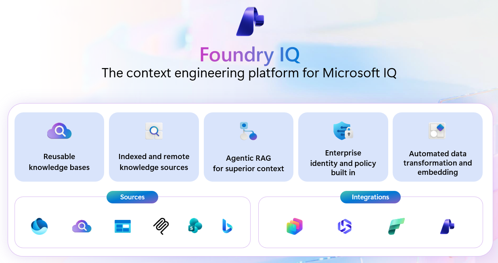

## 12. Foundry IQ

*"How your agents unlock knowledge."* 

Reference: [aka.ms/FoundryIQ](https://aka.ms/FoundryIQ)

| Capability | Description |
|---|---|
| **Automated data connectivity** | Faster agent delivery with point-and-click knowledge bases, reusable across agents. |
| **Context without blind spots** | Unlock better results with agentic retrieval that finds the relevant data automatically. |
| **Respect user access permissions** | Users only see what they are allowed to — even on organization-wide retrieval. |

**How it stacks up:** Rather than each agent maintaining its own siloed knowledge base wired directly to sources, Foundry IQ inserts a shared **agentic retrieval engine** between agents and multiple knowledge bases — so agents query multiple knowledge bases through one governed layer instead of point-to-point wiring.

**Availability:**
- **Enterprise-grade security** — Available today
- **Unified governance** — Available today
- **Serverless Developer** — Public preview

**Context engineering stack:**

| Layer | Description |
|---|---|
| **Enterprise context** | Work IQ, Fabric IQ, agent memory, enriched metadata, embeddings. |
| **Context engineering** | Agentic RAG engine, knowledge bases. |
| **Knowledge sources** | Structured, unstructured, web. |

**Foundry IQ — the context engineering platform for Microsoft IQ:**
- Reusable knowledge bases.
- Indexed and remote knowledge sources.
- Agentic RAG for superior context.
- Enterprise identity and policy built in.
- Automated data transformation and embedding.

Sources and integrations connect through Microsoft 365, Bing, SharePoint, Fabric, and Foundry.

---
---

<table width="100%">
  <tr>
    <td align="left">
      <a href="11-web-iq.md">⬅️ Previous</a>
    </td>
    <td align="right">
      <a href="13-demos-microsoft-iq-demos.md">Next ➡️</a>
    </td>
  </tr>
</table>
